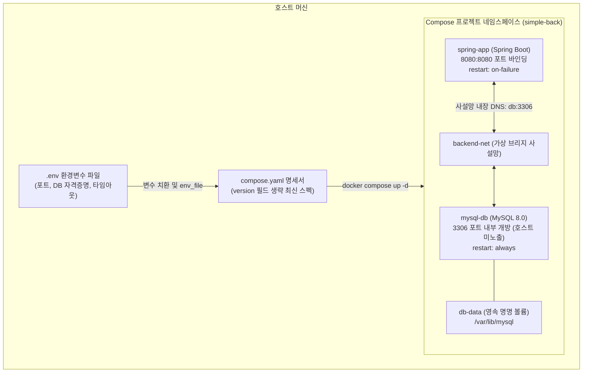

# Docker Compose 기반 멀티컨테이너와 백그라운드 관리 실습 가이드

> 💡 **[핵심 원리]** Docker Compose는 단일 호스트 환경에서 다중 컨테이너(2-Tier: App + DB)의 빌드, 네트워크, 볼륨, 의존 관계를 단일 선언형 명세서(`compose.yaml`)로 정의하고 일괄 제어(오케스트레이션)하는 도구입니다. 12-Factor App 원칙에 따라 환경설정과 비밀값을 코드와 분리하여 `.env`로 격리 관리합니다.

---

## 1. 실습 개요 및 목표

### 1.1 실습 개요
본 실습에서는 Spring Boot 백엔드와 MySQL 8.0 데이터베이스로 구성된 2-Tier 애플리케이션을 최신 오픈소스 Compose Specification 표준에 맞추어 `compose.yaml`로 정의합니다. 데이터베이스 비밀번호 및 포트 등 환경 종속적인 설정값은 `.env` 파일로 분리하고, 컨테이너 기동 순서 및 스토리지 초기화 레이스 컨디션(Startup Race Condition)을 체계적으로 해결합니다. 또한 백그라운드 데몬 구동, 실시간 로그 스트리밍, 프로세스 모니터링, 컨테이너 내부 디버깅 등 실무 컨테이너 운영 관리 명령어를 숙달하고, 명명된 볼륨(Named Volume)을 통한 데이터 영속성을 검증합니다.



### 1.2 개별 docker run vs docker compose 비교

| 비교 항목 | 개별 `docker run` 수동 관리 | `docker compose` 선언적 관리 |
|---|---|---|
| **네트워크 구성** | `docker network create` 선행 실행 필요 | YAML 선언만으로 전용 브리지 네트워크 자동 생성 |
| **컨테이너 구동** | 긴 옵션(`-d`, `-p`, `-e`, `-v`, `--net`)을 매번 명령어로 입력 | `docker compose up -d` 단일 명령으로 일괄 구동 |
| **의존성 제어** | DB가 완전히 뜰 때까지 엔지니어가 수동 대기 후 App 실행 | `depends_on`을 통한 기동 순서 선언적 명시 |
| **변수 관리** | 쉘 스크립트나 터미널 인자로 전달하여 유출 위험 | `.env` 파일 자동 파싱 및 변수 치환 지원 |
| **자원 회수** | `docker stop`, `rm`, `network rm` 순차 개별 삭제 | `docker compose down`으로 프로젝트 자원 일괄 정리 |

### 1.3 실습 목표
- **12-Factor 원칙 준수**: DB 자격증명과 포트 설정을 `.env` 파일로 분리하고 HikariCP 연결 획득 대기 시간을 안전하게 구성한다.
- **최신 Compose 표준 준수**: `version` 필드가 생략된 최신 Compose Specification 규격의 2-Tier `compose.yaml`을 작성하고 `docker compose config --quiet`로 구문을 사전 검증한다.
- **백그라운드 일괄 오케스트레이션**: `docker compose up -d`로 멀티 컨테이너 서비스를 일괄 구동하고, 네임스페이스가 격리된 네트워크 및 볼륨을 점검한다.
- **실무 관리 명령어 숙달**: 백그라운드 서비스 모니터링(`ps`, `logs -f`, `top`), 내부 진입(`exec`), 개별 생명주기 제어(`stop`, `start`, `restart`) 명령어를 능숙히 다룬다.
- **데이터 영속성 검증**: `down`과 `down -v`의 볼륨 보존 차이를 실제 데이터베이스 쿼리를 통해 검증한다.

---

## 2. 실습 환경 및 준비

### 2.1 실습 환경 요약
- **작업 디렉터리**: `~/workspace/simple-back`
- **호스트 런타임**: Docker Engine 24+ / Docker Compose v2+ (Rancher Desktop 또는 Docker Desktop)
- **베이스 프로젝트**: `simple-back` (Spring Boot 4.1.1, JDK 17, Gradle 8.x)
- **주요 파일**: `.env`, `compose.yaml`, `Dockerfile`

### 2.2 컨테이너 서비스 구성 명세

| 서비스명 | 컨테이너명 | 베이스 이미지 / 빌드 | 호스트/내부 포트 | 연결 네트워크 | 마운트 볼륨 | 재시작 정책 |
|---|---|---|---|---|---|---|
| `db` | `mysql-db` | `mysql:8.0` | 호스트 미노출 / 내부 `3306` | `backend-net` | `db-data:/var/lib/mysql` | `restart: always` |
| `app` | `spring-app` | 멀티 스테이지 빌드 (`Dockerfile`) | `8080:8080` | `backend-net` | 없음 | `restart: on-failure` |

> ⚠️ **[주의 사항]** 데이터베이스 컨테이너(`db`)의 3306 포트는 호스트 머신에 직접 노출하지 않습니다. 호스트 포트 바인딩(`ports`)을 생략하고 내부 사설망(`backend-net`)에서만 통신하도록 설정하여 외부 무차별 대입 공격(Brute Force)을 원천 차단합니다.

---

## 3. 핵심 실습 절차 (Step-by-Step)

### Step 1. 실습 디렉터리 및 스프링부트 프로젝트 구조 점검

앞 차시에서 클론한 `simple-back` 프로젝트로 이동하여 파일 구조와 설정 파일을 점검합니다.

```bash
cd ~/workspace/simple-back
ls -la
ls src/main/resources
cat src/main/resources/application.yml
```

> 📌 **[기대 출력 확인]**
> - 루트 디렉터리에 `Dockerfile`, `src/`, `build.gradle`이 존재해야 합니다.
> - `application.yml`에는 하드코딩된 DB 비밀번호가 없으며 포트(`8080`) 및 Actuator 기본 설정만 정의되어 있습니다.

### Step 2. 기존 멀티 스테이지 Dockerfile 점검

03차시에서 작성한 2단계 멀티 스테이지 `Dockerfile`이 정상 유지되고 있는지 확인합니다.

```bash
cat Dockerfile
```

> 📌 **[기대 출력 확인]**
> ```dockerfile
> FROM gradle:8.12.0-jdk17 AS builder
> WORKDIR /app
> COPY build.gradle settings.gradle ./
> COPY src ./src
> RUN gradle bootJar --no-daemon
> 
> FROM azul/zulu-openjdk-alpine:17-jre-headless
> WORKDIR /app
> COPY --from=builder /app/build/libs/*.jar app.jar
> EXPOSE 8080
> ENTRYPOINT ["java", "-jar", "app.jar"]
> ```

### Step 3. 12-Factor 원칙 기반 .env 환경설정 파일 작성

데이터베이스 자격증명과 포트 설정을 소스코드 외부 파일인 `.env`에 격리 선언합니다. 기존 클론 소스에 이미 `.env`가 존재하는 경우 내용을 보존하며 덧붙입니다.

```bash
# 기존 .env 내용 보존을 위해 줄바꿈 추가 후 환경변수 작성
printf "
" >> .env

cat <<EOF >> .env
# 데이터베이스 설정
DB_ROOT_PASSWORD=rootpass
DB_NAME=mydb
DB_USER=root
DB_PASSWORD=rootpass

# 애플리케이션 설정
APP_PORT=8080
APP_MESSAGE=Running via Docker Compose 2-Tier with .env!

# HikariCP 연결 획득 대기 시간 (30초)
SPRING_DATASOURCE_HIKARI_CONNECTION_TIMEOUT=30000
EOF

# 키 목록만 안전하게 확인 (비밀번호 노출 방지)
sed -n "s/^\([A-Za-z_][A-Za-z0-9_]*\)=.*//p" .env
```

> ⚠️ **[주의 사항]** `SPRING_DATASOURCE_HIKARI_INITIALIZATION_FAIL_TIMEOUT` 변수는 설정하지 마십시오. `-1` 주입 시 Spring Boot 3/HikariCP 최신 버전에서 `The configuration of the pool is sealed once started` 예외가 발생하며 기동이 실패합니다. 연결 대기 시간은 `SPRING_DATASOURCE_HIKARI_CONNECTION_TIMEOUT=30000`으로 안전하게 통제합니다.

### Step 4. 최신 스펙 2-Tier compose.yaml 명세 작성

최신 Docker Compose Specification 규격에 맞추어 `version` 필드를 생략하고 `compose.yaml`을 작성합니다.

```bash
cat <<EOF > compose.yaml
services:
  db:
    image: mysql:8.0
    container_name: mysql-db
    restart: always
    environment:
      MYSQL_ROOT_PASSWORD: ${DB_ROOT_PASSWORD}
      MYSQL_DATABASE: ${DB_NAME}
    volumes:
      - db-data:/var/lib/mysql
    networks:
      - backend-net

  app:
    build:
      context: .
      dockerfile: Dockerfile
    container_name: spring-app
    restart: on-failure
    ports:
      - "${APP_PORT}:8080"
    env_file:
      - .env
    environment:
      PORT: 8080
      SPRING_DATASOURCE_URL: "jdbc:mysql://db:3306/${DB_NAME}?useSSL=false&allowPublicKeyRetrieval=true"
      SPRING_DATASOURCE_USERNAME: ${DB_USER}
      SPRING_DATASOURCE_PASSWORD: ${DB_PASSWORD}
    depends_on:
      - db
    networks:
      - backend-net

volumes:
  db-data:

networks:
  backend-net:
EOF
```

> 💡 **[핵심 원리]**
> - `depends_on: - db`: 컨테이너 시작 순서를 제어하여 `db` 컨테이너가 먼저 생성된 후 `app` 컨테이너가 기동되도록 보장합니다.
> - `SPRING_DATASOURCE_URL`: 호스트 이름으로 서비스 명칭인 `db`를 선언하여 Compose 내장 사설 DNS를 통해 MySQL과 직접 통신합니다.

### Step 5. docker compose config 명령을 통한 렌더링 사전 검증

YAML 구문 오류 및 환경변수 치환 결과를 사전에 검증합니다.

```bash
docker compose config --quiet
```

> 📌 **[기대 출력 확인]**
> `--quiet` 옵션을 주면 치환된 민감 비밀번호를 콘솔에 평문 노출하지 않고 구문 문법 오류(Syntax Error)만 검출합니다. 출력이 없고 종료 코드 `0`이면 정상입니다.

### Step 6. 2-Tier 서비스 일괄 백그라운드 구동 및 자원 점검

Compose 명령어로 애플리케이션 이미지를 빌드하고 전체 서비스를 백그라운드 데몬으로 일괄 기동합니다.

```bash
# 전체 서비스 백그라운드 일괄 구동
docker compose up -d

# 실행 중인 컨테이너 상태 점검
docker compose ps

# 프로젝트 네임스페이스가 적용된 네트워크 및 볼륨 확인
docker network ls | grep backend-net
docker volume ls | grep db-data
```

> 📌 **[기대 출력 확인]**
> `docker compose ps` 출력 결과 `mysql-db`와 `spring-app`의 상태가 `Up`으로 표시됩니다. 가상 네트워크명은 `<디렉터리명>_backend-net`, 볼륨명은 `<디렉터리명>_db-data` 형태로 네임스페이스가 자동 부여됩니다.

### Step 7. MySQL 스토리지 엔진 초기화 로그 점검

MySQL 엔진이 실제 클라이언트 연결을 수락할 준비를 완료했는지 점검합니다.

```bash
# 초기화 임시 서버(port: 0)와 구분하여 실제 정식 TCP 포트 준비 대기
docker compose exec -T db sh -c '
  for attempt in $(seq 1 60); do
    MYSQL_PWD="$MYSQL_ROOT_PASSWORD" mysql --protocol=TCP -h127.0.0.1       -uroot -Nse "SELECT 1" 2>/dev/null && exit 0
    sleep 2
  done
  exit 1
'

docker compose logs db | grep "ready for connections" | grep -E "port: 3306([^0-9]|$)"
```

> 💡 **[핵심 원리]** MySQL 컨테이너는 기동 직후 시스템 테이블 생성을 위해 임시 데몬(`port: 0`)을 띄웠다가 스스로 종료한 뒤, 정식 데몬(`port: 3306`)을 다시 시작합니다. 따라서 `ready for connections ... port: 3306` 로그와 TCP `SELECT 1` 통과를 확인해야 DB가 완전히 준비된 것입니다.

### Step 8. Spring Boot 서비스 재구동 및 Hikari 커넥션 풀 안착 검증

MySQL의 준비 완료 시점에 맞춰 `app` 컨테이너를 재구동하여 DataSource 커넥션 풀을 안정적으로 체결합니다.

```bash
APP_RESTART_AT=$(date -u +%Y-%m-%dT%H:%M:%SZ)
docker compose restart app
docker compose ps

# Actuator Health 체크 대기 (최대 180초)
curl -fsS --retry 60 --retry-all-errors --retry-delay 2   --retry-max-time 180 --max-time 3 http://localhost:8080/actuator/health

# Hikari 커넥션 풀 연결 로그 확인
docker compose logs --since "$APP_RESTART_AT" app | grep "HikariPool"
```

> 📌 **[기대 출력 확인]**
> `/actuator/health` 호출 시 `{"status":"UP","components":{"db":{"status":"UP"...}}}` 응답이 반환되고, 로그에 `HikariPool-1 - Start completed.`가 확인됩니다.

### Step 9. 다중 서비스 실시간 로그 스트리밍 및 필터링 제어

백그라운드 컨테이너들의 로그를 실시간으로 모니터링하고 필터링하는 명령어를 실습합니다.

```bash
# 1. 전체 서비스 실시간 스트리밍 (확인 후 터미널에서 Ctrl + C로 종료)
docker compose logs -f

# 2. app 서비스의 최근 30줄 로그 확인
docker compose logs --tail 30 app

# 3. db 서비스의 타임스탬프(-t) 포함 최근 20줄 로그 확인
docker compose logs -t --tail 20 db
```

> 💡 **[핵심 원리]** `docker compose logs -f`는 로그 스트림을 확인하는 것이므로 `Ctrl + C`를 눌러 빠져나와도 백그라운드 컨테이너는 종료되지 않고 정상 실행 상태를 유지합니다 (`docker attach`와 다른 동작).

### Step 10. compose top 프로세스 점검 및 exec 내부 명령 실행

컨테이너 내부의 실제 OS 프로세스와 PID를 점검하고 컨테이너 내부 쉘 명령을 직접 실행합니다.

```bash
# 1. 백그라운드 컨테이너 내부 프로세스 및 호스트 PID 조회
docker compose top

# 2. app 컨테이너 내부 환경변수 주입 상태 확인
docker compose exec app env | cut -d= -f1 | grep "^SPRING"

# 3. db 컨테이너 내부 MySQL CLI 쿼리 직접 실행
docker compose exec db sh -c '
  MYSQL_PWD="$MYSQL_ROOT_PASSWORD" mysql -uroot -e "SHOW DATABASES;"
'
```

> 📌 **[기대 출력 확인]**
> - `top` 명령으로 `mysqld` 및 `java` 프로세스의 호스트 PID와 CPU 점유 상태가 출력됩니다.
> - `SHOW DATABASES;` 결과로 `mydb`, `information_schema`, `performance_schema` 목록이 출력됩니다.

### Step 11. 서비스 개별 제어(stop/start) 및 HTTP API 응답 검증

특정 컨테이너만 일시 중지 및 재개하는 개별 제어 명령을 실습하고 최종 REST API 엔드포인트를 호출합니다.

```bash
# 1. app 서비스 일시 중지
docker compose stop app
docker compose ps -a

# 2. app 서비스 재개
docker compose start app
docker compose ps

# 3. 웹 엔드포인트 응답 검증
curl -fsS --retry 60 --retry-all-errors --retry-delay 2   --retry-max-time 180 --max-time 3 http://localhost:8080/actuator/health
curl -i http://localhost:8080/
curl -i http://localhost:8080/users
```

> 📌 **[기대 출력 확인]**
> `curl -i http://localhost:8080/users` 호출 시 HTTP `200 OK`와 함께 DB에서 조회된 사용자 JSON 목록이 정상 반환됩니다.

### Step 12. 명명된 볼륨 데이터 보존 검증 및 재생성 테스트

데이터베이스에 테스트 데이터를 기록한 후 컨테이너를 삭제 및 재생성하여 데이터가 안전하게 영속 보존되는지 검증합니다.

```bash
# 1. 검증용 레코드 삽입
docker compose exec -T db sh -c '
  MYSQL_PWD="$MYSQL_ROOT_PASSWORD" mysql -uroot "$MYSQL_DATABASE"
' <<'SQL'
INSERT INTO users(name, email) VALUES ("Compose Check", "compose-check@example.test")
ON DUPLICATE KEY UPDATE name = "Compose Check";
SELECT name, email FROM users WHERE email = "compose-check@example.test";
SQL

# 2. 컨테이너 및 네트워크 종료 (볼륨은 보존)
docker compose down

# 3. 데이터 볼륨 보존 확인
docker volume ls | grep db-data

# 4. 동일 프로젝트로 재생성 후 데이터 조회
docker compose up -d
curl -fsS --retry 60 --retry-all-errors --retry-delay 2   --retry-max-time 180 --max-time 3 http://localhost:8080/actuator/health

docker compose exec -T db sh -c '
  MYSQL_PWD="$MYSQL_ROOT_PASSWORD" mysql -uroot "$MYSQL_DATABASE"
' <<'SQL'
SELECT name, email FROM users WHERE email = "compose-check@example.test";
SQL
```

> 📌 **[기대 출력 확인]**
> `docker compose down`으로 컨테이너가 완전히 삭제되었음에도, `docker compose up -d`로 재생성한 후 `compose-check@example.test` 데이터가 영속 볼륨(`db-data`)에서 손실 없이 그대로 조회됩니다.

---

## 4. 실무 트러블슈팅 가이드

### Issue 1: Spring Boot 기동 시 MySQL 연결 거부 (Connection Refused)
- **증상**: `docker compose up -d` 후 `spring-app` 로그에 `Communications link failure`, `Connection refused` 예외가 반복 발생하며 애플리케이션이 비정상 종료됨.
- **원인**: `compose.yaml`의 `depends_on: - db`는 MySQL 컨테이너의 *생성/실행(Up)* 상태만 보장할 뿐, 내부 MySQL 엔진의 *초기화 완료(Ready for connections)* 상태를 보장하지 않습니다. MySQL은 초기화 시 임시 데몬(`port: 0`)을 실행했다가 재시작하므로 이 과도기에 Spring Boot가 연결을 시도하면 연결이 거부됩니다.
- **해결책**: Step 7의 TCP `SELECT 1` 루프 검사나 `ready for connections ... port: 3306` 로그를 확인한 후, `docker compose restart app`으로 애플리케이션 커넥션 풀을 다시 안착시킵니다.

### Issue 2: HikariCP 설정 봉인 예외 발생
- **증상**: `spring-app` 구동 중 `The configuration of the pool is sealed once started` 예외가 출력되며 애플리케이션 컨텍스트 초기화 실패.
- **원인**: 환경변수로 `SPRING_DATASOURCE_HIKARI_INITIALIZATION_FAIL_TIMEOUT=-1`을 주입하는 경우 발생합니다. 최신 HikariCP는 풀 기동 후 설정 변경을 엄격히 차단합니다.
- **해결책**: 해당 환경변수 설정을 제거하고, `SPRING_DATASOURCE_HIKARI_CONNECTION_TIMEOUT=30000` (연결 획득 대기 30초) 설정만 유지합니다.

### Issue 3: .env 파일 수정 후 restart 시 변경 사항 미반영
- **증상**: `.env` 파일에서 포트나 환경변수 값을 변경한 뒤 `docker compose restart app`을 실행했으나 이전 설정값이 그대로 유지됨.
- **원인**: `restart` 명령은 기존에 생성된 컨테이너 프로세스만 단순히 재시작할 뿐, 컨테이너 메타데이터나 환경변수를 다시 읽어들이지 않습니다.
- **해결책**: 환경변수 변경 시에는 컨테이너를 재생성(Recreate)하는 `docker compose up -d app` 명령을 실행해야 합니다.

### Issue 4: docker compose config 실행 시 비밀번호 평문 노출
- **증상**: `docker compose config`를 실행하면 `.env`의 `DB_ROOT_PASSWORD` 등 민감한 자격증명이 터미널 화면과 로그 기록에 그대로 노출됨.
- **원인**: `config` 명령의 기본 동작은 모든 환경변수가 치환된 최종 YAML 텍스트를 stdout에 출력하는 것입니다.
- **해결책**: 실무 CI/CD 및 교육 환경에서는 `docker compose config --quiet` 플래그를 사용하여 민감 정보 출력 없이 문법 유효성(종료 코드 0)만 점검합니다.

---


## 5. 실습 자원 정리 (Cleanup)

실습이 모두 완료된 후 생성된 컨테이너, 네트워크 및 실습용 데이터 볼륨을 완전히 정리합니다.

```bash
# 1. 볼륨을 포함한 전체 실습 자원 일괄 정리
docker compose down -v

# 2. 잔여 컨테이너 및 볼륨 삭제 확인
docker compose ps -a
docker volume ls | grep db-data
```

> 📌 **[기대 출력 확인]**
> `docker compose ps -a` 실행 결과 아무런 서비스가 출력되지 않아야 하며, `docker volume ls | grep db-data` 실행 결과가 비어 있어야(종료 코드 1) 모든 실습 자원이 안전하게 정리된 상태입니다.
