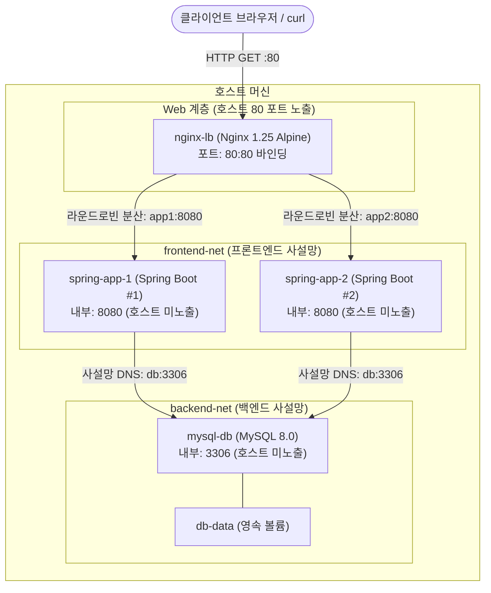

# Docker Compose Nginx 로드밸런싱과 다중환경 분기 실습 가이드

> 💡 **[핵심 원리]** Nginx 리버스 프록시를 웹 티어로 배치하여 트래픽을 다중 백엔드 컨테이너로 라운드로빈 분산하고, 네트워크를 `frontend-net`과 `backend-net`으로 물리적·논리적으로 분리(3-Layer Architecture)하여 데이터베이스를 인터넷으로부터 격리합니다. 또한 개발(local)과 운영(prod) 환경을 Compose 다중 파일 오버라이드 기법으로 안전하게 분기합니다.

---

## 1. 실습 개요 및 목표

### 1.1 실습 개요
본 실습은 마이크로서비스 및 웹 서비스의 표준 구조인 **3-Tier (Web - App - DB)** 아키텍처를 Docker Compose로 구축합니다. Nginx 리버스 프록시의 `upstream` 블록을 활용하여 2대의 Spring Boot 인스턴스(`app1`, `app2`)로 요청을 균등 분산하는 L7 라운드로빈 로드밸런싱을 구현합니다. 심층 방어(Defense in Depth) 원칙에 따라 외부에 개방되는 포트는 Nginx의 80 포트로 일원화하고, 백엔드 애플리케이션과 MySQL 데이터베이스의 호스트 포트 바인딩을 제거하여 가상 사설망(`frontend-net`, `backend-net`) 내부에 안전하게 격리합니다. 마지막으로 단일 코드베이스에서 개발 환경(`compose.override.yaml`)과 프로덕션 환경(`compose.prod.yaml`)을 Compose 다중 파일 오버라이드로 분기 배포하는 실무 패턴을 체득합니다.



### 1.2 3-Layer 네트워크 보안 격리 모델

| 계층 (Tier) | 컨테이너 서비스 | 소속 가상 네트워크 | 외부 포트 노출 | 비고 |
|---|---|---|---|---|
| **Web 계층** | `nginx` | `frontend-net` | **80:80** (외부 공개) | 단일 진입점, SSL 종단 및 트래픽 분산 |
| **App 계층** | `app1`, `app2` | `frontend-net`, `backend-net` | 없음 (사설망 전용) | 양쪽 사설망을 잇는 중계자 역할 |
| **DB 계층** | `db` | `backend-net` | 없음 (사설망 전용) | Nginx 및 외부 인터넷과의 통신 원천 차단 |

### 1.3 실습 목표
- **L7 라운드로빈 로드밸런싱 구현**: Nginx `upstream` 블록을 정의하고 2대의 Spring Boot 백엔드로 트래픽을 교대 분산한다.
- **클라이언트 원본 헤더 보존**: `proxy_set_header`를 통해 `Host`, `X-Real-IP`, `X-Forwarded-For`를 백엔드로 투명하게 전달한다.
- **3-Layer 심층 방어 네트워크 구축**: `frontend-net`과 `backend-net`을 분리하여 데이터베이스 포트의 외부 노출을 원천 봉쇄한다.
- **다중 환경(Local vs Prod) 분기 제어**: 기본 `compose.yaml`에 환경별 변수 파일(`.env.local`, `.env.prod`)과 오버라이드 파일(`compose.override.yaml`, `compose.prod.yaml`)을 결합하여 배포 모드를 전환한다.

---

## 2. 실습 환경 및 준비

### 2.1 실습 환경 요약
- **작업 디렉터리**: `~/workspace/simple-back`
- **도구 및 버전**: Docker Engine 24+ / Docker Compose v2+
- **컨테이너 이미지**:
  - `nginx:alpine`: 리버스 프록시 및 로드밸런서
  - `spring-app`: Spring Boot 멀티 스테이지 커스텀 빌드 이미지
  - `mysql:8.0`: 격리 백엔드 데이터베이스
- **가상 사설망**:
  - `frontend-net`: Nginx와 백엔드 앱(`app1`, `app2`) 통신
  - `backend-net`: 백엔드 앱(`app1`, `app2`)과 데이터베이스(`db`) 통신

---

## 3. 핵심 실습 절차 (Step-by-Step)

### Step 1. Nginx 디렉터리 생성 및 upstream 라운드로빈 프록시 설정

백엔드 컨테이너 2대(`app1:8080`, `app2:8080`)로 요청을 분산할 Nginx 설정 파일(`nginx/nginx.conf`)을 작성합니다.

```bash
cd ~/workspace/simple-back
mkdir -p nginx

cat <<EOF > nginx/nginx.conf
events {
    worker_connections 1024;
}

http {
    upstream backend_servers {
        server app1:8080;
        server app2:8080;
    }

    server {
        listen 80;

        location / {
            proxy_pass http://backend_servers;
            proxy_set_header Host $host;
            proxy_set_header X-Real-IP $remote_addr;
            proxy_set_header X-Forwarded-For $proxy_add_x_forwarded_for;
        }
    }
}
EOF
```

> 💡 **[핵심 원리]**
> - `upstream backend_servers`: 로드밸런싱 대상인 두 대의 서버를 단일 풀(Pool)로 그룹화합니다. 별도 알고리즘 지시어가 없으면 Nginx 기본 알고리즘인 **라운드로빈(Round Robin)**이 적용됩니다.
> - `proxy_pass http://backend_servers`: 클라이언트의 인바운드 요청을 업스트림 풀로 투명하게 전달합니다.

### Step 2. X-Forwarded-For 및 클라이언트 원본 헤더 보존 규칙 검증

프록시 중계 시 클라이언트의 원본 식별 정보가 손실되지 않도록 설정되었는지 점검합니다.

```bash
cat nginx/nginx.conf | grep proxy_set_header
```

> 📌 **[기대 출력 확인]**
> - `Host $host`: 클라이언트가 전송한 원본 HTTP Host 헤더를 유지합니다.
> - `X-Real-IP $remote_addr`: 직접 연결된 클라이언트의 실제 IP 주소를 전달합니다.
> - `X-Forwarded-For $proxy_add_x_forwarded_for`: 경유한 프록시 IP 목록을 쉼표로 연결하여 백엔드 애플리케이션에 최종 클라이언트의 원래 IP를 알립니다.

### Step 3. Nginx 및 이중화 백엔드(app1, app2) compose.yaml 선언

웹 티어(`nginx`)와 애플리케이션 티어(`app1`, `app2`)를 정의하는 `compose.yaml`의 전반부를 작성합니다.

```bash
cat <<EOF > compose.yaml
services:
  nginx:
    image: nginx:alpine
    container_name: nginx-lb
    restart: always
    ports:
      - "80:80"
    volumes:
      - ./nginx/nginx.conf:/etc/nginx/nginx.conf:ro
    depends_on:
      - app1
      - app2
    networks:
      - frontend-net

  app1:
    build:
      context: .
      dockerfile: Dockerfile
    container_name: spring-app-1
    restart: on-failure
    env_file:
      - .env
    environment:
      PORT: 8080
      APP_MESSAGE: "Response from Backend Instance #1 (app1)"
      SPRING_DATASOURCE_URL: "jdbc:mysql://db:3306/${DB_NAME}?useSSL=false&allowPublicKeyRetrieval=true"
      SPRING_DATASOURCE_USERNAME: ${DB_USER}
      SPRING_DATASOURCE_PASSWORD: ${DB_PASSWORD}
    depends_on:
      - db
    networks:
      - frontend-net
      - backend-net

  app2:
    build:
      context: .
      dockerfile: Dockerfile
    container_name: spring-app-2
    restart: on-failure
    env_file:
      - .env
    environment:
      PORT: 8080
      APP_MESSAGE: "Response from Backend Instance #2 (app2)"
      SPRING_DATASOURCE_URL: "jdbc:mysql://db:3306/${DB_NAME}?useSSL=false&allowPublicKeyRetrieval=true"
      SPRING_DATASOURCE_USERNAME: ${DB_USER}
      SPRING_DATASOURCE_PASSWORD: ${DB_PASSWORD}
    depends_on:
      - db
    networks:
      - frontend-net
      - backend-net
EOF
```

### Step 4. MySQL 격리 백엔드 네트워크 연동 및 포트 노출 차단 구성

데이터베이스 서비스를 추가하고, 2개의 독립된 가상 사설망과 영속 볼륨을 선언합니다.

```bash
cat <<EOF >> compose.yaml

  db:
    image: mysql:8.0
    container_name: mysql-db
    restart: always
    environment:
      MYSQL_ROOT_PASSWORD: ${DB_ROOT_PASSWORD}
      MYSQL_DATABASE: ${DB_NAME}
    volumes:
      - db-data:/var/lib/mysql
    networks:
      - backend-net

volumes:
  db-data:

networks:
  frontend-net:
  backend-net:
EOF
```

> ⚠️ **[주의 사항]** `db` 서비스에는 `ports` 항목이 전혀 없습니다. `db`는 오직 `backend-net` 사설망에만 존재하므로, 호스트 OS는 물론 Nginx 컨테이너에서도 직접 접속이 원천 차단됩니다.

### Step 5. 3-Layer compose 명세 파싱 및 포트 보안 격리 검증

`docker compose config` 명령으로 4개 컨테이너와 포트 격리 상태를 사전에 검증합니다.

```bash
docker compose config
```

> 📌 **[기대 출력 확인]**
> 최종 출력에서 `nginx` 서비스에만 `published: "80"` 포트가 바인딩되어 있어야 합니다. `app1`, `app2`, `db` 서비스에는 `published` 포트 항목이 전혀 존재하지 않아야 포트 격리가 완벽히 이루어진 것입니다.

### Step 6. 3-Layer 서비스 일괄 백그라운드 구동 및 DB 부팅 선확인

전체 서비스를 백그라운드로 구동하고, MySQL 스토리지 엔진이 완전히 준비된 후 백엔드 인스턴스를 안전하게 재기동합니다.

```bash
# 1. 전체 서비스 백그라운드 구동
docker compose up -d
docker compose ps

# 2. MySQL 엔진 준비 완료 로그 확인
docker compose logs db | grep "ready for connections"

# 3. 백엔드 인스턴스 2대 동시 재구동 (커넥션 풀 안착)
docker compose restart app1 app2
docker compose ps
```

> 📌 **[기대 출력 확인]**
> `docker compose ps` 실행 결과 `nginx-lb`, `spring-app-1`, `spring-app-2`, `mysql-db` 4개 컨테이너가 모두 `Up` 상태여야 합니다.

### Step 7. Nginx 라운드로빈 트래픽 분산 반복 호출 및 프록시 로그 검증

호스트의 80 포트로 HTTP 요청을 4회 연속 전송하여 두 백엔드 인스턴스가 교대로 응답하는지 검증합니다.

```bash
# 80 포트로 요청을 4회 연속 호출
curl -s http://localhost/
curl -s http://localhost/
curl -s http://localhost/
curl -s http://localhost/

# Nginx 프록시 접근 로그 실시간 확인 (확인 후 Ctrl + C)
docker compose logs -f nginx
```

> 📌 **[기대 출력 확인]**
> ```text
> Response from Backend Instance #1 (app1)
> Response from Backend Instance #2 (app2)
> Response from Backend Instance #1 (app1)
> Response from Backend Instance #2 (app2)
> ```
> 1번 인스턴스와 2번 인스턴스가 1:1 라운드로빈 방식으로 정확히 교대 응답하는 것을 확인합니다.

---

### Step 8. 환경별 .env 분기 (.env.local vs .env.prod) 작성

로컬 개발 환경과 프로덕션 운영 환경의 설정값(비밀번호, DB명, 안내 메시지)을 물리적으로 분리합니다.

```bash
# 1. 로컬 개발용 환경변수 파일
cat <<EOF > .env.local
DB_ROOT_PASSWORD=localpass
DB_NAME=mydb
DB_USER=root
DB_PASSWORD=localpass
APP_MESSAGE=Running in LOCAL Development Mode (Direct Port 8080)
SPRING_DATASOURCE_HIKARI_CONNECTION_TIMEOUT=30000
EOF

# 2. 프로덕션 운영용 환경변수 파일
cat <<EOF > .env.prod
DB_ROOT_PASSWORD=prod_super_secret_pw!
DB_NAME=proddb
DB_USER=root
DB_PASSWORD=prod_super_secret_pw!
APP_MESSAGE=Running in PRODUCTION Mode via Secure Nginx Proxy
SPRING_DATASOURCE_HIKARI_CONNECTION_TIMEOUT=30000
EOF
```

### Step 9. 공통 베이스 compose.yaml 및 개발용 compose.override.yaml 구성

모든 환경에서 공통으로 사용하는 서비스 골격 파일과, 로컬 개발 시 포트를 직접 개방하는 `compose.override.yaml`을 작성합니다.

```bash
# 1. 공통 베이스 compose.yaml (포트 개방 없음)
cat <<EOF > compose.yaml
services:
  app:
    build:
      context: .
      dockerfile: Dockerfile
    restart: on-failure
    environment:
      PORT: 8080
      APP_MESSAGE: ${APP_MESSAGE}
      SPRING_DATASOURCE_URL: "jdbc:mysql://db:3306/${DB_NAME}?useSSL=false&allowPublicKeyRetrieval=true"
      SPRING_DATASOURCE_USERNAME: ${DB_USER}
      SPRING_DATASOURCE_PASSWORD: ${DB_PASSWORD}
      SPRING_DATASOURCE_HIKARI_CONNECTION_TIMEOUT: ${SPRING_DATASOURCE_HIKARI_CONNECTION_TIMEOUT}
    depends_on:
      - db
    networks:
      - app-net

  db:
    image: mysql:8.0
    restart: always
    environment:
      MYSQL_ROOT_PASSWORD: ${DB_ROOT_PASSWORD}
      MYSQL_DATABASE: ${DB_NAME}
    volumes:
      - db-data:/var/lib/mysql
    networks:
      - app-net

volumes:
  db-data:

networks:
  app-net:
EOF

# 2. 로컬 개발용 오버라이드 파일 (8080 및 3306 포트 직접 노출)
cat <<EOF > compose.override.yaml
services:
  app:
    ports:
      - "8080:8080"

  db:
    ports:
      - "3306:3306"
EOF
```

> 💡 **[핵심 원리]** Docker Compose는 파일명을 지정하지 않고 `docker compose up`을 실행하면 디렉터리 내의 `compose.yaml`과 `compose.override.yaml`을 **자동으로 병합(Auto-merge)**합니다. 따라서 로컬 개발자는 추가 옵션 없이 앱과 DB 포트에 직접 접근할 수 있습니다.

### Step 10. 운영용 compose.prod.yaml 프록시 격리 명세 구성

외부 직접 포트를 차단하고 Nginx 리버스 프록시를 전면에 배치하는 운영 전용 확장 파일을 작성합니다.

```bash
cat <<EOF > compose.prod.yaml
services:
  app:
    restart: always

  db:
    restart: always

  nginx:
    image: nginx:alpine
    restart: always
    ports:
      - "80:80"
    volumes:
      - ./nginx/nginx.conf:/etc/nginx/nginx.conf:ro
    depends_on:
      - app
    networks:
      - app-net
EOF
```

### Step 11. 로컬 vs 프로덕션 오버라이드 병합 구동 및 포트 차이 검증

오버라이드 플래그를 사용하여 두 환경을 번갈아 구동하고 포트 개방 차이와 응답 결과를 비교합니다.

```bash
# 1. 기존 컨테이너 정리
docker compose down

# 2. [로컬 개발 모드 구동] 자동 오버라이드 병합 (8080, 3306 직접 개방)
docker compose --env-file .env.local up -d
docker compose ps
curl http://localhost:8080/
docker compose down

# 3. [프로덕션 모드 구동] 명시적 다중 파일 병합 (80 포트만 Nginx로 개방)
docker compose --env-file .env.prod -f compose.yaml -f compose.prod.yaml up -d
docker compose ps
curl http://localhost/
```

> 📌 **[기대 출력 확인]**
> - 로컬 모드: `curl http://localhost:8080/` 호출 시 `Running in LOCAL Development Mode (Direct Port 8080)` 응답 확인
> - 프로덕션 모드: `curl http://localhost/` (80 포트) 호출 시 `Running in PRODUCTION Mode via Secure Nginx Proxy` 응답 확인

---

## 4. 실무 트러블슈팅 가이드

### Issue 1: Nginx 기동 실패 또는 502 Bad Gateway (host not found in upstream)
- **증상**: Nginx 컨테이너가 시작 직후 비정상 종료되거나 클라이언트 요청 시 `502 Bad Gateway`가 반환됨. Nginx 로그에 `host not found in upstream "app1:8080"` 에러 출력.
- **원인**: Nginx와 백엔드 컨테이너(`app1`, `app2`)가 동일한 가상 네트워크(`frontend-net`)에 연결되어 있지 않아 Nginx가 Docker 내장 DNS를 통해 대상 IP를 조회하지 못함.
- **해결책**: `compose.yaml`에서 `nginx`, `app1`, `app2` 서비스의 `networks` 항목에 모두 `frontend-net`이 정확히 포함되어 있는지 확인합니다.

### Issue 2: 이중화 백엔드 기동 시 MySQL 연결 경합 (Startup Race Condition)
- **증상**: `app1`과 `app2` 중 하나 또는 둘 다 기동 도중 `Communications link failure` 예외로 크래시 발생.
- **원인**: 백엔드 인스턴스 2대가 동시에 MySQL에 접속을 시도할 때, MySQL이 초기화 단계(임시 데몬 port 0)에 있으면 커넥션 연결이 거부됩니다.
- **해결책**: MySQL의 `ready for connections ... port: 3306` 로그를 확인한 후, `docker compose restart app1 app2` 명령으로 백엔드 인스턴스를 재기동합니다.

### Issue 3: Compose 다중 파일 병합(Override) 순서 오류
- **증상**: `docker compose -f compose.prod.yaml -f compose.yaml up` 실행 시 의도했던 프로덕션 설정(포트 차단 등)이 적용되지 않고 오류가 발생함.
- **원인**: `-f` 옵션은 나중에 지정된 파일이 이전 파일의 설정을 덮어씁니다(Override). 베이스 파일을 뒤에 두면 베이스 파일의 기본값이 프로덕션 설정을 덮어쓰게 됩니다.
- **해결책**: 항상 공통 베이스 파일을 먼저, 환경별 확장 파일을 나중에 지정해야 합니다:
  `docker compose -f compose.yaml -f compose.prod.yaml up -d`

### Issue 4: 호스트 80 포트 바인딩 충돌 (Port is already allocated)
- **증상**: `Error response from daemon: driver failed programming external connectivity on endpoint nginx-lb: Bind for 0.0.0.0:80 failed: port is already allocated`
- **원인**: 호스트 OS에서 Apache, Nginx 로컬 데몬, 또는 다른 웹 서버 프로세스가 이미 80 포트를 점유하고 있음.
- **해결책**: `lsof -i :80` 또는 `sudo netstat -tulpn | grep :80`으로 포트를 점유 중인 프로세스를 찾아 중지한 후 다시 실행합니다.

---


## 5. 실습 자원 정리 (Cleanup)

실습이 끝난 후 멀티 컨테이너와 볼륨을 완전히 정리합니다.

```bash
# 1. 프로덕션 오버라이드 스택 컨테이너 및 볼륨 일괄 삭제
docker compose -f compose.yaml -f compose.prod.yaml down -v

# 2. 잔여 리소스 확인
docker ps -a
docker volume ls | grep db-data
```

> 📌 **[기대 출력 확인]**
> `docker ps -a` 실행 결과 컨테이너 목록이 비어 있고, `docker volume ls | grep db-data`에 아무것도 출력되지 않아야 정상적으로 정리된 것입니다.
