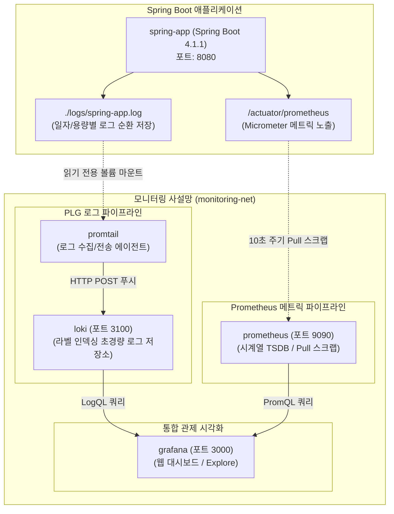

# 로그 및 메트릭 수집 PLG스택과 Prometheus 실습 가이드

> 💡 **[핵심 원리]** 클라우드 네이티브 컨테이너(Cattle)는 수초 만에 소멸하는 임시적(Ephemeral) 라이프사이클을 갖습니다. 컨테이너 내부 파일시스템에만 로그를 남기면 종료 시 영구 유실되므로, 호스트 볼륨 및 Logback 로그 순환 저장(Log Rotation)을 통해 디스크 고갈을 예방하고, Promtail-Loki-Grafana(PLG) 파이프라인으로 로그를 중앙 집계합니다. 또한 Spring Boot Actuator와 Micrometer를 연동하여 Prometheus(Pull 모델)로 시계열 메트릭을 수집하고 Grafana에서 실시간 시각화합니다.

---

## 1. 실습 개요 및 목표

### 1.1 실습 개요
본 실습에서는 클라우드 네이티브 관측성(Observability)의 양대 축인 **로그(Logs)**와 **메트릭(Metrics)**을 수집하고 통합 대시보드로 시각화하는 풀스택 관측성 파이프라인을 구축합니다. 애플리케이션 계층에서는 Logback의 `SizeAndTimeBasedRollingPolicy`를 설정하여 10MB 크기 및 7일 보관 주기로 로그를 순환 분할 저장하고 호스트 디렉터리로 바인드 마운트합니다. 로그 수집 에이전트인 Promtail이 이 로그를 실시간 테일링하여 초경량 라벨 인덱싱 로그 엔진인 Loki로 전송합니다. 동시에 Spring Boot Actuator와 Micrometer Prometheus 레지스트리를 통해 엔드포인트(`/actuator/prometheus`)를 노출하고, Prometheus 시계열 데이터베이스(TSDB)가 10초 주기로 지표를 스크랩(Pull)하도록 구성합니다. 최종적으로 Grafana에서 LogQL 및 PromQL을 활용하여 실시간 로그와 RPS, JVM 메모리 사용률, 활성 쓰레드 등을 한눈에 모니터링하는 통합 대시보드를 완성합니다.



### 1.2 ELK 스택 vs PLG 스택 비교

| 비교 항목 | ELK 스택 (Elasticsearch, Logstash, Kibana) | PLG 스택 (Promtail, Loki, Grafana) |
|---|---|---|
| **인덱싱 방식** | 로그 본문의 모든 단어를 역색인(Inverted Index) | 로그 본문은 미인덱싱(압축 보관), **라벨(메타데이터)만 인덱싱** |
| **메모리/자원 소모** | 수 GB ~ 수십 GB의 대규모 메모리(JVM Heap) 요구 | 최소 수백 MB 수준으로 극도의 초경량 작동 |
| **스토리지 비용** | 인덱스 크기가 원본 로그의 1~2배에 달함 | 고압축 청크 파일 저장으로 스토리지 비용 대폭 절감 |
| **적합한 환경** | 대규모 텍스트 검색 및 전문 분석 엔진 | **쿠버네티스/도커 컨테이너 클라우드 모니터링** |
| **대시보드 연계** | Elasticsearch 전용 Kibana 종속 | **Grafana 단일 화면에서 메트릭(Prometheus)+로그 결합 분석** |

### 1.3 실습 목표
- **로그 순환 저장 정책 수립**: Logback의 `SizeAndTimeBasedRollingPolicy`로 단일 파일 10MB, 7일 보관 주기의 디스크 고갈 방지 설정을 적용한다.
- **PLG 로그 파이프라인 구축**: Promtail → Loki → Grafana 흐름을 연동하고, Grafana Explore에서 LogQL로 특정 키워드(ERROR 등)를 필터링한다.
- **Actuator & Micrometer 메트릭 노출**: Spring Boot의 Actuator 설정과 Prometheus 메트릭 포맷 엔드포인트를 검증한다.
- **Prometheus Pull 아키텍처 실습**: `prometheus.yml` 스크랩 규칙을 정의하여 `spring-actuator` 타깃의 지표를 주기적으로 수집(State: UP)한다.
- **PromQL 질의 및 대시보드 제작**: RPS, JVM 힙 사용률, 활성 쓰레드 쿼리를 작성하고 커스텀 패널 3종(Time series, Gauge, Stat) 및 글로벌 표준 대시보드(ID 4701, 12856)를 구축한다.

---

## 2. 실습 환경 및 준비

### 2.1 실습 환경 요약
- **작업 디렉터리**: `~/workspace/simple-back`
- **호스트 런타임**: Docker Engine 24+ / Docker Compose v2+
- **가상 사설망**: `monitoring-net`
- **로그 공유 볼륨**: 호스트 `./logs` ↔ 컨테이너 `/app/logs` (app), `/var/log/app:ro` (promtail)

### 2.2 모니터링 스택 컨테이너 구성

| 서비스명 | 컨테이너명 | 이미지 | 포트 바인딩 | 주요 역할 |
|---|---|---|---|---|
| `app` | `spring-app` | 커스텀 빌드 | `8080:8080` | Spring Boot 애플리케이션, Actuator 노출, 로그 생성 |
| `loki` | `loki` | `grafana/loki:latest` | `3100:3100` | 라벨 기반 시계열 로그 스토리지 엔진 |
| `promtail` | `promtail` | `grafana/promtail:latest` | 내부 전용 | 로그 파일 실시간 수집 및 Loki 전송 에이전트 |
| `prometheus` | `prometheus` | `prom/prometheus:latest` | `9090:9090` | 시계열 메트릭 스크랩(Pull) 및 저장/질의 TSDB |
| `grafana` | `grafana` | `grafana/grafana:latest` | `3000:3000` | 웹 통합 관제 대시보드 (기본 계정: `admin` / `admin`) |

---

## 3. 핵심 실습 절차 (Step-by-Step)

### Step 1. Logback 로그 순환 저장(Log Rotation) 정책(logback-spring.xml) 구성

애플리케이션 로그를 콘솔뿐만 아니라 영속 파일로 기록하고, 날짜 변경 및 10MB 초과 시 파일을 분할 아카이빙하도록 설정합니다.

```bash
cd ~/workspace/simple-back
mkdir -p src/main/resources logs

cat <<EOF > src/main/resources/logback-spring.xml
<?xml version="1.0" encoding="UTF-8"?>
<configuration>
    <property name="LOG_PATH" value="logs"/>
    <property name="LOG_FILE_NAME" value="spring-app"/>

    <!-- 콘솔 출력용 Appender -->
    <appender name="CONSOLE" class="ch.qos.logback.core.ConsoleAppender">
        <encoder>
            <pattern>%d{yyyy-MM-dd HH:mm:ss.SSS} [%thread] %-5level %logger{36} - %msg%n</pattern>
        </encoder>
    </appender>

    <!-- 일자별 및 용량별 로그 순환(Log Rotation) 파일 Appender -->
    <appender name="FILE" class="ch.qos.logback.core.rolling.RollingFileAppender">
        <file>${LOG_PATH}/${LOG_FILE_NAME}.log</file>
        <rollingPolicy class="ch.qos.logback.core.rolling.SizeAndTimeBasedRollingPolicy">
            <fileNamePattern>${LOG_PATH}/${LOG_FILE_NAME}-%d{yyyy-MM-dd}.%i.log</fileNamePattern>
            <maxFileSize>10MB</maxFileSize>
            <maxHistory>7</maxHistory>
            <totalSizeCap>100MB</totalSizeCap>
        </rollingPolicy>
        <encoder>
            <pattern>%d{yyyy-MM-dd HH:mm:ss.SSS} [%thread] %-5level %logger{36} - %msg%n</pattern>
        </encoder>
    </appender>

    <root level="INFO">
        <appender-ref ref="CONSOLE"/>
        <appender-ref ref="FILE"/>
    </root>
</configuration>
EOF
```

> 💡 **[핵심 원리]**
> - `SizeAndTimeBasedRollingPolicy`: 날짜가 바뀌거나 단일 로그 파일이 `10MB`에 도달하면 `spring-app-2026-09-06.0.log` 형태로 아카이빙합니다.
> - `maxHistory: 7`: 최근 7일치 로그만 보관하고 이전 로그는 자동 삭제하여 디스크 풀(Disk Full) 장애를 원천 예방합니다.

### Step 2. 로컬 로그 디렉터리 바인드 및 설정 검증

설정 파일의 문법과 호스트 `logs/` 디렉터리의 상태를 점검합니다.

```bash
ls -ld logs
cat src/main/resources/logback-spring.xml | grep -E "LOG_PATH|maxFileSize"
```

> 📌 **[기대 출력 확인]**
> `logs` 디렉터리가 존재하고 `maxFileSize` 10MB 설정이 확인됩니다.

### Step 3. Loki 스토리지 및 인덱스 설정(loki-config.yml) 작성

Loki의 HTTP 수신 포트(`3100`), 청크 파일시스템 스토리지 및 TSDB 스키마를 구성합니다.

```bash
mkdir -p loki promtail

cat <<EOF > loki/loki-config.yml
auth_enabled: false

server:
  http_listen_port: 3100

common:
  path_prefix: /loki
  storage:
    filesystem:
      chunks_directory: /loki/chunks
      rules_directory: /loki/rules
  replication_factor: 1
  ring:
    kvstore:
      store: inmemory

schema_config:
  configs:
    - from: 2020-10-24
      store: tsdb
      object_store: filesystem
      schema: v13
      index:
        prefix: index_
        period: 24h

analytics:
  reporting_enabled: false
EOF
```

### Step 4. Promtail 파일 스크랩 및 Loki 푸시 설정(promtail-config.yml) 작성

로그 수집기 Promtail이 마운트된 로그 파일을 실시간 테일링하여 동일 사설망의 Loki로 전송하도록 설정합니다.

```bash
cat <<EOF > promtail/promtail-config.yml
server:
  http_listen_port: 9080
  grpc_listen_port: 0

positions:
  filename: /tmp/positions.yaml

clients:
  - url: http://loki:3100/loki/api/v1/push

scrape_configs:
  - job_name: spring-boot-logs
    static_configs:
      - targets:
          - localhost
        labels:
          job: spring-boot
          app: demo
          __path__: /var/log/app/*.log
EOF
```

> 💡 **[핵심 원리]**
> - `clients.url: http://loki:3100/loki/api/v1/push`: Docker Compose 내부 DNS 이름을 사용하여 Loki 컨테이너로 직접 로그를 푸시합니다.
> - `labels: job: spring-boot`: 로그 스트림을 필터링하기 위한 핵심 인덱싱 키를 부여합니다.

### Step 5. Loki, Promtail, Grafana 모니터링 서비스 compose.yaml 선언

애플리케이션과 PLG 로깅 스택 서비스를 선언합니다.

```bash
cat <<EOF > compose.yaml
services:
  app:
    build:
      context: .
      dockerfile: Dockerfile
    container_name: spring-app
    restart: on-failure
    ports:
      - "8080:8080"
    environment:
      PORT: 8080
      APP_MESSAGE: "Observability Pipeline Running!"
    volumes:
      - ./logs:/app/logs
    networks:
      - monitoring-net

  loki:
    image: grafana/loki:latest
    container_name: loki
    restart: always
    ports:
      - "3100:3100"
    volumes:
      - ./loki/loki-config.yml:/etc/loki/local-config.yaml:ro
    command: -config.file=/etc/loki/local-config.yaml
    networks:
      - monitoring-net

  promtail:
    image: grafana/promtail:latest
    container_name: promtail
    restart: always
    volumes:
      - ./promtail/promtail-config.yml:/etc/promtail/config.yml:ro
      - ./logs:/var/log/app:ro
    command: -config.file=/etc/promtail/config.yml
    depends_on:
      - loki
    networks:
      - monitoring-net

  grafana:
    image: grafana/grafana:latest
    container_name: grafana
    restart: always
    ports:
      - "3000:3000"
    environment:
      - GF_SECURITY_ADMIN_USER=admin
      - GF_SECURITY_ADMIN_PASSWORD=admin
    networks:
      - monitoring-net
EOF
```

### Step 6. monitoring-net 사설망 연동 및 구문 검증

모니터링 사설망을 추가하고 `compose.yaml` 구문을 검증합니다.

```bash
cat <<EOF >> compose.yaml

networks:
  monitoring-net:
EOF

docker compose config --quiet
```

### Step 7. PLG 스택 일괄 백그라운드 구동 및 컨테이너 헬스 점검

Compose 명령어로 PLG 스택 컨테이너를 구동합니다.

```bash
docker compose up -d
docker compose ps
```

> 📌 **[기대 출력 확인]**
> `spring-app`, `loki`, `promtail`, `grafana` 4개 서비스가 모두 `Up` 상태여야 합니다.

### Step 8. Grafana 대시보드 로그인 및 Loki 데이터 소스 연동

1. 웹 브라우저에서 `http://localhost:3000` 접속 (ID: `admin`, PW: `admin`)
2. 좌측 메뉴 **Connections** → **Data sources** → **Add data source** 클릭
3. **Loki** 선택 후 Server URL에 `http://loki:3100` 입력 (내부 DNS 이름 사용)
4. 하단 **Save & test** 클릭하여 `Data source successfully connected.` 녹색 알림 확인

### Step 9. 트래픽 발생 및 Explore 뷰 LogQL 실시간 로그 쿼리 검증

스프링부트에 HTTP 요청을 보내 로그를 발생시키고 Grafana Explore에서 실시간 로그를 확인합니다.

```bash
# 트래픽 발생
curl -s http://localhost:8080/
curl -s http://localhost:8080/users || true
```

1. Grafana 좌측 메뉴 **Explore** 클릭
2. 상단 데이터 소스를 **Loki**로 선택
3. **Label filters**에서 `job` = `spring-boot` 선택 후 **Run query** 클릭
4. 스프링부트의 실행 로그가 웹 화면에 실시간으로 표시되는 것을 확인합니다.
5. 특정 키워드 필터링 LogQL 쿼리 실행:
   ```logql
   {job="spring-boot"} |= "ERROR"
   ```

---

### Step 10. Actuator 및 Micrometer 구성 확인과 애플리케이션 재구동

`simple-back` 프로젝트의 `build.gradle`과 `application.yml`의 Actuator 및 Prometheus 연동 설정을 확인합니다.

```bash
# 1. 의존성 확인
grep -nE "actuator|micrometer-registry-prometheus" build.gradle

# 2. 엔드포인트 노출 설정 확인
cat src/main/resources/application.yml | grep -A 5 "management:"

# 3. 애플리케이션 재빌드 및 재구동
docker compose build app
docker compose up -d app
```

> 📌 **[기대 출력 확인]**
> `build.gradle`에 `spring-boot-starter-actuator`와 `micrometer-registry-prometheus`가 포함되어 있고, `application.yml`에 `exposure.include: health,info,prometheus`가 정의되어 있습니다.

### Step 11. Actuator 헬스 및 Prometheus 메트릭 엔드포인트 검증

스프링부트에서 메트릭이 올바른 평문 텍스트 규격으로 출력되는지 확인합니다.

```bash
# 1. 헬스체크 응답 확인
curl -s http://localhost:8080/actuator/health

# 2. Prometheus 메트릭 텍스트 출력 확인
curl -s http://localhost:8080/actuator/prometheus | head -n 20

# 3. 미노출 엔드포인트(env 등) 404 차단 확인 (보안 원칙)
curl -s -o /dev/null -w "%{http_code}
" http://localhost:8080/actuator/env
```

> 📌 **[기대 출력 확인]**
> `/actuator/prometheus`에서 `jvm_memory_used_bytes`, `http_server_requests_seconds_count` 등의 지표가 출력되고, `/actuator/env`는 `404`를 반환해야 합니다.

### Step 12. Prometheus 스크랩 규칙(prometheus.yml) 작성

Prometheus가 스프링부트의 Actuator 엔드포인트를 주기적으로 수집하도록 설정합니다.

```bash
mkdir -p prometheus

cat <<EOF > prometheus/prometheus.yml
global:
  scrape_interval: 15s
  evaluation_interval: 15s

scrape_configs:
  - job_name: prometheus
    static_configs:
      - targets: [localhost:9090]

  - job_name: spring-actuator
    metrics_path: /actuator/prometheus
    scrape_interval: 10s
    static_configs:
      - targets: [app:8080]
EOF
```

### Step 13. compose.yaml에 Prometheus 컨테이너 연동 및 Targets UP 점검

`compose.yaml`에 Prometheus 서비스를 추가하고 전체 스택을 재구동합니다.

```bash
cat <<EOF > compose.yaml
services:
  app:
    build:
      context: .
      dockerfile: Dockerfile
    container_name: spring-app
    restart: on-failure
    ports:
      - "8080:8080"
    environment:
      PORT: 8080
      APP_MESSAGE: "Full Observability Pipeline Running!"
    volumes:
      - ./logs:/app/logs
    networks:
      - monitoring-net

  loki:
    image: grafana/loki:latest
    container_name: loki
    restart: always
    ports:
      - "3100:3100"
    volumes:
      - ./loki/loki-config.yml:/etc/loki/local-config.yaml:ro
    command: -config.file=/etc/loki/local-config.yaml
    networks:
      - monitoring-net

  promtail:
    image: grafana/promtail:latest
    container_name: promtail
    restart: always
    volumes:
      - ./promtail/promtail-config.yml:/etc/promtail/config.yml:ro
      - ./logs:/var/log/app:ro
    command: -config.file=/etc/promtail/config.yml
    depends_on:
      - loki
    networks:
      - monitoring-net

  prometheus:
    image: prom/prometheus:latest
    container_name: prometheus
    restart: always
    ports:
      - "9090:9090"
    volumes:
      - ./prometheus/prometheus.yml:/etc/prometheus/prometheus.yml:ro
    networks:
      - monitoring-net

  grafana:
    image: grafana/grafana:latest
    container_name: grafana
    restart: always
    ports:
      - "3000:3000"
    environment:
      - GF_SECURITY_ADMIN_USER=admin
      - GF_SECURITY_ADMIN_PASSWORD=admin
    depends_on:
      - loki
      - prometheus
    networks:
      - monitoring-net

networks:
  monitoring-net:
EOF

docker compose up -d
docker compose ps
```

> 📌 **[기대 출력 확인]**
> 브라우저에서 `http://localhost:9090/targets`에 접속하여 `spring-actuator` 엔드포인트의 상태가 녹색의 **UP (1/1)**인지 확인합니다.

### Step 14. Prometheus Expression Browser 핵심 PromQL 쿼리 실습

Prometheus 웹 UI(`http://localhost:9090/graph`)에서 핵심 메트릭 질의를 실행합니다.

```promql
# 1. 초당 요청 수 (RPS) 계산
rate(http_server_requests_seconds_count[1m])

# 2. URI 및 HTTP 상태코드별 RPS 합산
sum(rate(http_server_requests_seconds_count[1m])) by (uri, status)

# 3. JVM 힙 메모리 사용률(%) 계산
(sum(jvm_memory_used_bytes{area="heap"}) / sum(jvm_memory_max_bytes{area="heap"})) * 100

# 4. 현재 활성 쓰레드 수
jvm_threads_live_threads
```

### Step 15. Grafana에 Prometheus 데이터 소스 연동 및 커스텀 대시보드 생성

1. Grafana(`http://localhost:3000`) 접속 후 **Connections** → **Data sources** → **Add data source** 클릭
2. **Prometheus** 선택 후 Server URL에 `http://prometheus:9090` 입력
3. **Save & test** 클릭하여 연결 확인
4. 좌측 상단 `+` 버튼 → **New dashboard**를 클릭하여 대시보드 생성

### Step 16. 핵심 시각화 패널 3종(Time series, Gauge, Stat) 직접 제작

1. **[패널 1] RPS 트렌드 차트 (Time series)**:
   - 시각화: `Time series`
   - PromQL 쿼리: `sum(rate(http_server_requests_seconds_count[1m])) by (uri)`
   - Title: `Endpoint Request Rate (RPS)` / Unit: `requests/sec (rps)`
2. **[패널 2] JVM 힙 메모리 사용률 (Gauge)**:
   - 시각화: `Gauge`
   - PromQL 쿼리: `(sum(jvm_memory_used_bytes{area="heap"}) / sum(jvm_memory_max_bytes{area="heap"})) * 100`
   - Title: `JVM Heap Memory Usage (%)` / Unit: `Percent (0-100)`
   - Thresholds: Green(0), Yellow(70), Red(85)
3. **[패널 3] 실시간 활성 쓰레드 수 (Stat)**:
   - 시각화: `Stat`
   - PromQL 쿼리: `jvm_threads_live_threads`
   - Title: `Active JVM Threads`
4. 우측 상단 저장 버튼을 클릭하고 이름을 `Spring Boot Custom Monitoring`으로 저장합니다.

### Step 17. 실무 표준 대시보드(ID 4701, 12856) 임포트 및 트래픽 부하 관측

글로벌 표준 오픈소스 JSON 대시보드를 임포트하고 가상 트래픽을 주입하여 변화를 관측합니다.

```bash
mkdir -p grafana/dashboards

# 1. JVM Micrometer 표준 대시보드 (ID: 4701)
curl -s -L https://grafana.com/api/dashboards/4701/revisions/latest/download -o grafana/dashboards/jvm-micrometer-4701.json

# 2. Spring Boot System Monitor 대시보드 (ID: 12856)
curl -s -L https://grafana.com/api/dashboards/12856/revisions/latest/download -o grafana/dashboards/spring-boot-system-monitor-12856.json

# 3. 50회 연속 트래픽 주입
for i in {1..50}; do curl -s http://localhost:8080/ > /dev/null; sleep 0.1; done
```

1. Grafana 상단 `+` → **Import dashboard** 선택
2. `jvm-micrometer-4701.json` 파일을 업로드하고 데이터 소스로 `Prometheus`를 선택한 뒤 **Import** 클릭
3. 새로고침 주기를 `5s`로 설정한 후 실시간 JVM 가비지 컬렉션, 힙 메모리, 쓰레드 변화를 관측합니다.

---

## 4. 실무 트러블슈팅 가이드

### Issue 1: Promtail 로그 수집 실패 또는 빈 로그 (no such file or directory)
- **증상**: Promtail 로그에 `/var/log/app/*.log: no such file or directory` 에러가 출력되고 Loki에 로그가 전달되지 않음.
- **원인**: 호스트의 `./logs` 디렉터리가 생성되지 않은 상태에서 컨테이너가 먼저 구동되었거나, Spring Boot의 Logback 출력 경로와 Promtail 볼륨 마운트 경로가 불일치함.
- **해결책**: 호스트 머신에서 `mkdir -p logs`로 디렉터리를 먼저 생성하고, `compose.yaml`에서 `./logs:/app/logs`(app) 및 `./logs:/var/log/app:ro`(promtail) 바인드 마운트가 정확한지 확인합니다.

### Issue 2: Grafana에서 데이터 소스 연결 실패 (Connection refused)
- **증상**: Grafana에서 Loki 또는 Prometheus 데이터 소스 등록 시 `HTTP Error: Connection refused` 발생.
- **원인**: Server URL에 `http://localhost:3100` 또는 `http://localhost:9090`을 입력한 경우입니다. Grafana 컨테이너 관점에서 `localhost`는 Grafana 컨테이너 자신을 의미하므로 대상 서비스에 도달할 수 없습니다.
- **해결책**: Compose 가상 사설망의 내장 DNS 서비스 이름을 사용하여 `http://loki:3100`, `http://prometheus:9090`으로 입력해야 합니다.

### Issue 3: Actuator /actuator/prometheus 404 에러
- **증상**: `curl http://localhost:8080/actuator/prometheus` 호출 시 HTTP `404 Not Found`가 반환됨.
- **원인**: `build.gradle`에 `micrometer-registry-prometheus` 의존성이 누락되었거나, `application.yml`의 `management.endpoints.web.exposure.include` 목록에 `prometheus`가 선언되지 않음.
- **해결책**: 의존성과 YAML 설정을 추가한 뒤, 반드시 `docker compose build app`으로 이미지를 다시 빌드하고 컨테이너를 재생성(`docker compose up -d app`)해야 합니다.

### Issue 4: Prometheus Targets 페이지에서 Target Down 에러
- **증상**: Prometheus 웹 콘솔 `http://localhost:9090/targets`에서 `spring-actuator`가 빨간색 `DOWN` 상태로 표시됨.
- **원인**: `prometheus.yml`의 targets에 `localhost:8080`을 기재한 경우, Prometheus 컨테이너 내부의 8080 포트를 조회하므로 실패합니다.
- **해결책**: `prometheus.yml`의 타깃 주소를 `app:8080` (Compose 서비스 이름)으로 명시해야 합니다.

---


## 5. 실습 자원 정리 (Cleanup)

실습이 끝난 후 모니터링 파이프라인 컨테이너와 네트워크를 완전히 정리합니다.

```bash
# 1. 전체 모니터링 스택 종료 및 볼륨 일괄 회수
docker compose down -v

# 2. 잔여 컨테이너 및 볼륨 확인
docker compose ps -a
docker volume ls | grep simple-back
```

> 📌 **[기대 출력 확인]**
> `docker compose ps -a` 결과에 실행 중이거나 중단된 컨테이너가 없어야 합니다.
