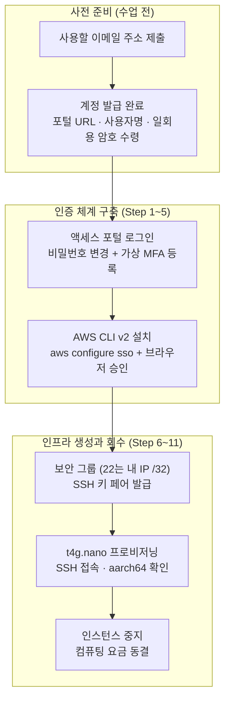

# 클라우드 기초 개념과 AWS 환경 세팅 실습 가이드

> 💡 **[핵심 원리]** 영구 액세스 키를 파일로 들고 다니는 대신, IAM Identity Center 포털에서 MFA로 인증하고 브라우저 승인을 거쳐 수 시간짜리 임시 STS 토큰을 발급받아 AWS CLI가 사용합니다. 계정에는 소형 ARM 인스턴스(`t4g.nano`/`micro`/`small`)만 허용하는 서비스 제어 정책(SCP) 가드레일이 걸려 있어 과금 사고가 API 레벨에서 차단되며, SSH(22)는 본인 공인 IP `/32`로만 열어 무차별 대입 공격 표면을 제거합니다.

---

## 1. 실습 개요 및 목표

### 1.1 실습 개요
본 실습은 로컬 컨테이너 환경을 벗어나 실제 클라우드 인프라를 다루는 첫 단계입니다. 각자 제출한 이메일 주소로 발급된 AWS 계정과 IAM Identity Center 사용자로 액세스 포털에 로그인하고, 초기 비밀번호 변경과 가상 MFA(TOTP) 등록을 마칩니다. 이어서 AWS CLI v2를 설치해 `aws configure sso`로 프로필을 등록하고 브라우저 승인을 거쳐 임시 자격 증명을 받습니다.

자격 증명이 준비되면 서울 리전(`ap-northeast-2`)의 가용 영역을 CLI와 콘솔 양쪽에서 대조하고, 기본 VPC에 보안 그룹과 SSH 키 페어를 만든 뒤 초경량 `t4g.nano`(ARM Graviton) 인스턴스를 프로비저닝합니다. SSH로 접속해 `aarch64` 아키텍처를 확인하고, 실습이 끝나면 즉시 인스턴스를 중지해 컴퓨팅 요금을 동결합니다.



### 1.2 실습 목표
- **계정 배정과 포털 인증**: 제출한 이메일로 발급된 계정에 일회용 암호로 로그인하고, 비밀번호 변경과 가상 MFA 등록을 완료한다.
- **단기 자격 증명 체계 이해**: 영구 액세스 키 대신 IAM Identity Center 기반 임시 STS 토큰을 사용하는 이유와 갱신 방법을 이해한다.
- **AWS CLI v2 설치 및 SSO 프로필 구성**: 호스트 터미널에 CLI v2를 설치하고 `aws configure sso`로 named profile을 등록한 뒤 브라우저 승인으로 세션을 발급받는다.
- **CLI와 콘솔 교차 검증**: STS 역할 세션과 서울 리전 가용 영역을 CLI 출력과 콘솔 화면에서 각각 확인한다.
- **최소 권한 네트워크 구성**: SSH(22)는 본인 공인 IP `/32`로 제한하고 웹 포트(80, 8080)만 공개하는 보안 그룹을 만든다.
- **ARM 인스턴스 프로비저닝과 비용 통제**: `t4g.nano` 인스턴스를 생성해 SSH로 접속하고 `aarch64`를 확인한 뒤 즉시 중지한다.

---

## 2. 실습 환경 및 준비

### 2.1 실습 환경 요약
- **리전**: `ap-northeast-2` (서울)
- **계정 구조**: AWS Organizations 조직의 교육용 멤버 계정 1인 1계정 (신용카드 등록 불필요)
- **인증 방식**: IAM Identity Center 액세스 포털 + 가상 MFA(TOTP) + 임시 STS 토큰 (세션 4시간)
- **로컬 터미널**: macOS/Linux는 `zsh`/`bash`, Windows는 **Git Bash** 기준 (PowerShell·PuTTY 계열은 6절 참고)
- **필수 도구**: AWS CLI v2, SSH 클라이언트, 스마트폰 인증 앱(Google Authenticator 등), 웹 브라우저
- **생성 자원**: 보안 그룹 1개, 키 페어 1개, `t4g.nano` 인스턴스 1대 (EBS 8GB)

### 2.2 수강생 사전 준비
1. **사용할 이메일 주소 제출** — 이 주소로 AWS 계정과 포털 사용자가 발급되므로 수업 중 확인 가능한 주소를 제출합니다.
2. **스마트폰 인증 앱 설치** — MFA 등록에 사용합니다. 기기 변경 시 복구가 필요하므로 앱의 백업 기능을 함께 확인합니다.
3. **터미널 준비** — Windows는 Git Bash를 설치해 둡니다.

## 3. 핵심 실습 절차 (Step-by-Step)

### Step 1. 액세스 포털 첫 로그인과 콘솔 진입
배부받은 포털 URL에 접속해 사용자명과 일회용 암호로 로그인합니다.

| 화면 | 볼 위치 | 확인 항목 |
|---|---|---|
| 포털 첫 화면 | `AWS 계정` 목록 | 배정 계정 1건과 권한 세트 이름(`InfraTrainingPowerUser`) |
| 계정 행 펼침 | 권한 세트 우측 | `Management console` 링크 |
| 콘솔 상단 바 | 우측 리전 선택기 | `아시아 태평양(서울) ap-northeast-2` |
| 콘솔 상단 바 | 우측 계정 메뉴 | 계정 ID와 현재 로그인된 역할 이름 |

### Step 2. 터미널 미인증 상태 확인
자격 증명이 없는 상태를 먼저 관찰합니다.

```bash
aws sts get-caller-identity
```

- 프로필이 없으면 `Unable to locate credentials`가 출력됩니다.
- 프로필은 있으나 세션이 만료된 경우에는 `Error loading SSO Token: Token for <세션명> does not exist`가 출력되며, 이때는 `aws sso login`을 다시 실행합니다.

**계정 가드레일**: 이 계정은 `t4g.nano`, `t4g.micro`, `t4g.small` 외의 인스턴스 생성이 API 레벨에서 거부됩니다. 거부 시 `UnauthorizedOperation` 메시지에 근거가 된 SCP 식별자가 함께 표시됩니다.

### Step 3. 비밀번호 변경과 가상 MFA 등록
1. 일회용 암호로 로그인하면 **비밀번호 변경 화면**이 먼저 표시되므로 새 비밀번호를 설정합니다.
2. 포털 우측 상단 **사용자 이름 메뉴**에서 MFA 디바이스 등록 항목으로 이동합니다. 최초 로그인 시 등록 화면이 바로 표시되기도 합니다.
3. **인증 앱(Authenticator app)**을 선택하고 스마트폰으로 QR 코드를 스캔한 뒤 6자리 코드를 입력합니다.
4. 로그아웃 후 새 비밀번호와 MFA 코드로 재로그인되는지 확인합니다.

> ⚠️ 인증 앱을 삭제하거나 스마트폰을 교체하면 본인이 직접 재등록할 수 없습니다. 강사가 Identity Center 콘솔에서 기존 디바이스를 해제해야 합니다.

### Step 4. AWS CLI v2 설치 및 버전 점검

```bash
# 기존 설치 여부 및 버전 확인
command -v aws
aws --version
```

```bash
# macOS / Linux / WSL2
curl -fsSL https://awscli.amazonaws.com/v2/install.sh | bash
export PATH="$HOME/.local/bin:$PATH"
aws --version
```

```bash
# Windows (Git Bash): 공식 MSI 설치 관리자 내려받아 설치
curl -o AWSCLIV2.msi https://awscli.amazonaws.com/AWSCLIV2.msi
MSYS_NO_PATHCONV=1 msiexec.exe /i AWSCLIV2.msi /qn

# 설치 후 Git Bash 창을 새로 열어 PATH를 반영한 뒤 확인
aws --version
```

- `MSYS_NO_PATHCONV=1`은 Git Bash가 `/i`, `/qn` 같은 Windows 옵션을 경로로 변환하는 것을 막는 설정입니다.
- 관리자 권한 승격(UAC) 창이 뜨면 승인하고, 승격이 차단된 환경에서는 내려받은 `AWSCLIV2.msi`를 탐색기에서 직접 실행합니다.

- **검증 기준**: 출력이 `aws-cli/2.`로 시작해야 합니다. (검증 환경 실측: `aws-cli/2.36.44 Python/3.14.7 Darwin/25.3.0 source/arm64`)
- macOS에서 Homebrew를 쓰는 경우 `brew install awscli`로 설치해도 동일한 v2가 설치됩니다.

### Step 5. SSO 프로필 등록과 브라우저 승인

```bash
# 대화형 SSO 프로필 등록
aws configure sso --profile student01

# SSO session name: infra-training
# SSO start URL: 배정받은_포털_URL
# SSO region: ap-northeast-2
# SSO registration scopes: sso:account:access
# (승인 후 계정과 권한 세트를 목록에서 선택)
# CLI default client Region: ap-northeast-2
# CLI default output format: json
# CLI profile name: student01

# 세션 갱신 및 환경변수 고정
aws sso login --profile student01
export AWS_PROFILE="student01"
export AWS_REGION="ap-northeast-2"
export AWS_PAGER=""
```

| 브라우저 화면 | 볼 위치 | 조작 |
|---|---|---|
| 디바이스 승인 | 화면 중앙의 8자리 코드 | 터미널에 출력된 코드와 일치하는지 확인 후 진행 |
| 권한 요청 | 하단 버튼 | `Allow access` 선택 |
| 승인 완료 | 상단 문구 | 승인 완료 표시를 확인한 뒤 터미널로 복귀 |

> ⚠️ 브라우저 승인을 끝내지 않으면 토큰이 발급되지 않습니다. 중간에 터미널을 `Ctrl + C`로 끊으면 클라이언트 등록 정보만 남고 이후 모든 명령이 `Error loading SSO Token`으로 실패합니다.

### Step 6. STS 자격 증명과 가용 영역 교차 검증

```bash
# 1. 현재 세션의 역할 자격 증명 확인
aws sts get-caller-identity

# 2. 서울 리전 가용 영역 조회
aws ec2 describe-availability-zones \
  --filters "Name=state,Values=available" \
  --query "AvailabilityZones[].{Zone:ZoneName,State:State}" \
  --output table
```

- `Arn`이 `arn:aws:sts::<계정ID>:assumed-role/AWSReservedSSO_InfraTrainingPowerUser_.../<사용자명>` 형식이면 정상입니다.
- 가용 영역 `ap-northeast-2a`, `2b`, `2c`, `2d` 4개가 표로 출력됩니다.
- **콘솔 대조**: VPC 콘솔 → `서브넷` 목록의 `가용 영역` 열에서 기본 서브넷 4개가 각각 다른 AZ에 있는지 확인합니다.

### Step 7. 기본 VPC 조회와 보안 그룹 생성

```bash
# 1. 기본 VPC ID 조회
export VPC_ID=$(aws ec2 describe-vpcs \
  --filters "Name=is-default,Values=true" \
  --query "Vpcs[0].VpcId" --output text)
echo "기본 VPC ID: $VPC_ID"

# 2. 개인 실습용 보안 그룹 생성
export MY_SG_NAME="student01-web-sg"
export MY_SG_ID=$(aws ec2 create-security-group \
  --group-name "$MY_SG_NAME" \
  --description "Security Group for Spring Boot and Nginx Practice" \
  --vpc-id "$VPC_ID" \
  --tag-specifications "ResourceType=security-group,Tags=[{Key=Name,Value=$MY_SG_NAME},{Key=Course,Value=infra-training}]" \
  --query "GroupId" --output text)
echo "생성된 보안 그룹 ID: $MY_SG_ID"
```

### Step 8. 인바운드 규칙 등록과 콘솔 교차 검증

```bash
# 1. 내 공인 IP 자동 감지
export MY_IP=$(curl -fsS https://checkip.amazonaws.com)
echo "내 공인 IP: $MY_IP"

# 2. SSH는 내 IP만, 웹 포트는 전역 허용
aws ec2 authorize-security-group-ingress --group-id "$MY_SG_ID" --protocol tcp --port 22 --cidr "$MY_IP/32"
aws ec2 authorize-security-group-ingress --group-id "$MY_SG_ID" --protocol tcp --port 80 --cidr 0.0.0.0/0
aws ec2 authorize-security-group-ingress --group-id "$MY_SG_ID" --protocol tcp --port 8080 --cidr 0.0.0.0/0

# 3. 등록 결과 확인
aws ec2 describe-security-groups --group-ids "$MY_SG_ID" \
  --query "SecurityGroups[0].IpPermissions[].{Port:FromPort,Proto:IpProtocol,Cidr:IpRanges[0].CidrIp}" \
  --output table
```

- **콘솔 대조**: EC2 콘솔 좌측 메뉴 **네트워크 및 보안 → 보안 그룹**에서 생성한 그룹을 클릭하고, 하단 **인바운드 규칙** 탭의 `포트 범위`·`소스` 열에서 22번이 내 공인 IP `/32`로 한정되어 있는지 확인합니다.

### Step 9. SSH 키 페어 발급과 권한 축소

```bash
mkdir -p ~/.ssh
export MY_KEY_NAME="student01-key"

aws ec2 create-key-pair \
  --key-name "$MY_KEY_NAME" \
  --query "KeyMaterial" \
  --output text > ~/.ssh/"$MY_KEY_NAME".pem

chmod 400 ~/.ssh/"$MY_KEY_NAME".pem
ls -l ~/.ssh/"$MY_KEY_NAME".pem
```

- **검증 기준**: `-r--------`(400) 권한. 개인키는 생성 시점에 단 한 번만 반환되므로 분실하면 키 페어를 다시 만들어야 합니다.
- Windows PowerShell·PuTTY 계열 사용자는 6절의 절차를 따릅니다.

### Step 10. Ubuntu ARM AMI 조회와 t4g.nano 프로비저닝

```bash
# 1. 서울 리전 최신 Ubuntu 26.04 ARM AMI 조회
export AMI_ID=$(aws ssm get-parameter \
  --name /aws/service/canonical/ubuntu/server/26.04/stable/current/arm64/hvm/ebs-gp3/ami-id \
  --query "Parameter.Value" --output text)
echo "최신 Ubuntu ARM AMI: $AMI_ID"

# 2. 인스턴스 프로비저닝
export INSTANCE_ID=$(aws ec2 run-instances \
  --image-id "$AMI_ID" \
  --instance-type t4g.nano \
  --key-name "$MY_KEY_NAME" \
  --security-group-ids "$MY_SG_ID" \
  --tag-specifications "ResourceType=instance,Tags=[{Key=Name,Value=student01-test-ec2},{Key=Course,Value=infra-training}]" \
  --query "Instances[0].InstanceId" --output text)
echo "프로비저닝 인스턴스 ID: $INSTANCE_ID"

# 3. 상태 대기 (임의의 sleep 대신 공식 waiter 사용)
aws ec2 wait instance-running --instance-ids "$INSTANCE_ID"
aws ec2 wait instance-status-ok --instance-ids "$INSTANCE_ID"

# 4. 공인 IP 조회
export PUBLIC_IP=$(aws ec2 describe-instances \
  --instance-ids "$INSTANCE_ID" \
  --query "Reservations[0].Instances[0].PublicIpAddress" --output text)
echo "할당된 퍼블릭 IP: $PUBLIC_IP"
```

| 콘솔에서 볼 위치 | 확인 항목 |
|---|---|
| EC2 → `인스턴스` 목록의 `인스턴스 상태` 열 | `실행 중` |
| 같은 목록의 `상태 검사` 열 | `2/2개 검사 통과` (실측 약 2분 소요) |
| 인스턴스 선택 후 하단 `세부 정보` 탭 | `퍼블릭 IPv4 주소`가 CLI 출력과 동일 |

### Step 11. SSH 접속, 아키텍처 검증, 인스턴스 중지

```bash
ssh -i ~/.ssh/"$MY_KEY_NAME".pem -o StrictHostKeyChecking=accept-new ubuntu@"$PUBLIC_IP"
```

```bash
# ─── 원격 EC2 터미널 내부 ───
uname -m                                  # 출력: aarch64
grep PRETTY_NAME /etc/os-release          # 출력: Ubuntu 26.04.1 LTS
free -h | head -2                         # t4g.nano 메모리 약 405Mi
exit
# ────────────────────────────
```

- AMI 메타데이터의 `arm64`와 커널 `uname -m`의 `aarch64`는 동일 아키텍처의 서로 다른 표기 규격입니다.

```bash
# 비용 통제: 인스턴스 즉시 중지
aws ec2 stop-instances --instance-ids "$INSTANCE_ID"
aws ec2 wait instance-stopped --instance-ids "$INSTANCE_ID"
echo "인스턴스가 안전하게 중지(Stopped)되었습니다."
```

---

## 4. 실무 트러블슈팅 가이드

### Issue 1: `Error loading SSO Token: Token for ... does not exist`
브라우저 승인이 완료되지 않았거나 세션이 만료된 경우입니다. `aws sso login --profile student01`을 다시 실행하고, 브라우저에서 코드 확인 → `Allow access`까지 끝냅니다. 세션 유효 기간은 4시간이며 수업 중 재로그인이 필요할 수 있습니다.

### Issue 2: 가드레일 확인 시 `InvalidParameterValue` (아키텍처 불일치)
ARM AMI에 `t3.micro` 같은 x86 인스턴스 타입을 지정하면 SCP 평가 이전에 아키텍처 불일치로 먼저 실패합니다. 가드레일 거부를 확인하려면 AMI와 같은 아키텍처의 허용 목록 외 타입(`t4g.medium`, `m7g.large`)을 사용합니다. 정상 거부 시에는 `UnauthorizedOperation ... explicit deny in a service control policy` 메시지가 출력됩니다.

### Issue 3: SSH 접속이 응답 없이 멈춤 (timeout)
카페·테더링 전환 등으로 공인 IP가 바뀌면 기존 `/32` 규칙이 더 이상 본인을 가리키지 않습니다. `curl -fsS https://checkip.amazonaws.com`으로 현재 IP를 다시 확인하고 22번 규칙을 새로 등록합니다. 인스턴스를 재시작한 경우에는 공인 IP도 바뀌므로 `describe-instances`로 다시 조회합니다.

### Issue 4: `WARNING: UNPROTECTED PRIVATE KEY FILE!`
개인키 권한이 느슨할 때 OpenSSH가 접속을 거부합니다. Git Bash·WSL2에서는 `chmod 400`, PowerShell에서는 `icacls`로 상속 권한을 제거합니다(6절 참고). WSL2에서 `/mnt/c/...` 경로의 키는 `chmod`가 반영되지 않으므로 WSL 홈(`~/.ssh/`)으로 복사한 뒤 권한을 조정합니다.

### Issue 5: 일회용 암호 만료 또는 MFA 기기 분실
일회용 암호는 발급 후 7일간만 유효합니다. 만료되었거나 인증 앱을 잃어버린 경우 본인이 복구할 수 없으므로 강사에게 암호 재발급 또는 MFA 디바이스 해제를 요청합니다.

---

## 5. 실습 자원 정리 (Cleanup)

### 5.1 당일 세션 종료 시 (후속 실습 재사용을 위한 중지 유지)

```bash
aws ec2 describe-instances \
  --instance-ids "$INSTANCE_ID" \
  --query "Reservations[0].Instances[0].{State:State.Name,Ip:PublicIpAddress}" --output json
# {"State": "stopped", "Ip": null}
```

- 중지와 동시에 동적 공인 IP가 AWS 공용 풀로 회수되어 `null`로 조회되며, 재시작 시 새 주소가 할당됩니다. 고정 IP(EIP)는 유휴 상태에서 과금되므로 실습에서는 생성하지 않습니다.
- 중지 상태에서는 컴퓨팅 요금이 발생하지 않고 EBS 보관료(8GB)만 소액 유지됩니다.

### 5.2 전체 실습 종료 후 (자원 전면 삭제)

```bash
# 1. 인스턴스 영구 종료
aws ec2 terminate-instances --instance-ids "$INSTANCE_ID"
aws ec2 wait instance-terminated --instance-ids "$INSTANCE_ID"

# 2. 보안 그룹 삭제
aws ec2 delete-security-group --group-id "$MY_SG_ID"

# 3. 키 페어 등록 해제 및 로컬 파일 삭제
aws ec2 delete-key-pair --key-name "$MY_KEY_NAME"
rm -f ~/.ssh/"$MY_KEY_NAME".pem
```

---

## 6. Appendix: Windows 호스트의 SSH 키 권한 설정과 PuTTY 계열 도구

본 실습의 명령어는 Git Bash 기준입니다. 다른 Windows 환경에서는 키 파일의 권한과 형식만 맞추면 동일하게 접속할 수 있습니다.

| 환경 | SSH 클라이언트 | 키 형식 | 권한 처리 방식 |
|---|---|---|---|
| Git Bash (표준) | 번들 OpenSSH | `.pem` | `chmod 400` 그대로 적용 |
| WSL2 | 리눅스 OpenSSH | `.pem` | `chmod 400` 적용. `/mnt/c/...` 경로에서는 미반영 |
| PowerShell | Windows 내장 OpenSSH | `.pem` | `icacls`로 상속 제거 후 소유자만 읽기 허용 |
| PuTTY 계열 | PuTTY · SuperPuTTY | `.ppk` | 파일 권한 검사 없음. PuTTYgen 변환 필요 |

### 6.1 PowerShell에서 키 권한 조정
Windows 10 1803 버전부터 OpenSSH 클라이언트가 기본 내장되어 PuTTY 없이도 접속할 수 있습니다. NTFS 상속 권한이 남아 있으면 `UNPROTECTED PRIVATE KEY FILE` 오류가 발생하므로 접근 주체를 소유자 한 명으로 축소합니다.

```powershell
$KEY="$env:USERPROFILE\.ssh\student01-key.pem"
icacls $KEY /inheritance:r
icacls $KEY /grant:r "$env:USERNAME:R"
ssh -i $KEY ubuntu@<인스턴스_공인_IP>
```

### 6.2 PuTTY 계열 도구와 `.ppk` 변환
PuTTY는 자체 키 형식(`.ppk`, PuTTY Private Key)만 인식하므로 `.pem`을 PuTTYgen으로 변환해야 합니다.

```powershell
# GUI에서는 Load로 .pem을 연 뒤 Save private key 실행
puttygen student01-key.pem -o student01-key.ppk

# 반대 방향 변환 (.ppk를 OpenSSH 형식으로)
puttygen student01-key.ppk -O private-openssh -o student01-key.pem
```

| 도구 | 역할 | 사용 시점 |
|---|---|---|
| PuTTYgen | `.pem`과 `.ppk` 상호 변환 및 키 생성 | 최초 1회 변환 |
| PuTTY | 단일 SSH 세션 접속 | `Session`에 `ubuntu@<공인 IP>`, `Connection → SSH → Auth → Credentials`에 `.ppk` 지정 |
| Pageant | 메모리 상주 키 에이전트 | `.ppk`를 등록해 두면 세션마다 키 지정 생략 |
| SuperPuTTY | PuTTY 세션의 탭 관리 및 목록 저장 | 다수 인스턴스를 동시에 관리할 때. 설정에서 `putty.exe` 경로 지정 필요, 파일 전송은 `pscp` 사용 |

- `.ppk`는 PuTTY 전용 형식이라 OpenSSH `ssh -i`에 그대로 넘길 수 없습니다. 두 형식 모두 개인키이므로 동일한 수준으로 보호합니다.
- SuperPuTTY는 세션 정보를 설정 파일에 저장하므로 공용 PC에서는 사용 후 세션 목록과 키 파일을 정리합니다.
