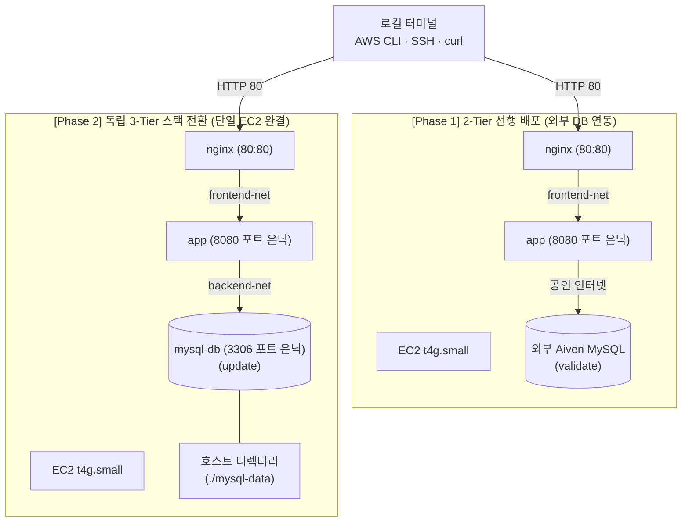

# AWS EC2 Docker Compose 배포와 Nginx 리버스 프록시 실습 가이드

> 💡 **[핵심 원리]** 단일 EC2 인스턴스에 Nginx·Spring Boot·MySQL 전체 스택을 한 번에 배포하면 네트워크 격리, DB 초기화 지연, 프록시 바인딩 오류가 복합적으로 얽혀 장애 추적이 어려워집니다. 따라서 **2단계 점진적 배포 전략(Phase 1: 외부 Aiven DB 연동 2-Tier 선행 → Phase 2: 단일 EC2 독립 3-Tier 스택 전환)**을 적용합니다. 대외 진입점은 Nginx(80) 하나뿐이며, Spring Boot(8080)와 MySQL(3306)은 호스트 포트를 열지 않고 가상 사설망(`frontend-net`, `backend-net`) 내부에서만 통신합니다. 신규 로컬 MySQL은 빈 DB이므로 `SPRING_JPA_HIBERNATE_DDL_AUTO=update`로 테이블을 자동 생성하며, 호스트 바인드 마운트(`./mysql-data:/var/lib/mysql`)를 통해 데이터 영속성과 직관적인 파일 가시성을 확보합니다.

---

## 1. 실습 개요 및 목표

### 1.1 실습 개요
멀티 컨테이너 구동에 필요한 메모리를 확보하기 위해 `t4g.small`(2GiB) EC2 인스턴스를 새로 프로비저닝합니다. 교육용 AWS 계정은 여러 수강생이 함께 쓰므로, 모든 자원 이름을 배부받은 사용자명 하나(`STUDENT_ID`)에서 파생시키고 `Owner` 태그를 부여해 다른 수강생의 자원과 섞이지 않게 합니다. 새 인스턴스에는 Docker가 없으므로 공식 설치 스크립트로 엔진과 Compose 플러그인을 설치하고, `ubuntu` 계정이 `docker` 그룹에 속하지 않아 모든 Docker 명령에 `sudo`가 필요하다는 점을 확인합니다.

이어서 2단계 점진적 배포를 수행합니다:
1. **Phase 1 (2-Tier 배포)**: 직전 07-1 차시에서 구축한 외부 클라우드 관리형 DB(Aiven MySQL) 환경을 재활용하여 Nginx(80) + Spring Boot(8080) 스택을 `.env.aiven`과 `compose.yaml`로 먼저 백그라운드 구동하고 80번 포트 응답과 8080번 포트 차단을 검증합니다.
2. **Phase 2 (독립 3-Tier 스택 전환)**: 단일 EC2 내부에 MySQL 8.0 컨테이너를 추가한 완전한 3-Tier 스택으로 확장합니다. `.env.mysql`과 `compose-mysql.yml`을 Gist curl로 신속히 다운로드(또는 수동 작성)하고, 빈 DB에 맞춰 `SPRING_JPA_HIBERNATE_DDL_AUTO=update`를 주입하며, `./mysql-data` 호스트 바인드 마운트로 데이터 영속성을 확보합니다.



### 1.2 실습 목표
- **공유 계정 자원 분리**: 모든 자원 이름을 `STUDENT_ID`에서 파생시키고 `Name`·`Course`·`Owner` 태그를 부여해 다른 수강생 자원과 구분한다.
- **인스턴스 프로비저닝과 런타임 구성**: `t4g.small` 인스턴스를 새로 만들고 Docker 엔진과 Compose 플러그인을 설치해 실행 권한 체계를 확인한다.
- **리버스 프록시 구성**: Nginx를 단일 대외 진입점으로 두고 클라이언트 원본 IP 보존 헤더(`X-Real-IP`, `X-Forwarded-For`)를 전달하도록 설정한다.
- **[Phase 1] 2-Tier 선행 검증**: 외부 Aiven DB를 연동한 Nginx-Spring Boot 스택으로 80번 포트 정상 응답과 8080 포트 직접 접속 차단을 1차 검증한다.
- **[Phase 2] 독립 3-Tier 전환 및 DDL 전략**: 단일 EC2 내부에 MySQL 컨테이너를 결합하고, JPA DDL Auto(`update`) 테이블 자동 생성 및 호스트 바인드 마운트(`mysql-data`) 데이터 영속성을 검증한다.
- **메모리 예산 수립과 자원 통제**: 컨테이너별 메모리 상한(64M, 896M, 512M)을 배분해 커널 OOM Killer를 예방하고, 실습 종료 후 스택 정리와 인스턴스 중지로 과금을 동결한다.

---

## 2. 실습 환경 및 준비

### 2.1 실습 환경 요약

| 구분 | 내용 |
| --- | --- |
| AWS 자원 | 이번 차시에서 새로 만드는 키 페어 `${STUDENT_ID}-key`, 보안 그룹 `${STUDENT_ID}-web-sg`, 인스턴스 `${STUDENT_ID}-compose-ec2` |
| 인스턴스 사양 | `t4g.small`(ARM64 Graviton, 2GiB RAM), Ubuntu 최신 LTS |
| 작업 디렉터리 | `~/workspace/aws-lab` — 키 페어 `.pem` 보관 위치이며 모든 AWS CLI 명령을 이 디렉터리에서 실행 |
| CLI 환경변수 | `STUDENT_ID`에서 `AWS_PROFILE`·`MY_KEY_NAME`·`MY_SG_NAME`·`MY_INSTANCE_NAME`을 파생, `AWS_REGION="ap-northeast-2"`·`AWS_PAGER=""` 병행 선언 |
| 터미널 | macOS/Linux는 `bash`/`zsh`, Windows는 Git Bash 또는 WSL2 |
| 컨테이너 런타임 | 공식 Docker 엔진 최신 버전 및 Docker Compose v2 플러그인 |
| 환경 파일 및 컴포즈 명세 | Phase 1 (`.env.aiven`, `compose.yaml`), Phase 2 (`.env.mysql`, `compose-mysql.yml`) |
| 원격 명령 권한 | `ubuntu` 계정은 `docker` 그룹 비소속. EC2 안의 모든 Docker 명령을 `sudo docker`·`sudo docker compose`로 실행 |
| 컨테이너 이미지 | `ghcr.io/<본인 GitHub 아이디>/simple-back:latest`, `nginx:alpine`, `mysql:8.0` |

### 2.2 사전 준비 확인
1. **이전 차시 자원이 남아 있지 않다고 전제합니다.** 키 페어 발급부터 새로 시작하며, `.pem` 파일이 이미 있으면 재발급하지 않고 그대로 재사용합니다.
2. **키 페어 `.pem`은 Git 저장소 안에 두지 않습니다.** `~/workspace/aws-lab`에 보관하고 발급 직후 `chmod 400`으로 권한을 제한합니다. Windows PowerShell을 쓴다면 `icacls`로 상속을 제거하고, WSL2는 `/mnt/c/...`가 아니라 WSL 홈 아래 작업 디렉터리를 사용합니다.
3. **본인 공인 IP를 확인합니다.** SSH 22번 규칙은 `0.0.0.0/0`이 아니라 `내_공인_IP/32`로만 엽니다. 네트워크가 바뀌면 규칙을 다시 등록해야 합니다.
4. **GHCR 이미지가 발행되어 있는지 확인합니다.** 이미지 이름은 워크플로가 `${{ github.repository }}`를 그대로 쓰므로 **저장소 이름과 같습니다**. ARM64 인스턴스에서 구동하므로 `linux/arm64` 매니페스트가 포함되어 있어야 합니다.
5. **비밀번호·자격증명은 문서나 이미지에 하드코딩하지 않습니다.** DB 접속 정보는 `.env.aiven` 및 `.env.mysql` 파일로 분리해 실행 시점에 주입합니다.

---

## 3. 핵심 실습 절차 (Step-by-Step)

### Step 1. 실습 식별자 정의와 키 페어·보안 그룹 준비
교육용 계정은 여러 수강생이 공유하므로, 모든 자원 이름을 사용자명 하나에서 파생시키고 `Owner` 태그를 부여합니다.

```bash
# 1. 실습 식별자와 공통 환경변수 (본인 값으로 바꾸는 곳은 첫 줄뿐입니다)
export STUDENT_ID="student01"
export AWS_PROFILE="$STUDENT_ID"
export AWS_REGION="ap-northeast-2"
export AWS_PAGER=""

export MY_KEY_NAME="${STUDENT_ID}-key"
export MY_SG_NAME="${STUDENT_ID}-web-sg"
export MY_INSTANCE_NAME="${STUDENT_ID}-compose-ec2"

mkdir -p ~/workspace/aws-lab && cd ~/workspace/aws-lab

# 2. 키 페어: 로컬 .pem이 없으면 기존 키를 정리하고 새로 발급
if [ ! -f ./"$MY_KEY_NAME".pem ]; then
  aws ec2 delete-key-pair --key-name "$MY_KEY_NAME" >/dev/null 2>&1
  aws ec2 create-key-pair --key-name "$MY_KEY_NAME" \
    --tag-specifications "ResourceType=key-pair,Tags=[{Key=Name,Value=$MY_KEY_NAME},{Key=Course,Value=infra-training},{Key=Owner,Value=$STUDENT_ID}]" \
    --query "KeyMaterial" --output text > ./"$MY_KEY_NAME".pem
  chmod 400 ./"$MY_KEY_NAME".pem
fi
ls -l ./"$MY_KEY_NAME".pem

# 3. 보안 그룹: 없으면 생성, 있으면 재사용
export MY_SG_ID=$(aws ec2 describe-security-groups \
  --filters "Name=group-name,Values=$MY_SG_NAME" \
  --query "SecurityGroups[0].GroupId" --output text)

if [ "$MY_SG_ID" = "None" ]; then
  export VPC_ID=$(aws ec2 describe-vpcs --filters "Name=is-default,Values=true" \
    --query "Vpcs[0].VpcId" --output text)
  export MY_SG_ID=$(aws ec2 create-security-group \
    --group-name "$MY_SG_NAME" --vpc-id "$VPC_ID" \
    --description "Security Group for Docker Compose Practice" \
    --tag-specifications "ResourceType=security-group,Tags=[{Key=Name,Value=$MY_SG_NAME},{Key=Course,Value=infra-training},{Key=Owner,Value=$STUDENT_ID}]" \
    --query "GroupId" --output text)
fi
echo "보안 그룹 ID: $MY_SG_ID"

# 4. 인바운드 규칙 (이미 등록되어 있으면 중복 오류가 나며 그대로 두어도 됩니다)
export MY_IP=$(curl -fsS https://checkip.amazonaws.com)
aws ec2 authorize-security-group-ingress --group-id "$MY_SG_ID" --protocol tcp --port 22 --cidr "$MY_IP/32"
aws ec2 authorize-security-group-ingress --group-id "$MY_SG_ID" --protocol tcp --port 80 --cidr 0.0.0.0/0
aws ec2 authorize-security-group-ingress --group-id "$MY_SG_ID" --protocol tcp --port 8080 --cidr 0.0.0.0/0

aws ec2 describe-security-groups --group-ids "$MY_SG_ID" \
  --query "SecurityGroups[0].IpPermissions[].{Port:FromPort,Cidr:IpRanges[0].CidrIp}" --output table
```

- **검증 기준**: 인바운드 규칙 표에 22번이 `내_공인_IP/32`로, 80·8080번이 `0.0.0.0/0`으로 나타납니다.
- 8080번을 여는 이유는 애플리케이션을 노출하기 위해서가 아니라, Step 13에서 포트 매핑이 없으면 보안 그룹이 열려 있어도 접속되지 않음을 대조하기 위해서입니다.

### Step 2. t4g.small 인스턴스 프로비저닝 및 공인 IP 확인
3개 컨테이너를 동시에 구동하기 위해 처음부터 `t4g.small`(2GiB)로 프로비저닝합니다.

```bash
# 1. 같은 이름의 인스턴스가 살아 있는지 확인 (빈 결과여야 정상)
aws ec2 describe-instances \
  --filters "Name=tag:Name,Values=$MY_INSTANCE_NAME" "Name=tag:Owner,Values=$STUDENT_ID" \
            "Name=instance-state-name,Values=pending,running,stopping,stopped" \
  --query "Reservations[].Instances[].[InstanceId,InstanceType,State.Name]" --output table

# 2. 최신 Ubuntu 26.04 ARM AMI 조회
export AMI_ID=$(aws ssm get-parameter \
  --name /aws/service/canonical/ubuntu/server/26.04/stable/current/arm64/hvm/ebs-gp3/ami-id \
  --query "Parameter.Value" --output text)

# 3. 인스턴스 프로비저닝 및 상태 검사 통과 대기
export INSTANCE_ID=$(aws ec2 run-instances \
  --image-id "$AMI_ID" --instance-type t4g.small \
  --key-name "$MY_KEY_NAME" --security-group-ids "$MY_SG_ID" \
  --tag-specifications "ResourceType=instance,Tags=[{Key=Name,Value=$MY_INSTANCE_NAME},{Key=Course,Value=infra-training},{Key=Owner,Value=$STUDENT_ID}]" \
  --query "Instances[0].InstanceId" --output text)
echo "인스턴스 ID: $INSTANCE_ID"

aws ec2 wait instance-running --instance-ids "$INSTANCE_ID"
aws ec2 wait instance-status-ok --instance-ids "$INSTANCE_ID"

# 4. 공인 IP 조회
export PUBLIC_IP=$(aws ec2 describe-instances --instance-ids "$INSTANCE_ID" \
  --query "Reservations[0].Instances[0].PublicIpAddress" --output text)
echo "공인 IP: $PUBLIC_IP"
```

- **검증 기준**: `wait instance-status-ok`가 2~3분 내 반환되고 공인 IP가 출력됩니다.
- **참고 (이전 인스턴스 재사용)**: 선행 차시 인스턴스가 `stopped`로 남아 있다면 새로 만들지 않고 사양만 올릴 수 있습니다. 유형 변경은 중지 상태에서만 가능하며, 재시작 시 공인 IP가 새로 할당되므로 `PUBLIC_IP`를 다시 조회합니다.

```bash
export INSTANCE_ID=$(aws ec2 describe-instances \
  --filters "Name=tag:Owner,Values=$STUDENT_ID" "Name=instance-state-name,Values=stopped" \
  --query "Reservations[0].Instances[0].InstanceId" --output text)
aws ec2 modify-instance-attribute --instance-id "$INSTANCE_ID" --instance-type "Value=t4g.small"
aws ec2 start-instances --instance-ids "$INSTANCE_ID"
aws ec2 wait instance-status-ok --instance-ids "$INSTANCE_ID"
```

### Step 3. Docker 엔진 설치 및 실행 권한 확인
새로 만든 인스턴스에는 Docker가 없으므로 공식 설치 스크립트로 엔진과 Compose 플러그인을 설치합니다.

```bash
ssh -i ./"$MY_KEY_NAME".pem -o StrictHostKeyChecking=accept-new ubuntu@"$PUBLIC_IP"
```

```bash
# ─── (원격 EC2 터미널 내부 실행) ───
uname -m
free -h | head -2

curl -fsSL https://get.docker.com -o get-docker.sh
sudo sh get-docker.sh

sudo systemctl is-active docker
sudo docker --version
sudo docker compose version

docker ps      # sudo 없이 실행하면 거부됩니다
```

- **검증 기준**: `uname -m`이 `aarch64`, `free -h`가 `Mem: 1.8Gi`, `systemctl is-active docker`가 `active`로 출력되고 Compose 플러그인 버전이 응답합니다.
- `sudo` 없는 `docker ps`는 `permission denied while trying to connect to the docker API at unix:///var/run/docker.sock`로 거부됩니다. 이후 원격 Docker 명령은 모두 `sudo`와 함께 실행합니다.

### Step 4. Nginx 리버스 프록시 설정 파일 작성
80번 포트로 유입된 요청을 내부 스프링부트 컨테이너로 중계하는 설정 파일을 작성합니다.

```bash
# ─── (원격 EC2 터미널 내부 실행) ───
cat <<'EOF' > nginx.conf
events {
    worker_connections 1024;
}

http {
    server {
        listen 80;

        location / {
            proxy_pass http://app:8080;
            proxy_set_header Host $host;
            proxy_set_header X-Real-IP $remote_addr;
            proxy_set_header X-Forwarded-For $proxy_add_x_forwarded_for;
        }
    }
}
EOF
cat nginx.conf
```

- `proxy_pass`의 대상이 IP가 아니라 서비스명 `app`인 점이 핵심입니다. Compose가 만든 내부 네트워크의 DNS가 서비스명을 컨테이너 IP로 조회해 주므로, 컨테이너가 재생성되어 IP가 바뀌어도 설정을 고칠 필요가 없습니다.

### Step 5. 프록시 지시어 및 클라이언트 원본 IP 보존 헤더 검증
설정 파일의 핵심 지시어가 올바르게 구성되었는지 점검합니다.

```bash
# ─── (원격 EC2 터미널 내부 실행) ───
grep -E "listen|proxy_pass|proxy_set_header" nginx.conf
```

- **검증 기준**: `proxy_pass http://app:8080;`과 `Host`·`X-Real-IP`·`X-Forwarded-For` 헤더 매핑이 모두 출력됩니다.
- 이 헤더가 없으면 애플리케이션 로그에 찍히는 클라이언트 주소가 전부 Nginx 컨테이너 IP가 되어, 접속자 추적과 접근 제어가 불가능해집니다.

### Step 6. Phase 1: 외부 Aiven DB 환경변수 파일(.env.aiven) 작성
직전 차시(07-1)에서 구축한 외부 클라우드 관리형 DB(Aiven MySQL)를 재활용하여 Nginx와 Spring Boot 2-Tier 스택을 먼저 구동하기 위한 환경변수 파일을 작성합니다.

```bash
# ─── (원격 EC2 터미널 내부 실행) ───
# 1. 07-1에서 사용한 본인의 Aiven MySQL 자격 증명으로 .env.aiven 파일 작성
cat <<'EOF' > .env.aiven
SPRING_DATASOURCE_URL=jdbc:mysql://mysql-xxxxxx.b.aivencloud.com:12345/defaultdb?ssl-mode=REQUIRED
SPRING_DATASOURCE_USERNAME=avnadmin
SPRING_DATASOURCE_PASSWORD=본인_AIVEN_비밀번호
SPRING_JPA_HIBERNATE_DDL_AUTO=validate
SPRING_DATASOURCE_HIKARI_INITIALIZATIONFAILTIMEOUT=-1
SPRING_DATASOURCE_HIKARI_CONNECTIONTIMEOUT=30000
EOF

# 키 이름 확인 (보안을 위해 값 마스킹)
sed -E "s/=.*/=***/" .env.aiven
```

- **검증 기준**: `SPRING_JPA_HIBERNATE_DDL_AUTO=validate`가 선언되어 기존 Aiven DB의 테이블 스키마 변경을 방지하고 매핑만 검증합니다.
- `..._CONNECTIONTIMEOUT` 및 `..._INITIALIZATIONFAILTIMEOUT`은 스프링부트 바인딩 오류를 방지하기 위해 구분자 없는 표준 키를 사용합니다.

### Step 7. Phase 1: Nginx + App 2-Tier compose.yaml 작성 및 백그라운드 배포
외부 DB를 연동하는 2-Tier 스택 정의 파일(`compose.yaml`)을 작성하고 백그라운드로 기동합니다.

```bash
# ─── (원격 EC2 터미널 내부 실행) ───
export GITHUB_USERNAME="본인_깃허브_아이디"

cat <<EOF > compose.yaml
name: aws-3-tier

services:
  nginx:
    image: nginx:alpine
    restart: always
    ports:
      - "80:80"
    volumes:
      - ./nginx.conf:/etc/nginx/nginx.conf:ro
    depends_on:
      - app
    deploy:
      resources:
        limits:
          memory: 64M
    networks:
      - frontend-net

  app:
    image: ghcr.io/${GITHUB_USERNAME}/simple-back:latest
    restart: on-failure
    env_file:
      - .env.aiven
    environment:
      JAVA_TOOL_OPTIONS: "-XX:MaxRAMPercentage=75.0"
    deploy:
      resources:
        limits:
          memory: 896M
    networks:
      - frontend-net

networks:
  frontend-net:
EOF
cat compose.yaml

# 2-Tier 스택 백그라운드 구동 및 상태 점검
sudo docker compose up -d
sudo docker compose ps
```

- **검증 기준**: `nginx`와 `app` 2개 서비스가 모두 `Up` 상태로 표시되며, Nginx만 호스트 80번 포트에 매핑됩니다.

### Step 8. Phase 1: Nginx 80번 포트 프록시 응답 및 8080 포트 차단 검증
로컬 터미널에서 Nginx 80번 포트로 요청을 전송해 리버스 프록시 정상 통신을 확인하고, 8080 포트 직접 접근이 차단되는지 대조한 뒤 Phase 1 스택을 정리합니다.

```bash
# 로컬 호스트 터미널에서 실행
# 1. Nginx 80 포트를 통한 REST API 정상 응답 확인
curl -i http://"$PUBLIC_IP"/
curl -i http://"$PUBLIC_IP"/users

# 2. 8080 포트 직접 우회 접속 차단 확인 (포트 매핑 미선언으로 차단)
curl -i --max-time 3 http://"$PUBLIC_IP":8080/ || echo "8080 포트 직접 접속 차단 확인 (정상)"
```

```bash
# ─── (원격 EC2 터미널 내부 실행) ───
# Phase 2 전환을 위해 Phase 1 컨테이너 스택 정리
sudo docker compose down
```

- **검증 기준**: 80번 포트 호출 시 `200 OK` 및 직전 차시의 Aiven DB 데이터가 응답하며, 8080번 직접 접속은 즉시 거부(`curl: (7) Failed to connect`)됩니다.

### Step 9. Phase 2: 독립 3-Tier 전환을 위한 .env.mysql 작성 및 DDL 전략 수립
외부 의존성 없이 단일 EC2 안에서 MySQL 8.0 컨테이너까지 자체 구동하는 완전한 3-Tier 스택으로 전환합니다. Gist curl 다운로드와 수동 직접 작성 방식을 모두 지원합니다.

```bash
# ─── (원격 EC2 터미널 내부 실행) ───
# [방법 A - 권장] Gist curl 다운로드
curl -fsSL https://gist.githubusercontent.com/a1l1ke/a0adf3e0fe4ca09eae1f567f0e665bfb/raw/2e4760b9f8ec941528d6536b7b8a32a90fd2bc4b/.env.mysql -o .env.mysql
cat .env.mysql
```

```bash
# [방법 B - 수동 직접 작성]
cat <<'EOF' > .env.mysql
MYSQL_DATABASE=mydb
MYSQL_USER=myuser
MYSQL_PASSWORD=mypassword
MYSQL_RANDOM_ROOT_PASSWORD=1
# spring boot
SPRING_JPA_HIBERNATE_DDL_AUTO=update
SPRING_DATASOURCE_HIKARI_INITIALIZATIONFAILTIMEOUT=-1
SPRING_DATASOURCE_HIKARI_CONNECTIONTIMEOUT=30000
EOF
cat .env.mysql
```

- **검증 기준**: Aiven과 달리 신규 로컬 DB는 완전히 빈 상태이므로, JPA가 테이블을 자동 생성하도록 `SPRING_JPA_HIBERNATE_DDL_AUTO=update`가 지정되어 있는지 확인합니다.

### Step 10. Phase 2: MySQL 컨테이너 결합 compose-mysql.yml 작성 및 사전 문법 검증
MySQL 서비스, 2개 가상 사설망(`frontend-net`, `backend-net`), 호스트 바인드 마운트(`mysql-data`)가 결합된 `compose-mysql.yml`을 작성하고 문법을 사전 검증합니다.

```bash
# ─── (원격 EC2 터미널 내부 실행) ───
# [방법 A - 권장] Gist curl 다운로드
curl -fsSL https://gist.githubusercontent.com/a1l1ke/de389987097d51893bad5a7320669e64/raw/e315f70615dcdd2ae431f32daf14694182cd4a33/compose-mysql.yml -o compose-mysql.yml
cat compose-mysql.yml
```

```bash
# [방법 B - 수동 직접 작성]
cat <<'EOF' > compose-mysql.yml
name: aws-3-tier

services:
  nginx:
    image: nginx:alpine
    restart: always
    ports:
      - "80:80"
    volumes:
      - ./nginx.conf:/etc/nginx/nginx.conf:ro
    depends_on:
      - app
    deploy:
      resources:
        limits:
          memory: 64M
    networks:
      - frontend-net

  app:
    image: ghcr.io/a1l1ke/simple-back-ghcr:latest
    restart: on-failure
    env_file:
      - .env.mysql
    environment:
      JAVA_TOOL_OPTIONS: "-XX:MaxRAMPercentage=75.0"
      SPRING_DATASOURCE_URL: "jdbc:mysql://db:3306/${MYSQL_DATABASE}"
      SPRING_DATASOURCE_USERNAME: ${MYSQL_USER}
      SPRING_DATASOURCE_PASSWORD: ${MYSQL_PASSWORD}
    depends_on:
      - db
    deploy:
      resources:
        limits:
          memory: 896M
    networks:
      - frontend-net
      - backend-net

  db:
    image: mysql:8.0
    restart: always
    env_file:
      - .env.mysql
    command: --innodb-buffer-pool-size=256M
    environment:
      MYSQL_DATABASE: ${MYSQL_DATABASE}
      MYSQL_USER: ${MYSQL_USER}
      MYSQL_PASSWORD: ${MYSQL_PASSWORD}
      MYSQL_ROOT_PASSWORD: "1"
    volumes:
      - ./mysql-data:/var/lib/mysql
    deploy:
      resources:
        limits:
          memory: 512M
    networks:
      - backend-net

networks:
  frontend-net:
  backend-net:
EOF
cat compose-mysql.yml
```

```bash
# 전용 환경파일과 컴포즈 파일 지정 사전 문법 검증 (--quiet 패턴)
sudo docker compose --env-file .env.mysql -f compose-mysql.yml config --quiet && echo "문법 검증 통과"
```

- **검증 기준**: 에러 없이 `문법 검증 통과` 메시지가 출력됩니다.
- 호스트 바인드 마운트(`./mysql-data:/var/lib/mysql`)로 지정되어 있어 호스트 인스턴스 파일시스템에서 직접 DB 파일을 확인할 수 있습니다.

### Step 11. Phase 2: 3-Tier 전체 스택 백그라운드 구동 및 MySQL 준비 로그 확인
독립 3-Tier 스택을 백그라운드로 기동하고 MySQL 데이터베이스 초기화 및 Spring Boot 부트스트랩을 확인합니다.

```bash
# ─── (원격 EC2 터미널 내부 실행) ───
# 1. 3-Tier 스택 백그라운드 일괄 기동
sudo docker compose --env-file .env.mysql -f compose-mysql.yml up -d

# 2. 전체 컨테이너 상태 점검
sudo docker compose ps

# 3. MySQL 데이터베이스 초기화 및 준비 완료 로그 확인
sudo docker compose --env-file .env.mysql -f compose-mysql.yml logs db | grep "ready for connections"

# 4. Spring Boot 애플리케이션 기동 로그 확인
sudo docker compose --env-file .env.mysql -f compose-mysql.yml logs app | tail -10
```

- **검증 기준**: `docker compose ps`에서 `nginx`, `app`, `db` 3개 서비스가 모두 `Up`이고, `logs db`에 `ready for connections`, `logs app`에 `Started SimpleBackApplication in ...`이 확인됩니다.
- MySQL 부팅 지연으로 앱이 일시 재시작(`restart: on-failure`)될 수 있으며, 준비 완료 후 자동으로 연결되거나 필요 시 `sudo docker compose --env-file .env.mysql -f compose-mysql.yml restart app`으로 재기동합니다.

### Step 12. Phase 2: 호스트 머신에서 Nginx 80번 포트 REST API 및 DB 연동 검증
로컬 터미널에서 Nginx 80번 포트로 HTTP 요청을 전송해 단일 인스턴스 3-Tier 스택의 연동을 최종 검증합니다.

```bash
# 로컬 호스트 터미널에서 실행
curl -i http://"$PUBLIC_IP"/
curl -i http://"$PUBLIC_IP"/users
```

- **검증 기준**: `http://$PUBLIC_IP/` 호출 시 HTTP `200 OK` 및 환영 메시지가, `http://$PUBLIC_IP/users` 호출 시 HTTP `200 OK`와 빈 JSON 배열(`[]`)이 반환됩니다.
- 로컬 MySQL 컨테이너가 `SPRING_JPA_HIBERNATE_DDL_AUTO=update`에 의해 `users` 테이블을 자동 생성하였음을 증명합니다.

### Step 13. 호스트 바인드 마운트(mysql-data) 데이터 영속성 및 내부망 격리 대조 검증
원격 인스턴스 내부에서 호스트 바인드 마운트 디렉터리를 확인하여 데이터 파일의 영속성을 직접 관찰하고 격리를 대조합니다.

```bash
# ─── (원격 EC2 터미널 내부 실행) ───
# 1. 호스트 디렉터리에 생성된 실제 MySQL 데이터베이스 파일 관찰
ls -l ./mysql-data

# 2. 로컬 MySQL DB 디렉터리(mydb) 생성 여부 확인
sudo ls -l ./mysql-data/mydb
```

```bash
# 3. 로컬 호스트 터미널에서 8080 포트 직접 접속 차단 재확인
curl -i --max-time 3 http://"$PUBLIC_IP":8080/ || echo "8080 포트 직접 접속 차단 확인 (정상)"
```

- **검증 기준**: 호스트 파일시스템의 `./mysql-data`에 `ibdata1`, `auto.cnf`, `mydb` 디렉터리가 직접 생성되어 있음을 확인합니다.
- 외부 8080 직접 접근은 포트 매핑 미선언으로 인해 즉시 차단(`curl: (7) Failed to connect`)됩니다.

### Step 14. docker stats를 활용한 컨테이너별 메모리/CPU 점유율 점검
컨테이너별 실제 메모리 점유량이 설정한 예산 범위 내에 있는지 확인합니다.

```bash
# ─── (원격 EC2 터미널 내부 실행) ───
sudo docker stats --no-stream
```

- **점검 기준**:
  - `nginx`: 약 9MiB (상한 64M, 약 14%)
  - `app`: 약 215MiB (상한 896M, 약 24%)
  - `db`: 약 420MiB (상한 512M, 약 82%)
  - 상한 합계 1,472MiB가 인스턴스 가용 메모리(1.8GiB) 안에 들어오는지 확인합니다.

### Step 15. 컴포즈 프로세스 목록(top) 확인 및 스택 정지/재개 복습
호스트 OS 상의 컨테이너 PID를 확인하고 정지 및 재기동 명령을 실습합니다.

```bash
# ─── (원격 EC2 터미널 내부 실행) ───
# 1. 컨테이너 내부 프로세스 및 호스트 매핑 PID 확인
sudo docker compose --env-file .env.mysql -f compose-mysql.yml top

# 2. 컴포즈 스택 정지 및 재개
sudo docker compose --env-file .env.mysql -f compose-mysql.yml stop
sudo docker compose ps -a
sudo docker compose --env-file .env.mysql -f compose-mysql.yml start
sudo docker compose ps

exit
# ───────────────────────────────────
```

- **점검 기준**: `stop` 직후 `db`·`nginx`는 `Exited (0)`, `app`은 `Exited (143)`로 표시됩니다. `143`은 `SIGTERM`(128+15) 수신에 따른 정상 종료이므로 오류가 아닙니다.

### Step 16. 원격 컴포즈 스택 정지 및 바인드 마운트 데이터 보존 확인
후속 실습(`07-3`)에서 인스턴스를 재사용할 수 있도록 호스트 바인드 마운트 디렉터리(`mysql-data`)를 유지한 채 스택을 내립니다.

```bash
ssh -i ./"$MY_KEY_NAME".pem ubuntu@"$PUBLIC_IP" \
  "cd ~ && sudo docker compose --env-file .env.mysql -f compose-mysql.yml down && ls -l ./mysql-data"
```

- **검증 기준**: 컨테이너와 가상 네트워크는 제거되지만 호스트 파일시스템의 `./mysql-data` 디렉터리와 내부 파일은 그대로 보존됨을 확인합니다.

### Step 17. EC2 인스턴스 중지 및 컴퓨팅 과금 동결
실습 완료 후 EC2 인스턴스를 즉시 중지하여 과금을 동결합니다.

```bash
aws ec2 stop-instances --instance-ids "$INSTANCE_ID"
aws ec2 wait instance-stopped --instance-ids "$INSTANCE_ID"
echo "인스턴스가 안전하게 중지(Stopped)되었습니다."
```

---

## 4. 실무 트러블슈팅 가이드

### Issue 1: 원격 Docker 명령이 `permission denied ... /var/run/docker.sock`로 거부됨
공식 설치 스크립트로 엔진을 설치한 직후 `ubuntu` 계정은 `docker` 그룹에 속하지 않습니다. 그룹 목록에 `docker`가 없는 것이 정상이며, 모든 Docker 명령을 `sudo`와 함께 실행하면 됩니다.

```bash
# ─── (원격 EC2 터미널 내부 실행) ───
groups                       # docker 그룹이 없으면 sudo 필요
sudo docker compose ps       # sudo를 붙이면 정상 동작
```

`sudo`를 생략하려면 `sudo usermod -aG docker $USER` 실행 후 **재접속**해야 합니다. 그룹 변경은 재로그인 전까지 적용되지 않으며, `docker` 그룹 가입은 사실상 root 동등 권한을 부여하는 것이라 실습에서는 `sudo` 표기를 유지하는 편이 안전합니다.

### Issue 2: 호스트 바인드 마운트와 프로젝트 네임스페이스 이해
본 실습에서는 도커 네임드 볼륨 대신 호스트 바인드 마운트(`./mysql-data:/var/lib/mysql`)를 사용합니다. 데이터베이스 데이터가 호스트 파일시스템의 `./mysql-data`에 직접 기록되므로, `docker volume ls`가 아니라 `ls -l ./mysql-data`로 데이터 파일 생성 및 영속성을 직접 확인해야 합니다. 또한 Compose 파일 상단의 `name: aws-3-tier` 선언으로 가상 네트워크가 `aws-3-tier_frontend-net`, `aws-3-tier_backend-net`으로 일관되게 명명됩니다.

```bash
# ─── (원격 EC2 터미널 내부 실행) ───
ls -l ./mysql-data                       # 바인드 마운트 파일 목록 확인
sudo docker compose --env-file .env.mysql -f compose-mysql.yml ps  # 서비스 상태 확인
```

### Issue 3: `compose stop` 후 애플리케이션만 `Exited (143)`으로 표시됨
오류가 아닙니다. `143`은 `128 + 15`, 즉 `SIGTERM`을 받아 정상 종료했다는 뜻입니다. MySQL과 Nginx는 `Exited (0)`으로 표시되는데, 이는 종료 신호 처리 방식의 차이일 뿐입니다.

```bash
# ─── (원격 EC2 터미널 내부 실행) ───
sudo docker compose --env-file .env.mysql -f compose-mysql.yml ps -a  # 종료 코드 확인
sudo docker compose --env-file .env.mysql -f compose-mysql.yml start  # 그대로 재개하면 정상 기동
```

### Issue 4: `POST /users`가 `405 Method Not Allowed`를 반환하며 빈 배열 `[]`이 조회됨
실습 베이스 프로젝트의 `/users`는 조회 전용 엔드포인트(`GET`)이므로 `POST` 요청 시 `405 Method Not Allowed`가 반환되는 것은 정상 동작입니다. 또한 Phase 1의 외부 Aiven DB는 이전 실습 데이터가 있어 회원 목록이 조회되었으나, Phase 2의 신규 로컬 MySQL은 최초 기동된 빈 DB이므로 `SPRING_JPA_HIBERNATE_DDL_AUTO=update`에 의해 `users` 테이블만 자동 생성되고 데이터는 비어 있어 `[]`가 응답하는 것이 정상입니다.

```bash
# 로컬 호스트 터미널에서 실행
curl -s http://"$PUBLIC_IP"/users    # Phase 2 로컬 DB 연동 시 정상 출력: []
```

### Issue 5: `db` 컨테이너가 메모리 상한의 80% 가까이 점유함
정상 범위입니다. `--innodb-buffer-pool-size=256M`을 지정한 상태에서 512M 상한의 약 80%(약 420MiB)를 쓰는 것이 실측값입니다. 점유율이 높다고 상한을 올리면 3개 컨테이너 상한 합계가 인스턴스 가용 메모리(1.8GiB)를 넘어 커널 OOM Killer가 개입할 수 있습니다.

```bash
# ─── (원격 EC2 터미널 내부 실행) ───
sudo docker stats --no-stream
free -h | head -2              # 인스턴스 전체 여유 메모리 확인
```

여유가 더 필요하면 상한을 올리는 대신 `--innodb-buffer-pool-size` 값을 낮춥니다.

### Issue 6: 재기동 후 SSH나 `curl`이 이전 주소로 접속되지 않음
인스턴스를 중지하면 동적 공인 IP가 회수됩니다. 다시 시작하면 다른 주소가 할당되므로 `PUBLIC_IP`를 반드시 다시 조회해야 합니다. 접속 출발지 네트워크가 바뀌었다면 보안 그룹 22번 규칙도 현재 IP로 갱신합니다.

```bash
export PUBLIC_IP=$(aws ec2 describe-instances --instance-ids "$INSTANCE_ID" \
  --query "Reservations[0].Instances[0].PublicIpAddress" --output text)
echo "새 공인 IP: $PUBLIC_IP"

# 접속 출발지 IP가 바뀐 경우에만 22번 규칙 재등록
export MY_IP=$(curl -fsS https://checkip.amazonaws.com)
aws ec2 authorize-security-group-ingress --group-id "$MY_SG_ID" \
  --protocol tcp --port 22 --cidr "$MY_IP/32"
```

### Issue 7: Spring Boot 시작 시 MySQL 연결 실패 및 기동 지연
MySQL 컨테이너는 최초 기동 시 데이터 디렉터리를 초기화하느라 준비 완료까지 수십 초가 소요됩니다. `depends_on`은 컨테이너 시작 순서만 보장하므로 스프링부트가 먼저 연결을 시도해 일시적으로 재시작될 수 있습니다. 본 실습에서는 다음 2가지 안전장치로 자동 복구됩니다:
1. `compose-mysql.yml`의 `restart: on-failure` 정책
2. `.env.mysql`의 `SPRING_DATASOURCE_HIKARI_INITIALIZATIONFAILTIMEOUT=-1` 및 `SPRING_DATASOURCE_HIKARI_CONNECTIONTIMEOUT=30000`

만약 재시작이 반복된다면 MySQL 로그에서 `ready for connections`를 확인한 뒤 아래 명령으로 수동 재기동합니다:
```bash
# ─── (원격 EC2 터미널 내부 실행) ───
sudo docker compose --env-file .env.mysql -f compose-mysql.yml restart app
```

---

## 5. 실습 자원 정리 (Cleanup)

### 5.1 당일 세션 종료 시 (후속 차시 재사용을 위한 중지 상태 유지)
후속 차시에서 같은 인스턴스를 재기동해 관리형 서비스로 상태를 이전하므로 `stopped` 상태로 보존합니다. 호스트 바인드 디렉터리(`./mysql-data`) 내 DB 데이터는 인스턴스 EBS 볼륨 안에 그대로 유지됩니다.

```bash
# 1. 스택만 내리고 호스트 바인드 데이터는 보존 (Step 16과 동일)
ssh -i ./"$MY_KEY_NAME".pem ubuntu@"$PUBLIC_IP" \
  "cd ~ && sudo docker compose --env-file .env.mysql -f compose-mysql.yml down && ls -l ./mysql-data"

# 2. 인스턴스 중지
aws ec2 stop-instances --instance-ids "$INSTANCE_ID"
aws ec2 wait instance-stopped --instance-ids "$INSTANCE_ID"

# 3. 상태 확인
aws ec2 describe-instances --instance-ids "$INSTANCE_ID" \
  --query "Reservations[0].Instances[0].{State:State.Name,Type:InstanceType,Ip:PublicIpAddress}" --output json
# {"State": "stopped", "Type": "t4g.small", "Ip": null}
```

- 중지하면 컴퓨팅 요금은 0이 되고 EBS 보관료만 남습니다. 공인 IP는 회수되므로 다음 기동 시 다시 조회해야 합니다.

### 5.2 전체 실습 종료 후 (자원 전면 삭제)

```bash
# 1. 인스턴스 영구 종료
aws ec2 terminate-instances --instance-ids "$INSTANCE_ID"
aws ec2 wait instance-terminated --instance-ids "$INSTANCE_ID"

# 2. 보안 그룹 삭제
aws ec2 delete-security-group --group-id "$MY_SG_ID"

# 3. 키 페어 삭제 및 로컬 파일 제거
aws ec2 delete-key-pair --key-name "$MY_KEY_NAME"
rm -f ./"$MY_KEY_NAME".pem

# 4. 잔여 자원 확인 (본인 Owner 태그 기준으로 빈 결과여야 정상)
aws ec2 describe-instances \
  --filters "Name=tag:Owner,Values=$STUDENT_ID" "Name=instance-state-name,Values=running,stopped" \
  --query "Reservations[].Instances[].InstanceId" --output text
aws ec2 describe-volumes --query "Volumes[].VolumeId" --output text
```

- 인스턴스를 종료하면 그 안의 Docker 파일과 바인드 데이터도 함께 영구 삭제됩니다.
- 교육용 계정은 여러 수강생이 공유하므로, 잔여 자원 확인은 `Owner` 태그로 본인 자원만 조회합니다. 다른 수강생의 인스턴스나 보안 그룹을 삭제하지 않도록 주의합니다.
