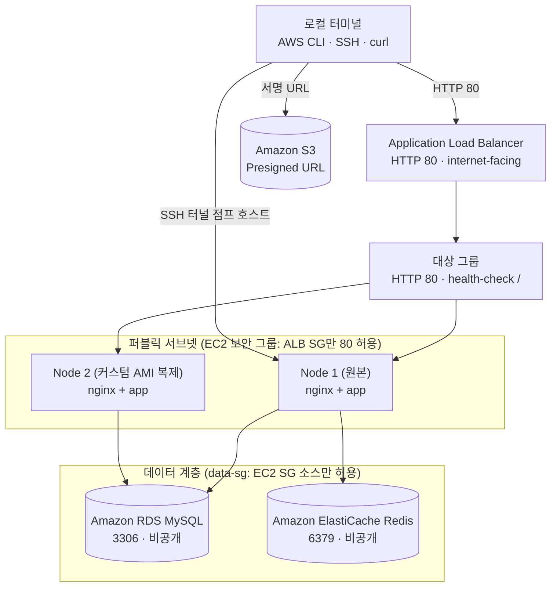

# AWS 관리형 서비스 연동 RDS S3 ElastiCache ALB 실습 가이드

> 💡 **[핵심 원리]** 단일 EC2 안에 애플리케이션과 데이터베이스가 함께 있으면 그 인스턴스는 복제할 수 없습니다. 상태(State)가 인스턴스 로컬 디스크에 묶여 있기 때문입니다. 따라서 먼저 데이터를 비공개 격리망의 관리형 서비스(`Amazon RDS MySQL`, `Amazon ElastiCache Redis`, `Amazon S3`)로 이관해 EC2를 무상태(Stateless)로 만들고, 그 상태의 인스턴스를 커스텀 AMI(골든 이미지)로 구워 동일 사양의 2번 인스턴스를 복제한 뒤, `Application Load Balancer(ALB)`를 전면에 세워 두 노드로 트래픽을 분산합니다. 데이터 계층은 공인 IP 없이 EC2 보안 그룹을 소스로 지정하는 보안 그룹 체이닝으로만 열고, 접근은 EC2를 점프 호스트로 삼는 SSH 터널로 수행합니다. ALB·RDS·ElastiCache는 `stop` 상태가 없어 생성 즉시 과금되므로 **당일 완결 원칙**에 따라 수업 종료 전 전면 삭제합니다.

---

## 1. 실습 개요 및 목표

### 1.1 실습 개요
기본 흐름은 선행 차시의 인스턴스 유무와 관계없이 Ubuntu 26.04 ARM EC2(`${STUDENT_ID}-managed-ec2`)를 새로 생성하고 Docker 런타임을 준비하는 것으로 실습을 시작합니다. 직전 차시(07-2)에서 중지해 둔 인스턴스(`${STUDENT_ID}-compose-ec2`)를 재사용하는 경우, 선택 절차를 통해 인스턴스를 재기동하고 기존 3-Layer 스택을 정리한 뒤 공통 흐름에 합류합니다.

이어서 상태 분리와 수평 확장을 순서대로 수행합니다.
1. **데이터 계층 분리**: EC2 보안 그룹만 소스로 허용하는 데이터 전용 보안 그룹을 만들고, 그 안에 RDS MySQL과 ElastiCache Redis를 비공개(`--no-publicly-accessible`)로 프로비저닝합니다. 프로비저닝이 진행되는 동안 S3 버킷을 만들고 퍼블릭 개방 없이 Presigned URL로 한시적 다운로드를 검증합니다.
2. **EC2 무상태화**: 기존 3-Tier 스택(로컬 MySQL 컨테이너 + 호스트 바인드 마운트) 잔존물을 정리하고, RDS를 바라보는 새 `compose.yaml`(프로젝트명 `aws-managed`)로 교체합니다. 이 시점부터 EC2에는 보존할 데이터가 남지 않습니다.
3. **골든 이미지 복제와 부하 분산**: 무상태화된 인스턴스를 커스텀 AMI로 추출하고 `user-data`로 2번 인스턴스를 자동 복제한 뒤, 대상 그룹과 ALB를 만들어 두 노드로 라운드로빈 분산되는지, 두 노드가 같은 RDS 데이터를 반환하는지 검증합니다. 마지막으로 EC2 보안 그룹의 80번 직접 공개를 회수해 ALB만 진입점으로 남깁니다.



### 1.2 실습 목표
- **상태의 외부 이관**: 로컬 컨테이너 DB의 영속 상태를 비공개 격리망의 RDS MySQL과 ElastiCache Redis로 완전히 옮겨 EC2 인스턴스를 순수 무상태로 만든다.
- **보안 그룹 체이닝과 사설망 접근**: 데이터 계층 인바운드를 CIDR가 아닌 EC2 보안 그룹 소스로만 열고, EC2를 점프 호스트로 삼는 SSH 터널로만 RDS·Redis에 접근한다.
- **객체 스토리지와 한시적 권한**: S3 버킷을 퍼블릭으로 열지 않고 만료 시간이 있는 Presigned URL로 객체를 내려받아 최소 권한 접근을 검증한다.
- **골든 이미지 기반 수평 복제**: 무상태화된 인스턴스에서 커스텀 AMI를 만들고 `user-data` 부팅 스크립트로 2번 인스턴스를 자동 기동한다.
- **ALB 부하 분산과 데이터 정합성**: 대상 그룹에 2대를 등록하고 반복 호출에서 두 노드 응답이 모두 관측되는지, 공유 RDS 기준 응답이 동일한지 확인한다.
- **당일 완결 과금 통제**: ALB·RDS·ElastiCache·S3·커스텀 AMI·EBS 스냅샷 등 `stop`이 없는 자원을 수업 종료 전 전면 삭제한다.

---

## 2. 실습 환경 및 준비

### 2.1 실습 환경 요약

| 구분 | 내용 |
| --- | --- |
| AWS 자원 | Ubuntu 26.04 ARM 신규 인스턴스(`${STUDENT_ID}-managed-ec2`, 기본 흐름) 또는 07-2 중지 인스턴스(`${STUDENT_ID}-compose-ec2`, 재사용 선택), 기본 VPC, 웹 보안 그룹(`${STUDENT_ID}-web-sg`), 키 페어(`${STUDENT_ID}-key.pem`) |
| 이번 차시 신규 자원 | 데이터 계층 보안 그룹 `${STUDENT_ID}-data-sg`, RDS `${STUDENT_ID}-mysql-db`, ElastiCache `${STUDENT_ID}-redis`, S3 `${STUDENT_ID}-app-assets-<계정ID>`, 커스텀 AMI `${STUDENT_ID}-app-image`, 대상 그룹 `${STUDENT_ID}-app-tg`, ALB `${STUDENT_ID}-app-alb`, ALB 보안 그룹 `${STUDENT_ID}-alb-sg` |
| 인계 상태 | 신규 생성 기본 흐름은 선행 차시 인스턴스에 의존하지 않으며 최신 Ubuntu 26.04 ARM AMI로 새로 생성합니다. 07-2 인스턴스를 재사용하는 경우 기존 3-Layer 스택(`compose-mysql.yml` + `.env.mysql`, `./mysql-data`)을 내리고 정리한 뒤 진행 |
| 관리형 서비스 사양 | RDS `db.t4g.micro` / `gp3 20GB` / 단일 AZ / 백업 보존 0일, ElastiCache `cache.t4g.micro` 단일 노드 |
| 작업 디렉터리 | `~/workspace/aws-lab` — 키 페어 `.pem` 보관 위치이며 모든 AWS CLI 명령을 이 디렉터리에서 실행 |
| CLI 환경변수 | `STUDENT_ID`에서 전체 변수 목록을 파생(`MY_KEY_NAME`, `MY_SG_NAME`, `MY_INSTANCE_NAME`, `MY_REUSE_INSTANCE_NAME`, `ACTIVE_INSTANCE_NAME`, `MY_DATA_SG_NAME`, `MY_DB_ID`, `MY_DB_SUBNET_GROUP`, `MY_CACHE_ID`, `MY_CACHE_SUBNET_GROUP`, `MY_AMI_NAME`, `MY_INSTANCE_NAME_2`, `MY_TG_NAME`, `MY_ALB_SG_NAME`, `MY_ALB_NAME`, `ACCOUNT_ID`, `MY_BUCKET`, `MY_APP_IMAGE`), `AWS_REGION="ap-northeast-2"`·`AWS_PAGER=""` 병행 선언 |
| SSH 접속 표기 | 인스턴스를 시작/재시작하면 공인 IP가 새로 할당되어 `known_hosts`와 어긋나므로 모든 `ssh` 호출에 `-o StrictHostKeyChecking=accept-new`를 붙임 |
| 원격 명령 권한 | `ubuntu` 계정은 `docker` 그룹 비소속. EC2 안의 모든 Docker 명령을 `sudo docker`·`sudo docker compose`로 실행 |
| 데이터베이스 도구 | IntelliJ IDEA Ultimate 내장 Database 도구, SSH 터널링 점프 호스트 경유 |
| 컨테이너 이미지 | `ghcr.io/<본인 GitHub 아이디>/simple-back:latest`, `nginx:alpine` |

### 2.2 사전 준비 확인
1. **신규 생성 기본 흐름 또는 재사용 인스턴스 확인**: 기본 흐름은 선행 차시 인스턴스 없이 신규 프로비저닝합니다. 만약 07-2 인스턴스를 재사용할 계획이라면 대상이 `stopped` 상태로 남아 있는지 확인합니다.
2. **로컬 `.pem`과 AWS 키 페어가 같은 키인지 지문으로 대조합니다.** 로컬 파일이 남아 있어도 AWS 쪽 키 페어가 재발급되었다면 SSH가 `Permission denied (publickey)`로 실패합니다.
3. **현재 공인 IP로 22번 규칙을 확인/등록합니다.** SSH 22번은 `0.0.0.0/0`이 아니라 `내_공인_IP/32`로만 엽니다.
4. **본인 GHCR 이미지 경로를 확인합니다.** 이미지 경로는 `ghcr.io/${GITHUB_USERNAME}/simple-back:latest` 변수형으로 두며, 존재하지 않는 경로를 쓰면 `error from registry: denied`로 기동이 즉시 실패합니다. ARM64 인스턴스이므로 `linux/arm64` 매니페스트가 포함되어 있어야 합니다.
5. **RDS 마스터 암호를 미리 정해 둡니다.** 8자 이상이어야 하며 `/`, `"`, `@`, 공백은 사용할 수 없습니다. 암호는 문서나 이미지에 하드코딩하지 않고 입력 프롬프트와 `.env` 파일로만 전달합니다.
6. **과금을 의식합니다.** ALB·RDS·ElastiCache는 중지 상태가 없어 생성한 순간부터 삭제할 때까지 계속 과금됩니다. 5절 정리는 수업 종료 전에 반드시 수행합니다.

---

## 3. 핵심 실습 절차 (Step-by-Step)

### Step 1. 신규 EC2와 데이터 계층 보안 그룹 준비
기본 흐름은 선행 차시의 인스턴스 유무와 관계없이 Ubuntu 26.04 ARM EC2를 새로 생성하는 방식입니다. `STUDENT_ID`에서 자원 이름을 한 번에 파생하고, 기존 키 페어와 웹 보안 그룹은 소유자와 지문이 일치할 때만 재사용합니다. 로컬 `.pem`과 AWS 키 페어 중 하나만 존재하거나 지문이 다르면 자동 삭제·재발급하지 않고 즉시 중단합니다.

```bash
# 1. 사용자 입력과 모든 이름을 첫 블록에 집약
export STUDENT_ID="student01"
export GITHUB_USERNAME="본인_깃허브_아이디"
export AWS_PROFILE="$STUDENT_ID"
export AWS_REGION="ap-northeast-2"
export AWS_PAGER=""

export MY_KEY_NAME="${STUDENT_ID}-key"
export MY_SG_NAME="${STUDENT_ID}-web-sg"
export MY_INSTANCE_NAME="${STUDENT_ID}-managed-ec2"
export MY_REUSE_INSTANCE_NAME="${STUDENT_ID}-compose-ec2"
export MY_DATA_SG_NAME="${STUDENT_ID}-data-sg"
export MY_DB_ID="${STUDENT_ID}-mysql-db"
export MY_DB_SUBNET_GROUP="${STUDENT_ID}-db-subnet-group"
export MY_CACHE_ID="${STUDENT_ID}-redis"
export MY_CACHE_SUBNET_GROUP="${STUDENT_ID}-cache-subnet-group"
export MY_AMI_NAME="${STUDENT_ID}-app-image"
export MY_INSTANCE_NAME_2="${MY_INSTANCE_NAME}-2"
export MY_TG_NAME="${STUDENT_ID}-app-tg"
export MY_ALB_SG_NAME="${STUDENT_ID}-alb-sg"
export MY_ALB_NAME="${STUDENT_ID}-app-alb"
export ACCOUNT_ID=$(aws sts get-caller-identity --query Account --output text)
export MY_BUCKET="${STUDENT_ID}-app-assets-${ACCOUNT_ID}"
export MY_APP_IMAGE="ghcr.io/${GITHUB_USERNAME}/simple-back:latest"
export ACTIVE_INSTANCE_NAME="$MY_INSTANCE_NAME"

mkdir -p ~/workspace/aws-lab
cd ~/workspace/aws-lab

# 2. 기본 VPC 및 키 페어 확인: 양쪽이 모두 없을 때만 신규 발급
export VPC_ID=$(aws ec2 describe-vpcs --filters "Name=is-default,Values=true" \
  --query "Vpcs[0].VpcId" --output text)
export AWS_KEY_NAME=$(aws ec2 describe-key-pairs \
  --filters "Name=key-name,Values=$MY_KEY_NAME" \
  --query "KeyPairs[0].KeyName" --output text)

if [ "$AWS_KEY_NAME" = "None" ] && [ ! -f ./"$MY_KEY_NAME".pem ]; then
  aws ec2 create-key-pair --key-name "$MY_KEY_NAME" \
    --tag-specifications "ResourceType=key-pair,Tags=[{Key=Name,Value=$MY_KEY_NAME},{Key=Course,Value=infra-training},{Key=Owner,Value=$STUDENT_ID}]" \
    --query "KeyMaterial" --output text > ./"$MY_KEY_NAME".pem
  chmod 400 ./"$MY_KEY_NAME".pem
elif [ "$AWS_KEY_NAME" != "None" ] && [ -f ./"$MY_KEY_NAME".pem ]; then
  export AWS_KEY_FINGERPRINT=$(aws ec2 describe-key-pairs --key-names "$MY_KEY_NAME" \
    --query "KeyPairs[0].KeyFingerprint" --output text)
  export LOCAL_KEY_FINGERPRINT=$(openssl pkcs8 -in ./"$MY_KEY_NAME".pem -nocrypt -topk8 -outform DER \
    | openssl sha1 -c | awk '{print $2}')
  if [ "$AWS_KEY_FINGERPRINT" != "$LOCAL_KEY_FINGERPRINT" ]; then
    echo "키 지문 불일치: 기존 키를 삭제하지 말고 강사에게 확인한다."
    exit 1
  fi
else
  echo "AWS 키 페어와 로컬 .pem 중 하나만 존재한다. 자동 복구하지 말고 강사에게 확인한다."
  exit 1
fi

# 3. 웹 보안 그룹: 동일 Owner이면 재사용하고, 없으면 생성
export MY_SG_ID=$(aws ec2 describe-security-groups \
  --filters "Name=group-name,Values=$MY_SG_NAME" "Name=vpc-id,Values=$VPC_ID" \
  --query "SecurityGroups[0].GroupId" --output text)
if [ "$MY_SG_ID" = "None" ]; then
  export MY_SG_ID=$(aws ec2 create-security-group \
    --group-name "$MY_SG_NAME" --vpc-id "$VPC_ID" \
    --description "Web access for managed service lab" \
    --tag-specifications "ResourceType=security-group,Tags=[{Key=Name,Value=$MY_SG_NAME},{Key=Course,Value=infra-training},{Key=Owner,Value=$STUDENT_ID}]" \
    --query "GroupId" --output text)
else
  export MY_SG_OWNER=$(aws ec2 describe-security-groups --group-ids "$MY_SG_ID" \
    --query "SecurityGroups[0].Tags[?Key=='Owner']|[0].Value" --output text)
  if [ "$MY_SG_OWNER" != "$STUDENT_ID" ]; then
    echo "웹 보안 그룹 Owner 불일치: 재사용하지 않고 중단한다."
    exit 1
  fi
fi

export MY_IP=$(curl -fsS https://checkip.amazonaws.com)
export SSH_RULE=$(aws ec2 describe-security-groups --group-ids "$MY_SG_ID" \
  --query "SecurityGroups[0].IpPermissions[?FromPort==\`22\`].IpRanges[?CidrIp=='$MY_IP/32'].CidrIp" --output text)
if [ -z "$SSH_RULE" ]; then
  aws ec2 authorize-security-group-ingress \
    --group-id "$MY_SG_ID" --protocol tcp --port 22 --cidr "$MY_IP/32"
fi
export HTTP_RULE=$(aws ec2 describe-security-groups --group-ids "$MY_SG_ID" \
  --query "SecurityGroups[0].IpPermissions[?FromPort==\`80\`].IpRanges[?CidrIp=='0.0.0.0/0'].CidrIp" --output text)
if [ -z "$HTTP_RULE" ]; then
  aws ec2 authorize-security-group-ingress \
    --group-id "$MY_SG_ID" --protocol tcp --port 80 --cidr 0.0.0.0/0
fi

# 4. 최신 Ubuntu ARM AMI로 신규 t4g.small 인스턴스 생성
export EXISTING_INSTANCE_ID=$(aws ec2 describe-instances \
  --filters "Name=tag:Name,Values=$MY_INSTANCE_NAME" "Name=tag:Owner,Values=$STUDENT_ID" \
            "Name=instance-state-name,Values=pending,running,stopping,stopped" \
  --query "Reservations[0].Instances[0].InstanceId" --output text)
if [ "$EXISTING_INSTANCE_ID" != "None" ]; then
  echo "같은 이름의 기존 인스턴스가 있다: $EXISTING_INSTANCE_ID"
  exit 1
fi

export BASE_AMI_ID=$(aws ssm get-parameter \
  --name /aws/service/canonical/ubuntu/server/26.04/stable/current/arm64/hvm/ebs-gp3/ami-id \
  --query "Parameter.Value" --output text)
export INSTANCE_ID=$(aws ec2 run-instances \
  --image-id "$BASE_AMI_ID" --instance-type t4g.small \
  --key-name "$MY_KEY_NAME" --security-group-ids "$MY_SG_ID" \
  --tag-specifications "ResourceType=instance,Tags=[{Key=Name,Value=$MY_INSTANCE_NAME},{Key=Course,Value=infra-training},{Key=Owner,Value=$STUDENT_ID}]" \
  --query "Instances[0].InstanceId" --output text)
aws ec2 wait instance-running --instance-ids "$INSTANCE_ID"
aws ec2 wait instance-status-ok --instance-ids "$INSTANCE_ID"
export PUBLIC_IP=$(aws ec2 describe-instances --instance-ids "$INSTANCE_ID" \
  --query "Reservations[0].Instances[0].PublicIpAddress" --output text)

# 5. 신규 Ubuntu에 Docker를 설치하고 실습 이미지를 미리 다운로드
ssh -i ./"$MY_KEY_NAME".pem -o StrictHostKeyChecking=accept-new ubuntu@"$PUBLIC_IP" bash -s <<EOF
set -e
curl -fsSL https://get.docker.com -o get-docker.sh
sudo sh get-docker.sh
sudo systemctl is-active docker
sudo docker compose version
sudo docker pull nginx:alpine
sudo docker pull "$MY_APP_IMAGE"
sudo docker image inspect nginx:alpine "$MY_APP_IMAGE" \
  --format '{{.RepoTags}} {{.Architecture}}'
EOF

# 6. 서브넷 목록과 데이터 계층 전용 보안 그룹 준비
SUBNET_IDS=($(aws ec2 describe-subnets --filters "Name=vpc-id,Values=$VPC_ID" \
  --query "Subnets[].SubnetId" --output text))
export MY_DATA_SG_ID=$(aws ec2 describe-security-groups \
  --filters "Name=group-name,Values=$MY_DATA_SG_NAME" "Name=vpc-id,Values=$VPC_ID" \
  --query "SecurityGroups[0].GroupId" --output text)
if [ "$MY_DATA_SG_ID" = "None" ]; then
  export MY_DATA_SG_ID=$(aws ec2 create-security-group \
    --group-name "$MY_DATA_SG_NAME" \
    --description "RDS and ElastiCache access from EC2 SG" --vpc-id "$VPC_ID" \
    --tag-specifications "ResourceType=security-group,Tags=[{Key=Name,Value=$MY_DATA_SG_NAME},{Key=Course,Value=infra-training},{Key=Owner,Value=$STUDENT_ID}]" \
    --query "GroupId" --output text)
fi
export MYSQL_SG_SOURCE=$(aws ec2 describe-security-groups --group-ids "$MY_DATA_SG_ID" \
  --query "SecurityGroups[0].IpPermissions[?FromPort==\`3306\`].UserIdGroupPairs[?GroupId=='$MY_SG_ID'].GroupId" --output text)
if [ -z "$MYSQL_SG_SOURCE" ]; then
  aws ec2 authorize-security-group-ingress \
    --group-id "$MY_DATA_SG_ID" --protocol tcp --port 3306 --source-group "$MY_SG_ID"
fi
export REDIS_SG_SOURCE=$(aws ec2 describe-security-groups --group-ids "$MY_DATA_SG_ID" \
  --query "SecurityGroups[0].IpPermissions[?FromPort==\`6379\`].UserIdGroupPairs[?GroupId=='$MY_SG_ID'].GroupId" --output text)
if [ -z "$REDIS_SG_SOURCE" ]; then
  aws ec2 authorize-security-group-ingress \
    --group-id "$MY_DATA_SG_ID" --protocol tcp --port 6379 --source-group "$MY_SG_ID"
fi

printf 'Node 1 Name=%s\nInstance=%s\nPublicIP=%s\nWebSG=%s\nDataSG=%s\n' \
  "$ACTIVE_INSTANCE_NAME" "$INSTANCE_ID" "$PUBLIC_IP" "$MY_SG_ID" "$MY_DATA_SG_ID"
```

| 명령어 및 주요 옵션 | 기능 | 설명 |
|---|---|---|
| `ssm get-parameter ... arm64` | Ubuntu AMI 조회 | 최신 Ubuntu 26.04 LTS ARM 이미지를 Canonical 공개 파라미터에서 조회 |
| `run-instances --instance-type t4g.small` | 신규 Node 1 생성 | 선행 차시 인스턴스에 의존하지 않는 `${STUDENT_ID}-managed-ec2` 생성 |
| `get.docker.com` / `docker pull` | 런타임 준비 | Docker 엔진과 Compose를 설치하고 Nginx 및 GHCR 멀티 플랫폼 이미지를 다운로드 |
| `authorize-security-group-ingress --source-group` | 보안 그룹 체이닝 | RDS·ElastiCache 접근 소스를 웹 보안 그룹으로 제한 |

> **선택 절차 — 07-2에서 중지한 인스턴스를 재사용하는 경우**: 위 4~5번 신규 생성·설치 명령 대신 다음 블록을 실행합니다. `Name`과 `Owner`, `stopped`를 모두 만족하는 `${STUDENT_ID}-compose-ec2`만 선택하며, 결과가 없으면 전체 상태를 확인한 뒤 중단합니다. 재시작하면 동적 공인 IP가 바뀌므로 반드시 다시 조회합니다. 기존 3-Layer 스택을 내리는 명령은 이 재사용 선택 절차에만 있습니다.
>
> ```bash
> export REUSE_INSTANCE_ID=$(aws ec2 describe-instances \
>   --filters "Name=tag:Name,Values=$MY_REUSE_INSTANCE_NAME" "Name=tag:Owner,Values=$STUDENT_ID" \
>             "Name=instance-state-name,Values=stopped" \
>   --query "Reservations[0].Instances[0].InstanceId" --output text)
> if [ "$REUSE_INSTANCE_ID" = "None" ]; then
>   aws ec2 describe-instances --filters "Name=tag:Owner,Values=$STUDENT_ID" \
>     --query "Reservations[].Instances[].[InstanceId,Tags[?Key=='Name']|[0].Value,State.Name]" --output table
>   echo "재사용할 중지 인스턴스가 없다. 기본 신규 생성 흐름을 실행한다."
>   exit 1
> fi
> export INSTANCE_ID="$REUSE_INSTANCE_ID"
> export ACTIVE_INSTANCE_NAME="$MY_REUSE_INSTANCE_NAME"
> aws ec2 start-instances --instance-ids "$INSTANCE_ID"
> aws ec2 wait instance-status-ok --instance-ids "$INSTANCE_ID"
> export PUBLIC_IP=$(aws ec2 describe-instances --instance-ids "$INSTANCE_ID" \
>   --query "Reservations[0].Instances[0].PublicIpAddress" --output text)
> ssh -i ./"$MY_KEY_NAME".pem -o StrictHostKeyChecking=accept-new ubuntu@"$PUBLIC_IP" bash -s <<EOF
> set -e
> if [ -f compose-mysql.yml ] && [ -f .env.mysql ]; then
>   sudo docker compose --env-file .env.mysql -f compose-mysql.yml down
> fi
> sudo rm -rf ./mysql-data
> rm -f compose-mysql.yml .env.mysql
> sudo docker pull nginx:alpine
> sudo docker pull "$MY_APP_IMAGE"
> EOF
> ```

> **AWS Console 확인**: `EC2 > Instances > Instances`에서 위 `printf`가 출력한 실제 `Node 1 Name` 값을 검색해 상태 `Running`과 상태 검사 `2/2 checks passed`를 확인합니다. `EC2 > Network & Security > Key Pairs`와 `Security Groups`에서는 각각 출력된 `$MY_KEY_NAME`, `$MY_SG_NAME`, `$MY_DATA_SG_NAME`의 실제 값을 검색합니다. 웹 보안 그룹의 22번 소스는 현재 공인 IP `/32`, 데이터 보안 그룹의 3306·6379 소스는 `$MY_SG_ID`의 실제 `sg-...` 값이어야 합니다.

> **세션 재접속 시**: 이름 변수는 초기 블록을 다시 실행하고, `INSTANCE_ID`·`PUBLIC_IP`·보안 그룹 ID처럼 AWS가 발급한 동적 값은 `describe-*` 조회 블록으로 다시 바인딩합니다. AWS Console 검색창에는 `$MY_INSTANCE_NAME` 문자열을 그대로 입력하지 않고 `echo "$ACTIVE_INSTANCE_NAME"`처럼 출력한 실제 값을 입력합니다.

---

### Step 2. 서브넷 그룹 생성 및 RDS·ElastiCache 비동기 프로비저닝 요청
다중 AZ 서브넷 그룹을 등록하고, 장시간 소요되는 RDS와 ElastiCache 인스턴스 생성을 비동기로 요청합니다.

```bash
# 1. RDS 및 ElastiCache 서브넷 그룹 생성
aws rds create-db-subnet-group \
  --db-subnet-group-name "$MY_DB_SUBNET_GROUP" \
  --db-subnet-group-description "Default VPC subnets for RDS" \
  --subnet-ids "${SUBNET_IDS[@]}"

aws elasticache create-cache-subnet-group \
  --cache-subnet-group-name "$MY_CACHE_SUBNET_GROUP" \
  --cache-subnet-group-description "Default VPC subnets for ElastiCache" \
  --subnet-ids "${SUBNET_IDS[@]}"

# 2. RDS MySQL (db.t4g.micro) 비동기 생성 요청
read -rsp "RDS master password: " MY_DB_PASSWORD; echo
echo
export MY_DB_PASSWORD

aws rds create-db-instance \
  --db-instance-identifier "$MY_DB_ID" \
  --db-instance-class db.t4g.micro \
  --engine mysql \
  --master-username admin \
  --master-user-password "$MY_DB_PASSWORD" \
  --allocated-storage 20 \
  --storage-type gp3 \
  --vpc-security-group-ids "$MY_DATA_SG_ID" \
  --db-subnet-group-name "$MY_DB_SUBNET_GROUP" \
  --no-multi-az \
  --no-publicly-accessible \
  --backup-retention-period 0 \
  --tags Key=Name,Value="$MY_DB_ID" Key=Course,Value=infra-training Key=Owner,Value="$STUDENT_ID"

# 3. ElastiCache Redis (cache.t4g.micro) 비동기 생성 요청
aws elasticache create-cache-cluster \
  --cache-cluster-id "$MY_CACHE_ID" \
  --cache-node-type cache.t4g.micro \
  --engine redis \
  --num-cache-nodes 1 \
  --cache-subnet-group-name "$MY_CACHE_SUBNET_GROUP" \
  --security-group-ids "$MY_DATA_SG_ID" \
  --tags Key=Name,Value="$MY_CACHE_ID" Key=Course,Value=infra-training Key=Owner,Value="$STUDENT_ID"
```

- **마스터 암호 제약**: 8자 이상이어야 하며 `/`, `"`, `@`, 공백은 사용할 수 없습니다. 제약을 어기면 `InvalidParameterValue`로 생성이 거부됩니다(Issue 7).
- **엔진 버전**: `--engine-version`을 지정하지 않았으므로 리전 기본값이 적용됩니다(검증 시점 MySQL `8.4.9`). 8.4 계열의 기본 인증 플러그인은 `caching_sha2_password`입니다.
- **데이터베이스 이름**: `--db-name`을 지정하지 않아 생성 직후 `DBName`은 `None`입니다. 실제 `appdb` 데이터베이스는 Step 7의 JDBC 옵션 `createDatabaseIfNotExist=true`에 의해 애플리케이션 최초 연결 시 생성됩니다.
- **소요 시간**: 검증 시점 RDS는 약 4분이 소요되었고, ElastiCache는 RDS 대기가 끝나는 시점에 이미 `available`이었습니다. 이 대기 시간 동안 Step 3~4를 진행합니다.

---

### Step 3. S3 버킷 생성 및 테스트 객체 업로드
RDS·ElastiCache 생성이 진행되는 동안 Amazon S3 버킷을 생성하고 객체를 업로드합니다.

```bash
# 1. 전역 고유 버킷 이름 생성 및 버킷 생성
export ACCOUNT_ID=$(aws sts get-caller-identity --query Account --output text)
export MY_BUCKET="${STUDENT_ID}-app-assets-${ACCOUNT_ID}"
echo "S3 버킷 이름: $MY_BUCKET"

aws s3 mb "s3://$MY_BUCKET" --region "$AWS_REGION"
aws s3api put-bucket-tagging \
  --bucket "$MY_BUCKET" \
  --tagging "TagSet=[{Key=Name,Value=$MY_BUCKET},{Key=Course,Value=infra-training},{Key=Owner,Value=$STUDENT_ID}]"

# 2. 테스트 파일 업로드 및 목록 확인
echo "Hello from Amazon S3 Managed Storage!" > hello.txt
aws s3 cp hello.txt "s3://$MY_BUCKET/hello.txt"
aws s3 ls "s3://$MY_BUCKET/"
```

- **검증 기준**: `make_bucket` 및 `upload` 메시지가 출력되고 `aws s3 ls`에 38바이트 객체 `hello.txt`가 보입니다.
- **버킷 이름 규칙**: S3 버킷 이름은 AWS 전체 계정을 통틀어 전역에서 유일해야 하므로 `${STUDENT_ID}-app-assets-${ACCOUNT_ID}`처럼 계정 ID를 접미어로 붙여 충돌(`BucketAlreadyExists`)을 방지합니다. 이름에는 소문자·숫자·하이픈만 사용할 수 있습니다.

---

### Step 4. S3 Presigned URL 발급 및 한시적 다운로드 검증
버킷을 퍼블릭 개방하지 않고 시간 한정 접근 링크를 발급하여 객체를 내려받습니다.

```bash
# 1. 300초(5분) 만료 Presigned URL 발급
export PRESIGNED_URL=$(aws s3 presign "s3://$MY_BUCKET/hello.txt" --expires-in 300)
echo "발급된 Presigned URL: $PRESIGNED_URL"

# 2. curl로 임시 서명 URL 다운로드 확인
curl -i -s "$PRESIGNED_URL"

# 3. 대조: 서명 없이 같은 객체를 직접 호출하면 차단됩니다
curl -i -s "https://${MY_BUCKET}.s3.${AWS_REGION}.amazonaws.com/hello.txt" | head -1
```

- **검증 기준**: 서명 URL은 `HTTP 200`과 함께 `Hello from Amazon S3 Managed Storage!` 본문을 반환하고, 서명 없는 직접 호출은 `HTTP 403`으로 거부됩니다.
- URL 질의 문자열의 `X-Amz-Algorithm=AWS4-HMAC-SHA256`, `X-Amz-Expires=300`이 시간 한정 서명의 실체입니다. 만료 후 같은 URL을 호출하면 다시 `403`이 반환됩니다.

---

### Step 5. RDS 프로비저닝 완료 대기 및 MySQL 엔드포인트 조회
공식 AWS CLI 대기자(`wait`)로 RDS 생성이 완료될 때까지 대기하고 FQDN 엔드포인트를 추출합니다.

```bash
echo "RDS 인스턴스 프로비저닝 완료 대기 중 (수 분 소요)..."
aws rds wait db-instance-available --db-instance-identifier "$MY_DB_ID"
echo "RDS MySQL 인스턴스 준비 완료!"

export RDS_ENDPOINT=$(aws rds describe-db-instances \
  --db-instance-identifier "$MY_DB_ID" \
  --query "DBInstances[0].Endpoint.Address" --output text)

export RDS_PORT=$(aws rds describe-db-instances \
  --db-instance-identifier "$MY_DB_ID" \
  --query "DBInstances[0].Endpoint.Port" --output text)

echo "확정된 RDS 엔드포인트: $RDS_ENDPOINT:$RDS_PORT"
```

- **검증 기준**: `<식별자>.ap-northeast-2.rds.amazonaws.com:3306` 형태의 엔드포인트가 출력됩니다. 이 주소는 사설 IP로만 조회되므로 EC2 밖에서는 연결되지 않습니다.

---

### Step 6. ElastiCache 프로비저닝 상태 폴링 및 Redis 엔드포인트 조회
ElastiCache 클러스터 상태를 폴링하여 `available` 전환을 확인하고 엔드포인트를 추출합니다.

```bash
echo "ElastiCache Redis 상태 폴링 시작..."
while [ "$(aws elasticache describe-cache-clusters \
  --cache-cluster-id "$MY_CACHE_ID" \
  --query "CacheClusters[0].CacheClusterStatus" --output text)" != "available" ]; do
  echo "현재 상태 대기 중... (15초 대기)"
  sleep 15
done
echo "ElastiCache Redis 프로비저닝 완료!"

export REDIS_ENDPOINT=$(aws elasticache describe-cache-clusters \
  --cache-cluster-id "$MY_CACHE_ID" --show-cache-node-info \
  --query "CacheClusters[0].CacheNodes[0].Endpoint.Address" --output text)

export REDIS_PORT=$(aws elasticache describe-cache-clusters \
  --cache-cluster-id "$MY_CACHE_ID" --show-cache-node-info \
  --query "CacheClusters[0].CacheNodes[0].Endpoint.Port" --output text)

echo "확정된 ElastiCache 엔드포인트: $REDIS_ENDPOINT:$REDIS_PORT"
```

- **검증 기준**: `<식별자>.apn2.cache.amazonaws.com:6379` 형태의 엔드포인트가 출력됩니다. RDS 대기가 끝난 시점이면 폴링은 대개 1회 만에 종료됩니다.

---

### Step 7. EC2 Compose 환경 설정 변경 (RDS 연동 .env 및 compose.yaml 재작성)
기존 3-Tier 스택(`compose-mysql.yml` + `.env.mysql`) 잔존물을 정리하고, RDS를 바라보는 새 `compose.yaml`을 작성합니다. 로컬 터미널의 환경변수(`$RDS_ENDPOINT`, `$MY_DB_PASSWORD`)를 원격에 그대로 전달해야 하므로 SSH 표준 입력으로 스크립트를 보냅니다.

```bash
# 0. 이미지 경로에 사용할 본인 GitHub 아이디 선언 (07-2와 동일한 GHCR 경로 규약)
export GITHUB_USERNAME="본인_깃허브_아이디"

ssh -i ./"$MY_KEY_NAME".pem -o StrictHostKeyChecking=accept-new ubuntu@"$PUBLIC_IP" bash -s <<EOF
# ─── (원격 EC2 터미널 내부 실행) ───
set -e

# 1. 이전 스택 종료 및 잔존물 정리 (80 포트 점유와 골든 AMI 용량 증가 방지)
sudo docker compose --env-file .env.mysql -f compose-mysql.yml down || true
sudo rm -rf ./mysql-data
rm -f compose-mysql.yml .env.mysql
sudo docker ps

# 2. .env를 RDS 접속 정보로 교체
cat <<ENVEOF > .env
GITHUB_USERNAME=$GITHUB_USERNAME
DB_NAME=appdb
DB_USER=admin
DB_PASSWORD=$MY_DB_PASSWORD
RDS_ENDPOINT=$RDS_ENDPOINT
APP_MESSAGE=Live on AWS EC2 Node 1 via Compose + RDS!
SPRING_JPA_HIBERNATE_DDL_AUTO=update
SPRING_DATASOURCE_HIKARI_CONNECTIONTIMEOUT=30000
ENVEOF

# 3. compose.yaml에서 db 컨테이너 제거 및 RDS 연결로 재작성
cat <<'COMPOSEEOF' > compose.yaml
name: aws-managed

services:
  nginx:
    image: nginx:alpine
    container_name: nginx-proxy
    restart: always
    ports:
      - "80:80"
    volumes:
      - ./nginx.conf:/etc/nginx/nginx.conf:ro
    depends_on:
      - app
    deploy:
      resources:
        limits:
          memory: 64M
    networks:
      - frontend-net

  app:
    image: ghcr.io/\${GITHUB_USERNAME}/simple-back:latest
    container_name: spring-app
    restart: on-failure
    env_file:
      - .env
    environment:
      PORT: 8080
      JAVA_TOOL_OPTIONS: "-XX:MaxRAMPercentage=75.0"
      SPRING_DATASOURCE_URL: "jdbc:mysql://\${RDS_ENDPOINT}:3306/\${DB_NAME}?createDatabaseIfNotExist=true"
      SPRING_DATASOURCE_USERNAME: \${DB_USER}
      SPRING_DATASOURCE_PASSWORD: \${DB_PASSWORD}
    deploy:
      resources:
        limits:
          memory: 1024M
    networks:
      - frontend-net

networks:
  frontend-net:
COMPOSEEOF

echo "원격 EC2의 .env 및 compose.yaml 갱신 완료"
EOF
```

- **이미지 경로**: `ghcr.io/${GITHUB_USERNAME}/simple-back:latest` 변수형을 사용합니다. 특정 아이디를 하드코딩하면 본인 계정에 없는 이미지를 조회해 기동에 실패합니다(Issue 1). `GITHUB_USERNAME`은 `.env`에 기록되어 Compose 변수 치환 시점에 대입됩니다.
- **Hikari 환경변수 키**: `SPRING_DATASOURCE_HIKARI_INITIALIZATION_FAIL_TIMEOUT`은 주입하지 않습니다(Issue 2). 연결 타임아웃은 구분자 없는 표준 키 `SPRING_DATASOURCE_HIKARI_CONNECTIONTIMEOUT`을 사용합니다.
- **DDL 전략**: RDS에는 테이블이 없으므로 `SPRING_JPA_HIBERNATE_DDL_AUTO=update`를 명시 주입해 JPA가 테이블을 생성하도록 합니다.
- **프로젝트명 고정**: 새 스택은 `name: aws-managed`로 고정합니다. 원격 홈(`/home/ubuntu`)에서 `name:` 없이 기동하면 프로젝트명이 `ubuntu`가 되어 이전 스택이 포트를 점유한 채로 남을 수 있습니다(Issue 3).
- **`mysql-data` 삭제 근거**: 호스트 바인드 마운트를 남겨두면 Step 12의 골든 AMI 스냅샷에 그대로 포함되어 이미지 용량과 스토리지 요금이 커집니다. 상태는 RDS로 이관되므로 삭제합니다.
- **메모리 상한**: `t4g.small`의 실가용 메모리는 약 1.8GiB입니다. 상한 합계를 실가용에 붙이지 않도록 앱은 `1024M`, Nginx는 `64M`으로 둡니다(실측 사용량 앱 약 220MiB, Nginx 약 3MiB).

---

### Step 8. Compose 스택 재기동 및 RDS 연동 검증
`--remove-orphans` 옵션으로 구버전 로컬 DB 컨테이너를 삭제하고 RDS 연동 API를 검증합니다.

```bash
# 1. 고아 컨테이너 정리 및 새 스택 기동
ssh -i ./"$MY_KEY_NAME".pem -o StrictHostKeyChecking=accept-new ubuntu@"$PUBLIC_IP" bash -s <<'EOF'
# ─── (원격 EC2 터미널 내부 실행) ───
set -e
sudo docker compose up -d --remove-orphans
sudo docker compose ps
echo "=== Spring Boot 시작 로그 확인 (30줄) ==="
sudo docker compose logs --tail 30 app
EOF

# 2. 로컬 터미널에서 Nginx 80번 포트 경유 API 호출
curl -i "http://$PUBLIC_IP/users"
```

- **검증 기준**: `docker compose logs app`에 `Started SimpleBackApplication`이 출력되고, `curl`이 `HTTP 200`과 빈 배열 `[]` 또는 사용자 JSON 목록을 반환합니다.
- **`.env` 확인 시 비밀 값 노출 방지**: 값을 그대로 출력하지 말고 키 이름만 확인합니다.

```bash
ssh -i ./"$MY_KEY_NAME".pem -o StrictHostKeyChecking=accept-new ubuntu@"$PUBLIC_IP" \
  'sed -E "s/=.*/=***/" .env'
```

---

### Step 9. ElastiCache Redis CLI 도구 설치 및 네트워크 연결 검증
원격 서버에 `redis-tools`를 설치하고 비공개 Redis 클러스터와 `PING`/`PONG` 핸드셰이크를 검증합니다.

```bash
ssh -i ./"$MY_KEY_NAME".pem -o StrictHostKeyChecking=accept-new ubuntu@"$PUBLIC_IP" bash -s <<EOF
# ─── (원격 EC2 터미널 내부 실행) ───
set -e
sudo apt-get update -y
sudo apt-get install -y redis-tools
redis-cli -h "$REDIS_ENDPOINT" -p 6379 ping
redis-cli -h "$REDIS_ENDPOINT" -p 6379 set ${STUDENT_ID}:ec2 "connected-from-ec2"
redis-cli -h "$REDIS_ENDPOINT" -p 6379 get ${STUDENT_ID}:ec2
redis-cli -h "$REDIS_ENDPOINT" -p 6379 del ${STUDENT_ID}:ec2
EOF
```

- **검증 기준**: `PONG`, `OK`, `connected-from-ec2`, `1`이 차례로 출력됩니다.
- 같은 엔드포인트를 로컬 PC에서 직접 호출하면 보안 그룹 체이닝 때문에 연결되지 않습니다. 이것이 사설망 격리가 동작한다는 증거입니다.

---

### Step 10. IntelliJ Database 도구에서 SSH 터널 기반 비공개 RDS 연결 및 쿼리
퍼블릭 접근이 차단된 비공개 RDS MySQL에 로컬 PC 개발 도구가 접근할 수 있도록, IntelliJ IDEA Ultimate의 `Database Tools and SQL` 기능을 사용합니다. Node 1 EC2(`$ACTIVE_INSTANCE_NAME`)를 SSH 점프 호스트로 지정하여 안전한 SSH 터널을 생성하고 테이블 데이터를 조회합니다.

1. IntelliJ `Database` 툴 윈도우 → `+` → `Data Source` → `MySQL`
2. **General 탭**: Host `$RDS_ENDPOINT`, Port `3306`, User `admin`, Password는 Step 2에서 입력한 마스터 암호, Database `appdb`
3. **SSH/SSL 탭**: `Use SSH tunnel` 체크 후 Host `$PUBLIC_IP`, Port `22`, User `ubuntu`, Auth `Key pair`, Private Key는 `~/workspace/aws-lab` 아래의 `${STUDENT_ID}-key.pem`
4. `Test Connection` 성공 확인 후 콘솔에서 쿼리 실행

```sql
-- 현재 접속 데이터베이스 확인
SELECT DATABASE();

-- 스프링부트 JPA가 자동 생성한 테이블 목록 조회
SHOW TABLES;

-- 사용자 테이블 데이터 조회
SELECT * FROM users;
```

- **검증 기준**: `SELECT DATABASE()`가 `appdb`를 반환하고 `SHOW TABLES`에 JPA가 생성한 `users` 테이블이 보입니다. 서버 핸드셰이크에서 MySQL `8.4.9`와 기본 인증 플러그인 `caching_sha2_password`가 확인됩니다.
- **터널 필수 근거**: 데이터 계층 보안 그룹이 EC2 보안 그룹만 소스로 허용하므로 EC2 밖(로컬 PC)에서의 직접 연결은 차단됩니다. `Use SSH tunnel`을 끄면 연결이 타임아웃됩니다.

---

### Step 11. IntelliJ Database 도구에서 SSH 터널 기반 비공개 ElastiCache 연결 및 데이터 검증
동일한 SSH 터널을 재사용하여 비공개 ElastiCache Redis에 연결하고 명령을 실행합니다.

1. `Database` 툴 윈도우 → `+` → `Data Source` → `Redis`
2. **General 탭**: Host `$REDIS_ENDPOINT`, Port `6379`, Auth `No auth`
3. **SSH/SSL 탭**: `Use SSH tunnel` 체크 후 앞서 만든 EC2 SSH 구성 선택
4. Redis 콘솔에서 쓰기·읽기·삭제 검증

```text
SET student01:intellij "connected-via-ssh-tunnel"
GET student01:intellij
DEL student01:intellij
```

- **검증 기준**: `SET`에 `OK`, `GET`에 `"connected-via-ssh-tunnel"`, `DEL`에 `(integer) 1`이 반환됩니다.
- RDS와 마찬가지로 보안 그룹 체이닝 때문에 EC2 밖에서의 직접 연결은 차단되므로 SSH 터널 구성이 반드시 활성화되어 있어야 합니다.

---

### Step 12. 원본 EC2 기반 커스텀 AMI 생성 및 2번째 인스턴스 자동 복제
데이터베이스 상태(State)가 RDS로 완전히 이관되었으므로, 현재 동작 중인 Node 1 EC2(`$ACTIVE_INSTANCE_NAME`)는 아무런 영속 데이터를 디스크에 저장하지 않는 순수 무상태(Stateless) 인스턴스가 되었습니다. 매번 Docker를 수동 설치하는 대신, 현재 인스턴스의 디스크를 통째로 커스텀 AMI(골든 이미지)로 굳힌 뒤 2번째 인스턴스를 즉시 복제 프로비저닝합니다.

```bash
# 1. 인스턴스 1 기반 커스텀 AMI 생성
export MY_AMI_NAME="${STUDENT_ID}-app-image"
export MY_INSTANCE_NAME_2="${MY_INSTANCE_NAME}-2"

export AMI_ID=$(aws ec2 create-image \
  --instance-id "$INSTANCE_ID" \
  --name "${MY_AMI_NAME}-$(date +%s)" \
  --tag-specifications "ResourceType=image,Tags=[{Key=Name,Value=$MY_AMI_NAME},{Key=Course,Value=infra-training},{Key=Owner,Value=$STUDENT_ID}]" \
  --no-reboot \
  --query "ImageId" --output text)
echo "생성 중인 커스텀 AMI: $AMI_ID"

aws ec2 wait image-available --image-ids "$AMI_ID"
echo "골든 AMI 준비 완료: $AMI_ID"

# 2. 커스텀 AMI와 user-data로 2번 인스턴스 프로비저닝
export INSTANCE_ID_2=$(aws ec2 run-instances \
  --image-id "$AMI_ID" \
  --instance-type t4g.small \
  --key-name "$MY_KEY_NAME" \
  --security-group-ids "$MY_SG_ID" \
  --tag-specifications "ResourceType=instance,Tags=[{Key=Name,Value=$MY_INSTANCE_NAME_2},{Key=Course,Value=infra-training},{Key=Owner,Value=$STUDENT_ID}]" \
  --user-data '#!/bin/bash
cd /home/ubuntu
sed -i "s/^APP_MESSAGE=.*/APP_MESSAGE=Live on AWS EC2 Node 2 (cloned) via Compose + RDS!/" .env
sudo docker compose up -d' \
  --query "Instances[0].InstanceId" --output text)

aws ec2 wait instance-running --instance-ids "$INSTANCE_ID_2"
aws ec2 wait instance-status-ok --instance-ids "$INSTANCE_ID_2"

export PUBLIC_IP_2=$(aws ec2 describe-instances \
  --instance-ids "$INSTANCE_ID_2" \
  --query "Reservations[0].Instances[0].PublicIpAddress" --output text)
echo "2번 인스턴스 공인 IP: $PUBLIC_IP_2"

# 3. 복제 노드의 응답 메시지 확인 (Node 2로 치환되어야 정상)
curl -s "http://$PUBLIC_IP_2/"
```

- **검증 기준**: AMI 생성 대기는 검증 시점 약 6분이 소요되었습니다. 복제 노드 응답 JSON의 `message`가 `Live on AWS EC2 Node 2 (cloned) via Compose + RDS!`로 바뀌어 있습니다.
- `--no-reboot`로 만든 AMI에서도 cloud-init이 인스턴스별 모듈을 실행하므로 `user-data`가 동작합니다. `restart` 정책으로 컨테이너가 먼저 복구되어 있어도 `docker compose up -d`가 `.env` 변경을 감지해 컨테이너를 재생성합니다.
- 두 노드가 같은 RDS를 바라보므로 애플리케이션 데이터는 공유되고, 응답 메시지만 노드별로 갈립니다.

---

### Step 13. ALB 대상 그룹 및 ALB 리소스 생성과 리스너 연결
두 대의 인스턴스를 바인딩할 대상 그룹과 인터넷 경계형 ALB를 생성합니다.

```bash
# 1. 대상 그룹(포트 80) 생성 및 2대 인스턴스 등록
export MY_TG_NAME="${STUDENT_ID}-app-tg"
export MY_ALB_SG_NAME="${STUDENT_ID}-alb-sg"
export MY_ALB_NAME="${STUDENT_ID}-app-alb"

export MY_TG_ARN=$(aws elbv2 create-target-group \
  --name "$MY_TG_NAME" \
  --protocol HTTP --port 80 \
  --vpc-id "$VPC_ID" \
  --target-type instance \
  --health-check-path / \
  --tags Key=Name,Value="$MY_TG_NAME" Key=Course,Value=infra-training Key=Owner,Value="$STUDENT_ID" \
  --query "TargetGroups[0].TargetGroupArn" --output text)

aws elbv2 register-targets \
  --target-group-arn "$MY_TG_ARN" \
  --targets "Id=$INSTANCE_ID" "Id=$INSTANCE_ID_2"

# 2. ALB 전용 보안 그룹 생성 (인터넷 80 포트 허용)
export MY_ALB_SG_ID=$(aws ec2 create-security-group \
  --group-name "$MY_ALB_SG_NAME" \
  --description "ALB public HTTP entrypoint" \
  --vpc-id "$VPC_ID" \
  --tag-specifications "ResourceType=security-group,Tags=[{Key=Name,Value=$MY_ALB_SG_NAME},{Key=Course,Value=infra-training},{Key=Owner,Value=$STUDENT_ID}]" \
  --query "GroupId" --output text)

aws ec2 authorize-security-group-ingress \
  --group-id "$MY_ALB_SG_ID" --protocol tcp --port 80 --cidr 0.0.0.0/0

# 3. 인터넷 경계형 ALB 생성 (기본 VPC의 전체 서브넷 = 모든 AZ를 활성화)
export MY_ALB_ARN=$(aws elbv2 create-load-balancer \
  --name "$MY_ALB_NAME" \
  --subnets "${SUBNET_IDS[@]}" \
  --security-groups "$MY_ALB_SG_ID" \
  --scheme internet-facing \
  --type application \
  --tags Key=Name,Value="$MY_ALB_NAME" Key=Course,Value=infra-training Key=Owner,Value="$STUDENT_ID" \
  --query "LoadBalancers[0].LoadBalancerArn" --output text)

# 4. ALB 80 포트 기본 리스너 등록
aws elbv2 create-listener \
  --load-balancer-arn "$MY_ALB_ARN" \
  --protocol HTTP --port 80 \
  --default-actions "Type=forward,TargetGroupArn=$MY_TG_ARN"

export ALB_DNS=$(aws elbv2 describe-load-balancers \
  --load-balancer-arns "$MY_ALB_ARN" \
  --query "LoadBalancers[0].DNSName" --output text)
echo "ALB 진입점 도메인: http://$ALB_DNS"

# 5. 인스턴스가 배치된 AZ가 ALB 활성 AZ에 포함되는지 확인
aws ec2 describe-instances --instance-ids "$INSTANCE_ID" "$INSTANCE_ID_2" \
  --query "Reservations[].Instances[].[InstanceId,Placement.AvailabilityZone]" --output table
aws elbv2 describe-load-balancers --load-balancer-arns "$MY_ALB_ARN" \
  --query "LoadBalancers[0].AvailabilityZones[].ZoneName" --output table
```

- **서브넷 지정 기준**: Step 1에서 수집한 `SUBNET_IDS`(기본 VPC의 AZ당 1개 서브넷 전체)를 그대로 사용합니다. 앞 2개만 고르면 인스턴스가 배치된 AZ가 ALB에서 활성화되지 않아 대상이 전부 `unused`로 고정됩니다(Issue 6).
- **검증 기준**: 두 표의 AZ 목록을 비교해 인스턴스 AZ가 ALB 활성 AZ 안에 들어 있어야 합니다.

---

### Step 14. EC2 보안 그룹 잠금 및 ALB 라운드로빈 로드밸런싱 검증
EC2 직접 접근을 차단하고 오직 ALB로부터의 유입만 허용하도록 보안 그룹을 잠근 뒤, 부하 분산을 검증합니다.

```bash
# 1. EC2 보안 그룹 잠금: 기존 80, 8080 직접 공개 회수 및 ALB SG 체이닝
aws ec2 revoke-security-group-ingress \
  --group-id "$MY_SG_ID" --protocol tcp --port 80 --cidr 0.0.0.0/0

aws ec2 revoke-security-group-ingress \
  --group-id "$MY_SG_ID" --protocol tcp --port 8080 --cidr 0.0.0.0/0 || true

aws ec2 authorize-security-group-ingress \
  --group-id "$MY_SG_ID" --protocol tcp --port 80 --source-group "$MY_ALB_SG_ID"

# 2. 두 인스턴스가 헬스체크를 통과해 healthy 상태가 될 때까지 대기
echo "대상 그룹 헬스체크 통과 대기 중..."
aws elbv2 wait target-in-service \
  --target-group-arn "$MY_TG_ARN" \
  --targets "Id=$INSTANCE_ID" "Id=$INSTANCE_ID_2"
echo "인스턴스 2대 모두 healthy 상태 등록 완료!"

# 3. ALB 부하 분산 검증 (Node 1과 Node 2 응답이 섞여 나오는지 확인)
echo "=== ALB 라운드로빈 분산 테스트 (6회 호출) ==="
for i in {1..6}; do
  curl -s "http://$ALB_DNS/"
  echo ""
done

# 4. 공유 RDS 데이터 정합성 검증
curl -i "http://$ALB_DNS/users"

# 5. EC2 공인 IP 직접 접근 차단 검증
curl -m 3 "http://$PUBLIC_IP/" || echo "Node 1 직접 접근 차단 확인 (정상 보안 상태)"
curl -m 3 "http://$PUBLIC_IP_2/" || echo "Node 2 직접 접근 차단 확인 (정상 보안 상태)"
```

- **검증 기준**: 6회 반복 호출에서 Node 1과 Node 2 응답이 **모두 관측**되어야 합니다. 엄격한 1:1 교대가 아닐 수 있습니다(다중 AZ ALB 노드와 DNS 캐시 때문이며 정상입니다).
- `/users`는 두 노드 모두 같은 RDS를 조회하므로 동일한 JSON을 반환합니다. 상태가 인스턴스 밖으로 분리되었기 때문에 어느 노드가 응답해도 결과가 같습니다.
- EC2 공인 IP 직접 호출은 양 노드 모두 차단되어야 합니다. 이 시점부터 유일한 대외 진입점은 ALB 도메인입니다.

---

## 4. 실무 트러블슈팅 가이드

### Issue 1: `error from registry: denied`로 이미지 다운로드가 즉시 실패함
`compose.yaml`의 이미지 경로가 본인 계정에 존재하지 않는 GHCR 경로일 때 발생합니다. 특정 아이디를 하드코딩하지 말고 `.env`의 `GITHUB_USERNAME` 변수로 치환되게 둡니다.

```text
Image ghcr.io/<타인아이디>/simple-back:latest Error error from registry: denied
Error response from daemon: error from registry: denied
```

```bash
# 1. 원격 .env의 GITHUB_USERNAME 값이 본인 아이디인지 확인 (다른 값은 마스킹)
ssh -i ./"$MY_KEY_NAME".pem -o StrictHostKeyChecking=accept-new ubuntu@"$PUBLIC_IP" \
  'grep "^GITHUB_USERNAME=" .env'

# 2. 값이 잘못되었으면 교체 후 재기동
ssh -i ./"$MY_KEY_NAME".pem -o StrictHostKeyChecking=accept-new ubuntu@"$PUBLIC_IP" bash -s <<EOF
# ─── (원격 EC2 터미널 내부 실행) ───
sed -i "s|^GITHUB_USERNAME=.*|GITHUB_USERNAME=$GITHUB_USERNAME|" .env
grep -n "image:" compose.yaml
sudo docker compose up -d --remove-orphans
EOF
```

### Issue 2: `The configuration of the pool is sealed once started`로 스프링부트 기동 실패
`.env`에 `SPRING_DATASOURCE_HIKARI_INITIALIZATION_FAIL_TIMEOUT`을 주입하면 이 속성이 커넥션 풀 시작 이후에는 변경할 수 없는 값이라 바인딩 단계에서 기동이 중단됩니다. 연결 타임아웃은 구분자 없는 표준 키 `SPRING_DATASOURCE_HIKARI_CONNECTIONTIMEOUT`만 사용합니다.

```text
Property: spring.datasource.hikari.initialization-fail-timeout
Reason: java.lang.IllegalStateException: The configuration of the pool is sealed once started.
```

```bash
ssh -i ./"$MY_KEY_NAME".pem -o StrictHostKeyChecking=accept-new ubuntu@"$PUBLIC_IP" bash -s <<'EOF'
# ─── (원격 EC2 터미널 내부 실행) ───
# 문제 키 제거 후 구분자 없는 표준 키만 유지
sed -i "/^SPRING_DATASOURCE_HIKARI_INITIALIZATION_FAIL_TIMEOUT=/d" .env
grep -q "^SPRING_DATASOURCE_HIKARI_CONNECTIONTIMEOUT=" .env || echo "SPRING_DATASOURCE_HIKARI_CONNECTIONTIMEOUT=30000" >> .env
sed -E "s/=.*/=***/" .env
sudo docker compose up -d --force-recreate app
sudo docker compose logs --tail 20 app
EOF
```

### Issue 3: `Bind for 0.0.0.0:80 failed: port is already allocated`
새 스택에 `name:`이 없으면 프로젝트명이 원격 홈 디렉터리 이름인 `ubuntu`가 되고, 이전 차시 스택(`aws-3-tier`)이 `--remove-orphans` 대상에서 빠져 80번 포트를 계속 점유합니다.

```bash
ssh -i ./"$MY_KEY_NAME".pem -o StrictHostKeyChecking=accept-new ubuntu@"$PUBLIC_IP" bash -s <<'EOF'
# ─── (원격 EC2 터미널 내부 실행) ───
# 1. 어떤 프로젝트가 살아 있는지 확인
sudo docker ps --format '{{.Names}}\t{{.Status}}\t{{.Label "com.docker.compose.project"}}'

# 2. 이전 차시 스택을 명시적으로 종료하고 잔존물 정리
sudo docker compose --env-file .env.mysql -f compose-mysql.yml down || true
sudo rm -rf ./mysql-data
rm -f compose-mysql.yml .env.mysql

# 3. 새 스택의 프로젝트명 고정 여부 확인 후 재기동
head -1 compose.yaml          # "name: aws-managed"로 출력되어야 정상
sudo docker compose up -d --remove-orphans
sudo docker ps
EOF
```

### Issue 4: `Host key verification failed.`로 모든 원격 명령이 실패함
인스턴스를 중지했다 시작하면 동적 공인 IP가 새로 할당되고, 로컬 `known_hosts`에 남은 이전 항목과 충돌합니다.

```bash
# 1. 현재 공인 IP 재조회
export PUBLIC_IP=$(aws ec2 describe-instances --instance-ids "$INSTANCE_ID" \
  --query "Reservations[0].Instances[0].PublicIpAddress" --output text)
echo "새 공인 IP: $PUBLIC_IP"

# 2. 접속 출발지 IP가 바뀐 경우 22번 규칙 재등록
export MY_IP=$(curl -fsS https://checkip.amazonaws.com)
aws ec2 authorize-security-group-ingress \
  --group-id "$MY_SG_ID" --protocol tcp --port 22 --cidr "$MY_IP/32" || true

# 3. 이전 호스트 키 제거 후 재접속 (이후 모든 ssh 호출에 옵션 유지)
ssh-keygen -R "$PUBLIC_IP"
ssh -i ./"$MY_KEY_NAME".pem -o StrictHostKeyChecking=accept-new ubuntu@"$PUBLIC_IP" "hostname"
```

### Issue 5: `Permission denied (publickey)`로 SSH 인증이 거부됨
로컬 `.pem` 파일이 남아 있어도 AWS에 등록된 키 페어가 재발급되었다면 두 키는 다른 키입니다. 지문을 대조해 원인을 확정합니다.

```bash
# 1. 지문 대조: 두 값이 일치해야 같은 키입니다
aws ec2 describe-key-pairs --key-names "$MY_KEY_NAME" \
  --query "KeyPairs[0].KeyFingerprint" --output text
openssl pkcs8 -in ./"$MY_KEY_NAME".pem -nocrypt -topk8 -outform DER | openssl sha1 -c

# 2. 권한도 함께 확인 (400이 아니면 SSH가 키를 거부합니다)
chmod 400 ./"$MY_KEY_NAME".pem
```

지문이 다르면 실행 중인 인스턴스에 새 공개 키를 넣을 수 없으므로, 강사에게 상황을 알리고 새 키 페어를 발급받아 인스턴스를 다시 만들거나 기존 접속 수단(세션 연결)으로 공개 키를 등록해야 합니다.

### Issue 6: 대상이 `unused`로 고정되고 ALB가 `503`을 반환함
ALB를 생성할 때 인스턴스가 배치된 AZ의 서브넷을 포함하지 않으면 대상이 트래픽을 받지 못합니다. 이 상태에서 `wait target-in-service`는 약 10분을 소모한 뒤 실패합니다.

```text
i-0xxxxxxxxxxxxxxxx	unused	Target.NotInUse	Target is in an Availability Zone that is not enabled for the load balancer
aws: [ERROR]: Waiter TargetInService failed: Max attempts exceeded
<head><title>503 Service Temporarily Unavailable</title></head>
```

ALB를 삭제하고 다시 만들 필요 없이 활성 AZ만 확장하면 복구됩니다.

```bash
# 1. 원인 확인: 대상 상태와 ALB 활성 AZ 대조
aws elbv2 describe-target-health --target-group-arn "$MY_TG_ARN" \
  --query "TargetHealthDescriptions[].[Target.Id,TargetHealth.State,TargetHealth.Reason]" --output table
aws elbv2 describe-load-balancers --load-balancer-arns "$MY_ALB_ARN" \
  --query "LoadBalancers[0].AvailabilityZones[].ZoneName" --output table

# 2. 복구: 기본 VPC 전체 서브넷으로 ALB 활성 AZ 확장
aws elbv2 set-subnets --load-balancer-arn "$MY_ALB_ARN" --subnets "${SUBNET_IDS[@]}"

# 3. 전환 확인 (검증 실측 약 15초 내 healthy 전환)
aws elbv2 describe-target-health --target-group-arn "$MY_TG_ARN" \
  --query "TargetHealthDescriptions[].[Target.Id,TargetHealth.State]" --output table
curl -s "http://$ALB_DNS/"
```

### Issue 7: RDS 생성이 `InvalidParameterValue`로 거부됨
마스터 암호가 제약을 위반한 경우입니다. 8자 이상이어야 하고 `/`, `"`, `@`, 공백은 사용할 수 없습니다.

```bash
# 암호를 다시 입력받아 재요청 (입력값은 화면에 표시되지 않습니다)
read -rsp "RDS master password: " MY_DB_PASSWORD; echo
export MY_DB_PASSWORD

aws rds create-db-instance \
  --db-instance-identifier "$MY_DB_ID" \
  --db-instance-class db.t4g.micro \
  --engine mysql \
  --master-username admin \
  --master-user-password "$MY_DB_PASSWORD" \
  --allocated-storage 20 \
  --storage-type gp3 \
  --vpc-security-group-ids "$MY_DATA_SG_ID" \
  --db-subnet-group-name "$MY_DB_SUBNET_GROUP" \
  --no-multi-az --no-publicly-accessible --backup-retention-period 0 \
  --tags Key=Name,Value="$MY_DB_ID" Key=Course,Value=infra-training Key=Owner,Value="$STUDENT_ID"
```

---

## 5. 실습 자원 정리 (Cleanup)

### 5.1 당일 완결 필수: 고비용 관리형 서비스 전면 삭제
ALB·RDS·ElastiCache·S3는 `stop` 상태가 없어 시간당 요금이 계속 발생하므로 수업 종료 전 반드시 전면 삭제합니다.

```bash
# 1. ALB 및 리스너, 대상 그룹 삭제
echo "ALB 및 대상 그룹 삭제 중..."
aws elbv2 delete-load-balancer --load-balancer-arn "$MY_ALB_ARN"
aws elbv2 wait load-balancers-deleted --load-balancer-arns "$MY_ALB_ARN"
aws elbv2 delete-target-group --target-group-arn "$MY_TG_ARN"
echo "ALB 삭제 완료"

# 2. RDS MySQL 인스턴스 삭제 (최종 스냅샷 생략)
echo "RDS 삭제 접수 중..."
aws rds delete-db-instance \
  --db-instance-identifier "$MY_DB_ID" \
  --skip-final-snapshot \
  --delete-automated-backups

# 3. ElastiCache Redis 클러스터 삭제
echo "ElastiCache 삭제 접수 중..."
aws elasticache delete-cache-cluster --cache-cluster-id "$MY_CACHE_ID"

# 4. S3 버킷 내부 객체 비우기 및 버킷 삭제
aws s3 rm "s3://$MY_BUCKET" --recursive
aws s3 rb "s3://$MY_BUCKET"
echo "S3 버킷 삭제 완료"

# 5. RDS 삭제 완료 대기 후 서브넷 그룹과 데이터 계층 보안 그룹 삭제
echo "RDS 삭제 완료 대기 중 (수 분 소요)..."
aws rds wait db-instance-deleted --db-instance-identifier "$MY_DB_ID"

aws rds delete-db-subnet-group --db-subnet-group-name "$MY_DB_SUBNET_GROUP"
aws elasticache delete-cache-subnet-group --cache-subnet-group-name "$MY_CACHE_SUBNET_GROUP"
aws ec2 delete-security-group --group-id "$MY_DATA_SG_ID"
echo "서브넷 그룹 및 데이터 계층 보안 그룹 삭제 완료"
```

- **삭제 순서**: 서브넷 그룹과 데이터 계층 보안 그룹은 RDS·ElastiCache가 완전히 소멸한 뒤에야 삭제할 수 있습니다(`InvalidDBSubnetGroupStateFault`, `DependencyViolation`). 이 자원들을 남기면 다음 실행에서 같은 이름으로 재생성할 때 `DBSubnetGroupAlreadyExists`·`InvalidGroup.Duplicate` 충돌이 발생합니다.
- 캐시 서브넷 그룹 삭제가 `CacheSubnetGroupInUse`로 거부되면 `aws elasticache describe-cache-clusters --cache-cluster-id "$MY_CACHE_ID"`가 클러스터 없음을 반환할 때까지 기다린 뒤 다시 실행합니다.

### 5.2 전체 종료 후: 인스턴스 정리, 골든 AMI·스냅샷 삭제 및 보안 그룹 복원
복제용으로 생성했던 2번 인스턴스는 영구 종료(`terminate`)하고, 원본 1번 인스턴스는 후속 실습(08, 09)에서 재사용할 수 있도록 중지(`stop`)합니다. 또한 인스턴스를 삭제해도 별도로 남아 지속 과금을 유발하는 커스텀 AMI와 EBS 스냅샷을 명시적으로 등록 해제 및 삭제합니다.

> **인스턴스 정리 구분**:
> - **기본 흐름(신규 생성 인스턴스)**: 후속 실습(08, 09)에서 재사용하려면 원본 Node 1(`${STUDENT_ID}-managed-ec2`)을 `stop-instances`로 중지하여 디스크 상태를 보존하고(EBS 스토리지 과금 유지), 당일 실습만으로 완전히 정리하려면 `terminate-instances`로 영구 종료합니다. 복제본 Node 2는 `terminate-instances`로 영구 종료합니다.
> - **선택 절차(07-2 인스턴스 재사용)**: 보존 대상인 원본 Node 1(`${STUDENT_ID}-compose-ec2`)을 `stop-instances`로 중지하고, 복제본 Node 2는 `terminate-instances`로 영구 종료합니다.

```bash
# 1. 원본 인스턴스 컨테이너 정리 및 중지 / 2번 인스턴스 영구 종료
ssh -i ./"$MY_KEY_NAME".pem -o StrictHostKeyChecking=accept-new ubuntu@"$PUBLIC_IP" \
  "sudo docker compose down" || true

aws ec2 stop-instances --instance-ids "$INSTANCE_ID"
aws ec2 terminate-instances --instance-ids "$INSTANCE_ID_2"

aws ec2 wait instance-stopped --instance-ids "$INSTANCE_ID"
aws ec2 wait instance-terminated --instance-ids "$INSTANCE_ID_2"
echo "Node 1 중지 및 Node 2 영구 종료 완료"

# 2. 커스텀 AMI 및 EBS 스냅샷 삭제 (스토리지 과금 차단)
export AMI_SNAPSHOT_ID=$(aws ec2 describe-images \
  --image-ids "$AMI_ID" \
  --query "Images[0].BlockDeviceMappings[?Ebs].Ebs.SnapshotId" --output text)

aws ec2 deregister-image --image-id "$AMI_ID"
aws ec2 delete-snapshot --snapshot-id "$AMI_SNAPSHOT_ID"
echo "커스텀 AMI 및 스냅샷 삭제 완료"

# 3. ALB 보안 그룹 삭제 및 후속 실습용 EC2 보안 그룹 80 포트 복원
aws ec2 revoke-security-group-ingress \
  --group-id "$MY_SG_ID" --protocol tcp --port 80 --source-group "$MY_ALB_SG_ID" || true

aws ec2 authorize-security-group-ingress \
  --group-id "$MY_SG_ID" --protocol tcp --port 80 --cidr 0.0.0.0/0

aws ec2 delete-security-group --group-id "$MY_ALB_SG_ID" || true
echo "ALB 보안 그룹 삭제 및 EC2 보안 그룹 복원 완료"

# 4. 잔여 자원 확인 (본인 Owner 태그 기준으로 빈 결과여야 정상)
aws rds describe-db-instances --query "DBInstances[].DBInstanceIdentifier" --output text
aws elasticache describe-cache-clusters --query "CacheClusters[].CacheClusterId" --output text
aws elbv2 describe-load-balancers --query "LoadBalancers[].LoadBalancerName" --output text
aws ec2 describe-instances \
  --filters "Name=tag:Owner,Values=$STUDENT_ID" \
  --query "Reservations[].Instances[?State.Name!='terminated'].[InstanceId,State.Name]" --output text
aws ec2 describe-volumes --query "Volumes[].VolumeId" --output text
aws ec2 describe-images --owners self --query "Images[?starts_with(Name,'$STUDENT_ID')].ImageId" --output text
aws ec2 describe-snapshots --owner-ids self --query "Snapshots[].SnapshotId" --output text
aws s3 ls | grep "$STUDENT_ID" || echo "본인 S3 버킷 없음 (정상)"

echo "=== 이번 차시의 모든 유료 클라우드 리소스가 정리되었습니다. ==="
```

- 중지한 Node 1은 컴퓨팅 요금이 0이 되고 EBS 보관료만 남습니다. 공인 IP는 회수되므로 다음 기동 시 다시 조회해야 합니다.
- 교육용 계정은 여러 수강생이 공유하므로 잔여 자원 확인 결과에 다른 수강생 자원이 보이더라도 삭제하지 않습니다. 반드시 본인 `STUDENT_ID` 접두어가 붙은 자원만 정리합니다.
