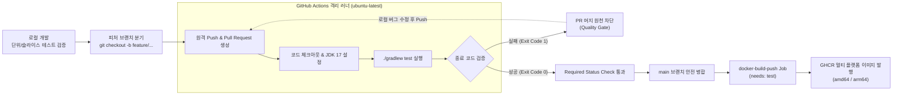

# Git GitHub Actions CI 파이프라인과 자동화 테스트 실습 가이드

> 💡 **[핵심 원리]**
> 소프트웨어 품질 검증 체계에서 런타임 모니터링(05차시의 Prometheus, Loki, Alertmanager)은 이미 운영 서버에 배포된 이후(사후, Runtime) 장애를 관측하는 수단입니다. 반면 **지속적 통합(CI, Continuous Integration)**은 소스코드가 중앙 브랜치(`main`)에 병합되기 전(사전, Shift-Left) 독립된 클라우드 격리 러너가 자동으로 빌드와 테스트를 실행하고 결함을 즉시 탐지하는 품질 가드레일입니다.
> Gradle Wrapper의 프로세스 종료 코드(`Exit Code 0` 성공 vs `1` 실패)를 기반으로 빌드 성공 여부를 판정하며, GitHub의 **Branch Protection Rules**와 **필수 상태 확인(Required Status Checks)**을 결합하여 테스트를 통과하지 않은 코드의 직접 푸시 및 머지를 원천 차단(Quality Gate)합니다. 나아가 검증이 완료된 코드에 한해서만 멀티 플랫폼 도커 이미지를 빌드하여 GHCR에 자동 발행하는 의존 파이프라인(`needs: test`)을 구현함으로써 안전하고 일관된 소프트웨어 인도 체계를 완성합니다.

---

## 1. 실습 개요 및 목표

### 1.1 실습 개요
본 실습은 클론된 `simple-back` Spring Boot 프로젝트의 테스트 자산을 분석하고, Gradle Wrapper를 이용한 로컬 테스트 검증부터 GitHub Actions 클라우드 러너를 활용한 무인 자동화 CI 파이프라인 구축까지 전 과정을 실습합니다.
피처 브랜치를 분기하여 의도적 실패(Red) 코드를 작성하고 PR을 생성함으로써 GitHub Actions가 테스트 실패를 감지해 머지 버튼을 비활성화하는 품질 게이트를 체험합니다. 이후 버그를 수정(Green)하여 안전하게 `main` 브랜치로 병합하고, 테스트 성공을 전제로 Buildx 멀티 플랫폼(`linux/amd64`, `linux/arm64`) 도커 이미지를 GHCR에 자동 발행하는 통합 파이프라인으로 확장합니다.



### 1.2 핵심 학습 목표
- **Spring Test 자산 식별 및 격리 원리 이해**: 순수 단위 테스트(`UserServiceTest`, Mockito)와 웹 계층 슬라이스 테스트(`UserControllerTest`, `@WebMvcTest`, `@MockitoBean`)의 격리 수준 및 실행 속도 차이를 체득한다.
- **Fail-Fast 프로세스 종료 코드 검증**: Gradle Wrapper(`gradlew test`) 실행 시 성공(`0`)과 실패(`1`)의 프로세스 종료 코드를 직접 확인하고 CI 자동화 판정 원리를 이해한다.
- **클라우드 격리 러너 기반 CI 파이프라인 구축**: GitHub Actions 워크플로우(`.github/workflows/ci.yml`)를 작성하여 푸시 및 PR 발생 시 무인 자동화 테스트를 수행하고 HTML 리포트 아티팩트를 보존한다.
- **Branch Protection Rules 기반 품질 게이트 구축**: `main` 브랜치에 필수 상태 확인(Required Status Checks)을 적용하여 테스트 실패 시 머지를 원천 차단하는 안전장치를 구성한다.
- **파이프라인 의존성(`needs: test`) 구현**: 단위/슬라이스 테스트가 100% 통과한 경우에만 Docker Buildx 멀티 플랫폼(`linux/amd64`, `linux/arm64`) 이미지를 GHCR에 자동 빌드·푸시하는 단계적 파이프라인을 완성한다.

---

## 2. 실습 환경 및 준비

### 2.1 실습 환경 요약

| 구분 | 사양 및 설정 내용 |
| --- | --- |
| **작업 디렉터리** | `~/workspace/simple-back` (로컬 프로젝트 루트) |
| **기반 애플리케이션** | Java 17 (Eclipse Temurin), Gradle 8.x, Spring Boot 4.x 기반 `simple-back` |
| **테스트 의존성** | `spring-boot-starter-test` (JUnit 5, AssertJ, Mockito), `spring-boot-starter-webmvc-test`, `h2` (인메모리 DB) |
| **형상 관리** | Git, 본인 GitHub 원격 리포지토리 (`main` 및 피처 브랜치) |
| **CI 러너 환경** | GitHub Actions 클라우드 호스팅 러너 (`ubuntu-latest`) |
| **도커 레지스트리** | GitHub Container Registry (`ghcr.io`) |
| **인증 방식** | 워크플로우 내장 `secrets.GITHUB_TOKEN` 및 `permissions: packages: write` |
| **빌드 대상 플랫폼** | `linux/amd64`, `linux/arm64` (Docker Buildx 멀티 아키텍처) |

### 2.2 사전 준비 확인
1. **로컬 JDK 17 및 Git 설치 확인**: 터미널에서 `java -version` 및 `git --version`을 실행하여 런타임과 도구가 준비되어 있는지 확인합니다.
2. **저장소 클론 상태 점검**: `~/workspace/simple-back` 디렉터리가 존재하고 `git remote -v`에 본인 GitHub 원격 저장소가 올바르게 연결되어 있는지 확인합니다.
3. **GitHub Actions 권한 설정**: GitHub 저장소의 `Settings` → `Actions` → `General` → `Workflow permissions`에서 **Read and write permissions**가 선택되어 있는지 확인합니다. (미설정 시 GHCR 패키지 푸시가 거부될 수 있습니다.)
4. **애플리케이션 신규 작성 지양**: 본 차시는 애플리케이션 코드를 새로 작성하지 않고, 이미 클론된 프로젝트에 내장된 테스트 자산을 바탕으로 CI 파이프라인을 연결하는 데 집중합니다.

---

## 3. 핵심 실습 절차 (Step-by-Step)

### Step 1. 실습 프로젝트 클론 확인 및 테스트 자산 점검
앞 차시에서 클론한 `simple-back` 프로젝트로 이동하여 `build.gradle`의 테스트 의존성과 저장소에 이미 포함된 테스트 자산을 점검합니다.

```bash
# 1. 실습 프로젝트 디렉터리로 이동 (디렉터리가 없으면 클론)
[ -d ~/workspace/simple-back ] || \
  git clone https://github.com/aibe-7th/simple-back.git ~/workspace/simple-back
cd ~/workspace/simple-back

# 2. build.gradle 내 테스트 핵심 의존성 확인
grep -n "starter-test\|webmvc-test\|h2database" build.gradle

# 3. 저장소에 포함된 기존 테스트 클래스 목록 확인
find src/test -type f -name "*.java" | sort
```

- **옵션 및 구문 설명**:
  - `[ -d 경로 ] || git clone ...`: 디렉터리 존재 여부를 안전하게 확인하고 없을 때만 클론을 수행합니다.
  - `grep -n`: 일치하는 행의 번호와 내용을 함께 출력합니다.
  - `find src/test -type f -name "*.java"`: 테스트 디렉터리 하위의 모든 Java 테스트 소스를 검색합니다.

> 📌 **[기대 출력 확인]**
> ```text
> 42:	testImplementation 'org.springframework.boot:spring-boot-starter-test'
> 43:	testImplementation 'org.springframework.boot:spring-boot-starter-webmvc-test'
> 45:	testRuntimeOnly 'com.h2database:h2'
>
> src/test/java/org/example/simpleback/SimpleBackApplicationTests.java
> src/test/java/org/example/simpleback/app/UserServiceTest.java
> src/test/java/org/example/simpleback/ui/UserControllerTest.java
> ```
> 세 가지 테스트 의존성과 3종의 테스트 클래스(단위, 웹 슬라이스, 컨텍스트 로딩)가 모두 정상 출력되어야 합니다.

---

### Step 2. 비즈니스 로직 단위 테스트(UserServiceTest) 분석 및 단독 실행
스프링 컨텍스트 로딩 없이 순수 Mockito 모의 객체만으로 실행되는 비즈니스 로직 단위 테스트를 확인하고 단독 실행합니다.

```bash
# 1. UserServiceTest 코드 확인
cat src/test/java/org/example/simpleback/app/UserServiceTest.java

# 2. 해당 단위 테스트 클래스만 단독 실행
./gradlew test --tests 'org.example.simpleback.app.UserServiceTest'
```

- **옵션 및 구문 설명**:
  - `--tests 'org.example.simpleback.app.UserServiceTest'`: 전체 테스트를 돌리지 않고 지정된 클래스의 단위 테스트만 선별 실행하여 피드백 시간을 단축합니다.
  - `@ExtendWith(MockitoExtension.class)`: 무거운 스프링 컨텍스트(`ApplicationContext`)를 띄우지 않고 `@Mock` 어노테이션으로 가짜 레포지토리를 주입하여 밀리초(ms) 단위로 고속 실행됩니다.

> 📌 **[기대 출력 확인]**
> ```text
> > Task :compileJava UP-TO-DATE
> > Task :processResources UP-TO-DATE
> > Task :classes UP-TO-DATE
> > Task :compileTestJava UP-TO-DATE
> > Task :processTestResources NO-SOURCE
> > Task :testClasses UP-TO-DATE
> > Task :test
>
> BUILD SUCCESSFUL in 1s
> 3 actionable tasks: 1 executed, 2 up-to-date
> ```
> 데이터베이스 연결이나 웹 서버 구동 없이 1초 안팎의 매우 빠른 속도로 `BUILD SUCCESSFUL`이 표시됩니다.

---

### Step 3. Web 계층 슬라이스 테스트(UserControllerTest) 분석 및 단독 실행
웹 계층 빈만 선별 로드하여 MockMvc 가상 호출을 검증하는 슬라이스 테스트를 확인하고 단독 실행합니다.

```bash
# 1. UserControllerTest 코드 확인
cat src/test/java/org/example/simpleback/ui/UserControllerTest.java

# 2. 해당 슬라이스 테스트 클래스만 단독 실행
./gradlew test --tests 'org.example.simpleback.ui.UserControllerTest'
```

- **옵션 및 구문 설명**:
  - `@WebMvcTest(UserController.class)`: Spring MVC 컨트롤러와 관련 컴포넌트(`Security`, `Filter` 등)만 메모리에 로드하고 서비스/레포지토리 빈은 로드하지 않습니다.
  - `@MockitoBean private UserQueryUseCase userQueryUseCase`: Spring Boot 4 표준 모의 빈 등록 어노테이션으로, 하위 비즈니스 유스케이스 계층을 격리합니다.
  - `MockMvc`: 실제 서블릿 컨테이너(Tomcat)의 TCP 포트를 열지 않고 HTTP 요청과 응답을 메모리 상에서 완벽히 모의 검증합니다.

> 📌 **[기대 출력 확인]**
> ```text
> > Task :test
>
> BUILD SUCCESSFUL in 2s
> 3 actionable tasks: 1 executed, 2 up-to-date
> ```
> `GET /` 루트 헬스체크 및 `GET /users` 엔드포인트 검증 2건이 모두 정상 통과합니다.

---

### Step 4. Gradle Wrapper를 활용한 전체 테스트 실행 및 HTML 리포트 분석
전체 테스트 스위트를 실행하고 정상 종료 코드(0) 및 Gradle이 자동 생성한 HTML 리포트를 확인합니다.

```bash
# 1. 전체 단위/슬라이스/컨텍스트 로딩 테스트 일괄 실행
./gradlew test

# 2. 직전 프로세스 종료 코드(Exit Code) 확인
echo "테스트 프로세스 종료 코드: $?"

# 3. 자동 생성된 테스트 HTML 결과 리포트 파일 확인
ls -la build/reports/tests/test/index.html
```

- **옵션 및 구문 설명**:
  - `./gradlew test`: 프로젝트 내 정의된 모든 테스트(`UserServiceTest`, `UserControllerTest`, `SimpleBackApplicationTests`)를 실행합니다.
  - `$?`: 리눅스/유닉스 셸에서 가장 최근에 실행된 명령어의 종료 상태 코드(Exit Code)를 담고 있는 특수 변수입니다.
  - `build/reports/tests/test/index.html`: Gradle이 테스트 실행 통계(총 테스트 수, 통과/실패 수, 소요 시간, 실패 스택 트레이스)를 브라우저로 볼 수 있도록 생성한 HTML 문서입니다.

> 📌 **[기대 출력 확인]**
> ```text
> BUILD SUCCESSFUL in 2s
> 테스트 프로세스 종료 코드: 0
> -rw-r--r--  1 user  staff  2834 Sep 16 18:00 build/reports/tests/test/index.html
> ```
> 모든 테스트가 성공했으므로 종료 코드가 정확히 `0`으로 출력되고 HTML 리포트가 생성됩니다.

---

### Step 5. 의도적 테스트 실패(Red) 유도 및 프로세스 종료 코드(Exit Code) 검증
테스트 검증 단계를 고의로 실패시켜 비정상 종료 코드(`1`)가 반환됨을 직접 확인하여, CI 시스템이 실패를 감지하는 원리를 체득합니다.

```bash
# 1. 백업본을 생성하고 의도적 실패 코드 유도 (admin@example.com -> wrong@example.com)
sed -i.bak 's/"admin@example.com"/"wrong@example.com"/g' \
  src/test/java/org/example/simpleback/app/UserServiceTest.java

# 2. 실패 테스트 실행 및 조건부 출력으로 종료 감지
./gradlew test || echo "Gradle 태스크 실패 감지!"

# 3. 실패 시 프로세스 종료 코드 확인
echo "실패 시 프로세스 종료 코드: $?"

# 4. 원본 코드로 복원 후 정상화 확인
mv src/test/java/org/example/simpleback/app/UserServiceTest.java.bak \
  src/test/java/org/example/simpleback/app/UserServiceTest.java
./gradlew test
echo "복원 후 정상 종료 코드: $?"
```

- **옵션 및 구문 설명**:
  - `sed -i.bak 's/A/B/g'`: 소스 파일의 특정 문자열을 치환하면서 `.bak` 확장자의 원본 백업 파일을 생성합니다.
  - `명령어1 || 명령어2`: 앞 명령어가 비정상 종료(`Exit Code != 0`)할 때만 뒤 명령어를 실행합니다.

> 📌 **[기대 출력 확인]**
> ```text
> UserServiceTest > createsDefaultUserWhenRepositoryIsEmpty() FAILED
>     org.opentest4j.AssertionFailedError: 
>     expected: "wrong@example.com"
>      but was: "admin@example.com"
> ...
> BUILD FAILED in 1s
> Gradle 태스크 실패 감지!
> 실패 시 프로세스 종료 코드: 1
>
> # 복원 후 실행 시:
> BUILD SUCCESSFUL in 1s
> 복원 후 정상 종료 코드: 0
> ```
> 단 1건의 Assertion이라도 실패하면 프로세스가 즉시 종료 코드 `1`을 반환하며 중단(Fail-Fast)됨을 실증합니다.

---

### Step 6. GitHub Actions CI 기본 워크플로우(.github/workflows/ci.yml) 작성
원격 `main` 푸시 및 PR 발생 시 가상 머신 러너에서 무인 자동화 테스트를 수행하는 워크플로우를 생성합니다.

```bash
# 1. 워크플로우 저장 디렉터리 생성
mkdir -p .github/workflows

# 2. 기본 CI 워크플로우 정의
cat <<'EOF' > .github/workflows/ci.yml
name: Continuous Integration

on:
  push:
    branches: [ "main" ]
  pull_request:
    branches: [ "main" ]

jobs:
  test:
    name: Run Unit & Slice Tests
    runs-on: ubuntu-latest

    steps:
      - name: Checkout repository
        uses: actions/checkout@v6

      - name: Set up JDK 17
        uses: actions/setup-java@v6
        with:
          java-version: '17'
          distribution: 'temurin'
          cache: 'gradle'

      - name: Grant execute permission for gradlew
        run: chmod +x gradlew

      - name: Run tests with Gradle Wrapper
        run: ./gradlew test

      - name: Upload test results
        if: always()
        uses: actions/upload-artifact@v7
        with:
          name: gradle-test-reports
          path: build/reports/tests/test/
EOF
```

- **옵션 및 구문 설명**:
  - `on.push / on.pull_request`: `main` 브랜치를 대상으로 하는 푸시 및 PR 이벤트가 감지될 때 워크플로우를 트리거합니다.
  - `runs-on: ubuntu-latest`: GitHub에서 제공하는 최신 우분투 가상 머신 격리 환경을 매 실행마다 신규 할당받습니다.
  - `actions/setup-java@v6` + `cache: 'gradle'`: Temurin 17 JDK를 설치하고 Gradle 캐시(`~/.gradle/caches`)를 자동 보존하여 후속 빌드 속도를 대폭 개선합니다.
  - `run: chmod +x gradlew`: 체크아웃된 러너 환경에서 Gradle Wrapper 실행 파일에 실행 권한(`+x`)을 명시적으로 부여합니다.
  - `if: always()`: 앞선 테스트 스텝이 실패(Exit Code 1)하더라도 반드시 실행되도록 강제하여 실패 원인 분석용 리포트를 항상 수집합니다.
  - `actions/upload-artifact@v7`: 생성된 HTML 테스트 리포트를 ZIP 아티팩트로 압축하여 GitHub 웹 화면에 보존합니다.

> 📌 **[기대 출력 확인]**
> `.github/workflows/ci.yml` 파일이 생성되고 파일 내용이 정상 등록되었는지 `cat .github/workflows/ci.yml`로 확인합니다.

---

### Step 7. CI 설정 커밋/푸시 및 GitHub Actions 러너 빌드 로그 검증
로컬에서 작성한 CI 워크플로우를 `main` 브랜치에 커밋 및 푸시하고 GitHub 웹 화면에서 클라우드 러너의 실행 로그를 검증합니다.

```bash
# 1. 변경 파일 확인
git status

# 2. 워크플로우 파일 스테이징 및 커밋
git add .github/workflows/ci.yml
git commit -m "ci: add github actions test workflow"

# 3. main 브랜치 원격 푸시
git push origin main
```

- **옵션 및 구문 설명**:
  - `git push origin main`: 원격 저장소의 `main` 브랜치로 커밋을 전송하여 GitHub Actions `push` 이벤트를 즉시 발화시킵니다.

> 📌 **[검증 절차 및 확인 사항]**
> 1. 웹 브라우저에서 GitHub 리포지토리로 접속 후 상단의 **Actions** 탭을 클릭합니다.
> 2. `Continuous Integration` 워크플로우 실행 항목을 클릭하고 세부 Job인 **Run Unit & Slice Tests**로 진입합니다.
> 3. 러너 환경 설정, JDK 17 셋업, Gradle Wrapper 권한 부여, `./gradlew test` 단계가 모두 초록색 체크(`Success`)로 완료되는지 확인합니다.

---

### Step 8. 테스트 아티팩트(HTML 리포트) 다운로드 및 러너 캐시 동작 확인
클라우드 러너가 빌드 후 보존한 테스트 결과 아티팩트를 다운로드하여 확인하고, 의존성 캐싱 로그를 점검합니다.

```bash
# 로컬 터미널에서 최근 커밋 해시 확인 (러너 로그 대조용)
git log --oneline -1
```

- **옵션 및 구문 설명**:
  - `git log --oneline -1`: 가장 최근 커밋의 단축 해시와 메시지를 확인하여 GitHub Actions 실행 트리가 올바른 커밋을 바라보고 있는지 확인합니다.

> 📌 **[검증 절차 및 확인 사항]**
> 1. 완료된 워크플로우 실행 페이지 하단의 **Artifacts** 섹션에서 `gradle-test-reports` 항목을 클릭하여 ZIP 파일을 다운로드합니다.
> 2. 압축을 풀고 `index.html`을 웹 브라우저로 열어 전체 3개 테스트 클래스, 총 4건의 테스트 메서드가 100% 통과(Success rate 100%)했음을 확인합니다.
> 3. Actions 로그 중 `Set up JDK 17` 및 `Post Set up JDK 17` 단계를 펼쳐 `cache: 'gradle'`에 의해 Gradle 캐시가 저장(Saved)되었는지 확인합니다. (후속 실행 시 `Restored from cache`로 동작합니다.)

---

### Step 9. GitHub 저장소 Branch Protection Rules 및 필수 상태 확인 구성
`main` 브랜치에 브랜치 보호 규칙(Branch Protection Rules)을 적용하여, 테스트를 통과하지 않은 코드가 직접 푸시되거나 불완전한 상태로 병합되는 것을 구조적으로 차단합니다.

> ⚙️ **[GitHub 웹 콘솔 설정 절차]**
> 1. 저장소 상단의 **Settings** 탭 클릭 → 좌측 메뉴의 **Branches** 클릭
> 2. **Branch protection rules** 섹션 우측의 **Add branch protection rule** (또는 **Add classic rule**) 버튼 클릭
> 3. **Branch name pattern**에 `main` 입력
> 4. **Protect matching branches** 세부 옵션 체크:
>    - [x] **Require a pull request before merging**: 직접 푸시를 금지하고 반드시 PR을 통해 머지하도록 강제
>    - [x] **Require status checks to pass before merging**: 머지 전 CI 상태 확인이 성공해야 함을 강제
>      - 하단 검색창에 **`Run Unit & Slice Tests`** (또는 워크플로우 Job 이름)를 검색하여 체크박스 선택
>    - [x] **Do not allow bypassing the above settings**: 저장소 관리자(Admin)조차도 규칙을 우회할 수 없도록 강제 (Quality Gate 완성)
> 5. 화면 맨 하단의 **Create** (또는 **Save changes**) 버튼을 클릭하여 규칙을 저장합니다.

---

### Step 10. 로컬 터미널에서 보호된 main 브랜치 직접 푸시 차단 검증
로컬 터미널에서 `main` 브랜치로의 직접 푸시를 시도하여, 방금 설정한 브랜치 보호 규칙에 의해 GitHub 서버가 푸시를 강력하게 거부하는지 확인합니다.

```bash
# 1. 보호 규칙 동작 확인을 위한 빈(Empty) 커밋 생성
git commit --allow-empty -m "test: attempt direct push to protected main branch"

# 2. main 브랜치로 직접 푸시 시도 (실패 유도)
git push origin main || echo "보호 규칙에 의해 main 직접 푸시 차단 성공!"
```

- **옵션 및 구문 설명**:
  - `--allow-empty`: 파일 변경 사항이 없어도 Git 커밋 객체를 강제로 생성합니다.
  - `git push origin main || ...`: 푸시 실패 시 안내 메시지를 출력하도록 폴백을 구성합니다.

> 📌 **[기대 출력 확인]**
> ```text
> Total 0 (delta 0), reused 0 (delta 0), pack-reused 0
> remote: error: GH006: Protected branch rules not met for refs/heads/main.
> remote: error: Changes must be made through a pull request.
> To https://github.com/본인계정/simple-back.git
>  ! [remote rejected] main -> main (protected branch hook declined)
> error: failed to push some refs to 'https://github.com/본인계정/simple-back.git'
> 보호 규칙에 의해 main 직접 푸시 차단 성공!
> ```
> `GH006: Protected branch rules not met` 에러 메시지와 함께 원격 푸시가 거절되어야 합니다.

---

### Step 11. 피처 브랜치 생성 및 실패 테스트 코드를 포함한 PR 생성
임시 커밋을 정리한 뒤 신규 피처 브랜치를 생성하고, 고의로 깨지는 실패 테스트 코드를 작성하여 원격에 푸시한 후 PR을 생성합니다.

```bash
# 1. Step 10에서 생성한 빈 테스트 커밋 되돌리기
git reset --hard HEAD~1

# 2. 신규 피처 브랜치 생성 및 체크아웃
git checkout -b feature/user-update-fail

# 3. 고의로 실패하는 신규 테스트 클래스 작성 (기존 클래스와 충돌 방지)
cat <<'EOF' > src/test/java/org/example/simpleback/app/UserServiceDefaultUserTest.java
package org.example.simpleback.app;

import org.example.simpleback.domain.model.User;
import org.example.simpleback.domain.port.UserRepository;
import org.junit.jupiter.api.DisplayName;
import org.junit.jupiter.api.Test;
import org.junit.jupiter.api.extension.ExtendWith;
import org.mockito.ArgumentCaptor;
import org.mockito.Mock;
import org.mockito.junit.jupiter.MockitoExtension;

import java.util.List;

import static org.assertj.core.api.Assertions.assertThat;
import static org.mockito.BDDMockito.given;
import static org.mockito.Mockito.verify;

@ExtendWith(MockitoExtension.class)
class UserServiceDefaultUserTest {
    @Mock
    private UserRepository userRepository;

    @Test
    @DisplayName("신규 요구사항: 기본 사용자 이름 검증 (의도적 실패)")
    void checkDefaultUserName_Failure() {
        given(userRepository.count()).willReturn(0L);
        given(userRepository.findAll()).willReturn(List.of());
        UserService userService = new UserService(userRepository);

        userService.getUsers();

        ArgumentCaptor<User> userCaptor = ArgumentCaptor.forClass(User.class);
        verify(userRepository).save(userCaptor.capture());
        // 실제 생성되는 관리자명은 "infra-admin"이지만 "vip-admin"으로 잘못 단언하여 고의 실패 유도
        assertThat(userCaptor.getValue().name()).isEqualTo("vip-admin");
    }
}
EOF

# 4. 실패 테스트 커밋 및 피처 브랜치 원격 푸시
git add src/test/java/org/example/simpleback/app/UserServiceDefaultUserTest.java
git commit -m "test: add default user name verification (contains broken assertion)"
git push -u origin feature/user-update-fail
```

- **옵션 및 구문 설명**:
  - `git reset --hard HEAD~1`: 직전 커밋과 작업 트리를 완전히 이전 상태로 되돌립니다.
  - `git checkout -b <브랜치명>`: 새 브랜치를 생성하고 즉시 해당 브랜치로 작업 컨텍스트를 전환합니다.
  - `git push -u origin <브랜치명>`: 원격 저장소에 동일한 이름의 브랜치를 생성하고 업스트림 추적을 연결합니다.

> 📌 **[PR 생성 절차]**
> 1. GitHub 저장소 웹 페이지에 접속하면 나타나는 노란색 알림 배너의 **Compare & pull request** 버튼을 클릭합니다.
> 2. Base 브랜치가 `main`, Compare 브랜치가 `feature/user-update-fail`인지 확인합니다.
> 3. 제목에 `[WIP] Test branch protection with failing test`를 입력하고 **Create pull request** 버튼을 클릭합니다.

---

### Step 12. GitHub Actions Status Check 실패 및 머지 차단(Quality Gate) 관찰
생성된 PR 상세 화면에서 GitHub Actions가 자동으로 테스트를 실행하고, 실패가 감지되었을 때 머지 버튼이 물리적으로 차단되는 품질 게이트 동작을 관찰합니다.

> 📌 **[검증 절차 및 확인 사항]**
> 1. 생성된 PR 화면 하단의 상태 확인(Status checks) 섹션을 관찰합니다.
> 2. `Continuous Integration / Run Unit & Slice Tests` Job이 실행되다가 빨간색 `X` 표시(`Failure`)로 전환됩니다.
> 3. **Details** 링크를 클릭하여 러너 로그를 확인하면 `UserServiceDefaultUserTest > checkDefaultUserName_Failure FAILED`와 `BUILD FAILED`가 명시됩니다.
> 4. 다시 PR 화면으로 돌아오면 다음과 같은 경고와 함께 머지가 원천 차단되었음을 확인합니다:
>    - **Required statuses must pass before merging** (필수 상태 확인 통과 필요)
>    - **Merge pull request** 버튼이 비활성화(회색)되어 클릭 불가 상태 유지

---

### Step 13. 로컬 버그 수정 푸시 및 PR 재검증 후 main 안전 병합
로컬 환경에서 단언문(Assertion)의 오류를 올바른 기대값으로 수정하여 테스트를 검증하고, 동일 피처 브랜치로 푸시하여 PR의 상태를 녹색으로 전환한 뒤 안전하게 병합합니다.

```bash
# 1. 기대값을 올바른 이름("infra-admin")으로 수정
sed -i.bak 's/"vip-admin"/"infra-admin"/g' \
  src/test/java/org/example/simpleback/app/UserServiceDefaultUserTest.java
rm -f src/test/java/org/example/simpleback/app/UserServiceDefaultUserTest.java.bak

# 2. 로컬에서 테스트 통과 여부 사전 검증
./gradlew test
echo "로컬 테스트 검증 종료 코드: $?"

# 3. 버그 수정 커밋 및 원격 피처 브랜치로 푸시
git add src/test/java/org/example/simpleback/app/UserServiceDefaultUserTest.java
git commit -m "fix: correct expected default user name assertion"
git push origin feature/user-update-fail
```

- **옵션 및 구문 설명**:
  - 피처 브랜치에 새 커밋을 푸시하면 기존에 열려 있던 PR의 대상 커밋이 자동으로 갱신되며, GitHub Actions 워크플로우가 자동으로 재트리거됩니다.

> 📌 **[검증 및 머지 절차]**
> 1. PR 상세 페이지로 돌아와 GitHub Actions 워크플로우가 다시 실행되는 것을 확인합니다.
> 2. 수 초 내로 `Run Unit & Slice Tests`가 초록색 체크(`All checks have passed`)로 변경됩니다.
> 3. 비활성화되었던 **Merge pull request** 버튼이 녹색으로 활성화됩니다.
> 4. **Merge pull request** → **Confirm merge**를 순차적으로 클릭하여 코드를 `main` 브랜치에 안전하게 병합합니다.

---

### Step 14. CI 워크플로우에 Docker Buildx 및 GHCR 푸시 Job 확장 (needs: test)
테스트 통과를 전제로, `main` 브랜치 병합 시점에 멀티 플랫폼(`linux/amd64`, `linux/arm64`) 컨테이너 이미지를 빌드하여 GHCR에 자동 푸시하도록 워크플로우를 확장합니다.

```bash
# 1. main 브랜치로 복귀 및 원격 병합 내역 동기화
git checkout main
git pull origin main

# 2. 워크플로우 확장: test 성공 후 실행되는 docker-build-push Job 추가
cat <<'EOF' > .github/workflows/ci.yml
name: Continuous Integration & Package

on:
  push:
    branches: [ "main" ]
  pull_request:
    branches: [ "main" ]

env:
  REGISTRY: ghcr.io
  IMAGE_NAME: ${{ github.repository }}

jobs:
  test:
    name: Run Unit & Slice Tests
    runs-on: ubuntu-latest

    steps:
      - name: Checkout repository
        uses: actions/checkout@v6

      - name: Set up JDK 17
        uses: actions/setup-java@v6
        with:
          java-version: '17'
          distribution: 'temurin'
          cache: 'gradle'

      - name: Grant execute permission for gradlew
        run: chmod +x gradlew

      - name: Run tests with Gradle Wrapper
        run: ./gradlew test

      - name: Upload test results
        if: always()
        uses: actions/upload-artifact@v7
        with:
          name: gradle-test-reports
          path: build/reports/tests/test/

  docker-build-push:
    name: Build & Push Docker Image to GHCR
    needs: test
    if: github.event_name == 'push' && github.ref == 'refs/heads/main'
    runs-on: ubuntu-latest
    permissions:
      contents: read
      packages: write

    steps:
      - name: Checkout repository
        uses: actions/checkout@v6

      - name: Set up Docker Buildx
        uses: docker/setup-buildx-action@v4

      - name: Log in to GitHub Container Registry
        uses: docker/login-action@v4
        with:
          registry: ${{ env.REGISTRY }}
          username: ${{ github.actor }}
          password: ${{ secrets.GITHUB_TOKEN }}

      - name: Lowercase image name
        run: echo "IMAGE_NAME=${IMAGE_NAME,,}" >> $GITHUB_ENV

      - name: Build and push Docker image
        uses: docker/build-push-action@v7
        with:
          context: .
          push: true
          platforms: linux/amd64,linux/arm64
          tags: |
            ${{ env.REGISTRY }}/${{ env.IMAGE_NAME }}:latest
            ${{ env.REGISTRY }}/${{ env.IMAGE_NAME }}:${{ github.sha }}
EOF
```

- **옵션 및 구문 설명**:
  - `needs: test`: `test` Job이 완전히 성공(`Exit Code 0`)했을 때만 `docker-build-push` Job이 실행되도록 의존 관계를 정의합니다. 만약 테스트가 실패하면 빌드 Job은 즉시 취소(Skipped)됩니다.
  - `if: github.event_name == 'push' && github.ref == 'refs/heads/main'`: PR 검증 단계에서는 불필요한 이미지 빌드 및 푸시를 건너뛰고, `main` 브랜치에 최종 푸시/병합되었을 때만 푸시를 수행합니다.
  - `permissions: packages: write`: 워크플로우에 내장된 일회성 `secrets.GITHUB_TOKEN`에 GHCR 패키지 생성 및 갱신 권한을 안전하게 부여합니다.
  - `run: echo "IMAGE_NAME=${IMAGE_NAME,,}" >> $GITHUB_ENV`: 도커 레지스트리 표준 규격(소문자 전용)에 부합하도록 GitHub 사용자명/저장소명에 포함된 영문 대문자를 소문자로 강제 변환합니다.
  - `platforms: linux/amd64,linux/arm64`: QEMU 에뮬레이터를 통해 Intel/AMD 기반 클라우드 서버와 Apple Silicon 개발 머신 모두에서 실행 가능한 멀티 플랫폼 OCI 이미지를 일괄 빌드합니다.
  - `tags: ...:latest, ...:${{ github.sha }}`: 가변 포인터인 `latest` 태그와 Git 커밋 고유 해시(`github.sha`) 태그를 함께 부여하여 추적성과 롤백 가능성을 확보합니다.

---

### Step 15. 워크플로우 변경사항 PR 생성 및 테스트-빌드 파이프라인 연계 검증
보호된 `main` 브랜치 규정에 맞추어 새 피처 브랜치(`feature/ci-docker-pipeline`)에서 워크플로우를 PR로 올리고, PR 단계에서는 테스트만 돌고 머지 후에는 빌드까지 연속 실행되는 파이프라인 흐름을 검증합니다.

```bash
# 1. 신규 피처 브랜치 생성
git checkout -b feature/ci-docker-pipeline

# 2. 워크플로우 변경사항 커밋 및 푸시
git add .github/workflows/ci.yml
git commit -m "ci: add docker-build-push job with test dependency"
git push -u origin feature/ci-docker-pipeline
```

- **옵션 및 구문 설명**:
  - 보호 규칙이 켜져 있으므로 워크플로우 파일 수정 역시 PR을 통해서만 `main`에 반영할 수 있습니다.

> 📌 **[검증 및 병합 흐름]**
> 1. GitHub 웹에서 PR을 생성합니다.
> 2. PR 상태 확인창에서 `Run Unit & Slice Tests`만 실행되고 `Build & Push Docker Image to GHCR` Job은 `if` 조건에 의해 실행되지 않고 건너뛰어짐(Skipped)을 확인합니다.
> 3. 테스트 통과 후 **Merge pull request** → **Confirm merge**를 클릭합니다.
> 4. 병합 직후 Actions 탭의 `Continuous Integration & Package` 워크플로우로 진입합니다.
> 5. `test` Job 완료 후 선으로 연결된 `docker-build-push` Job이 순차적으로 실행되어 두 Job 모두 초록색 체크로 완료되는 파이프라인 의존성을 확인합니다.

---

### Step 16. GHCR 패키지 레지스트리 멀티 플랫폼 이미지 태그 확인
GitHub Container Registry에 새로 발행된 패키지와 멀티 플랫폼 아키텍처 매니페스트를 웹 화면에서 확인합니다.

> 📌 **[검증 절차 및 확인 사항]**
> 1. GitHub 저장소 메인 화면 우측 하단의 **Packages** 섹션에서 `simple-back` 패키지를 클릭합니다.
> 2. **Activity** 또는 **Tags** 탭에서 방금 발행된 태그 2종(`latest` 및 커밋 해시 태그)이 등록되었는지 확인합니다.
> 3. 태그 상세를 클릭하여 **OS/Arch** 항목에 **`linux/amd64`**와 **`linux/arm64`**가 모두 포함된 멀티 아키텍처 매니페스트 리스트인지 확인합니다.

---

### Step 17. 실습 임시 브랜치 정리 및 로컬/원격 동기화 상태 점검
실습에 사용했던 피처 브랜치들을 로컬과 원격 저장소에서 깔끔하게 정리하고, 로컬 `main` 브랜치를 최신 병합 상태로 동기화합니다.

```bash
# 1. main 브랜치로 이동 및 최신 변경사항 동기화
git checkout main
git pull origin main

# 2. 로컬 실습 임시 피처 브랜치 삭제
git branch -d feature/user-update-fail || true
git branch -d feature/ci-docker-pipeline || true

# 3. 원격 실습 임시 피처 브랜치 삭제
git push origin --delete feature/user-update-fail || true
git push origin --delete feature/ci-docker-pipeline || true

# 4. 최종 Git 상태 및 동기화 커밋 확인
git status
git log --oneline -5
```

- **옵션 및 구문 설명**:
  - `git branch -d <브랜치명>`: 병합이 완료된 로컬 브랜치를 안전하게 삭제합니다.
  - `git push origin --delete <브랜치명>`: 원격 저장소에 남아 있는 불필요한 피처 브랜치를 삭제하여 저장소를 깔끔하게 유지합니다.
  - `|| true`: 해당 브랜치가 이미 없거나 삭제되었더라도 스크립트가 중단되지 않고 다음 명령으로 계속 진행되도록 합니다.

> 📌 **[기대 출력 확인]**
> ```text
> On branch main
> Your branch is up to date with 'origin/main'.
> nothing to commit, working tree clean
> ```
> `main` 브랜치에 머지 커밋들이 모두 반영되어 있고 작업 트리가 완전히 깨끗한 상태여야 합니다.

---

## 4. 실무 트러블슈팅 가이드

실제 CI 파이프라인 구축 및 브랜치 보호 규칙 적용 과정에서 빈번하게 발생하는 대표적인 5가지 장애 유형과 원인, 복구 명령입니다.

### Issue 1: 러너에서 `./gradlew` 실행 시 `Permission denied` 오류 발생
- **증상**: GitHub Actions 러너의 `Run tests with Gradle Wrapper` 스텝에서 `/home/runner/work/_temp/...: ./gradlew: Permission denied` 에러와 함께 빌드가 즉시 중단됨.
- **원인**: Windows 환경에서 Git 커밋을 수행했거나 파일 생성 과정에서 Gradle Wrapper 실행 파일의 POSIX 실행 권한 비트(`+x`)가 제거된 상태로 원격에 푸시된 경우입니다.
- **복구 절차**: 로컬 저장소에서 실행 권한을 다시 부여하고 원격에 푸시하거나, 워크플로우 YAML 파일 내부에 권한 부여 스텝을 명시합니다.

```bash
# 로컬 터미널에서 실행 권한 복구 및 푸시
chmod +x gradlew
git update-index --chmod=+x gradlew
git commit -m "fix: grant execute permission to gradlew"
git push origin main
```

또한 워크플로우 스텝(`ci.yml`)에 다음 항목이 포함되어 있는지 확인합니다:
```yaml
      - name: Grant execute permission for gradlew
        run: chmod +x gradlew
```

---

### Issue 2: `@WebMvcTest` 슬라이스 테스트 컴파일 시 클래스 미발견 오류
- **증상**: 로컬 또는 CI 러너에서 `./gradlew test` 실행 시 `cannot find symbol: class WebMvcTest` 또는 `package org.springframework.boot.webmvc.test.autoconfigure does not exist` 컴파일 에러 발생.
- **원인**: Spring Boot 4.x 이상부터는 슬라이스 테스트 프레임워크가 모듈화되어 기존 `spring-boot-starter-test` 단독으로는 `@WebMvcTest`를 지원하지 않습니다. 또한 `@MockBean`이 제거되고 `@MockitoBean`으로 대체되었습니다.
- **복구 절차**: `build.gradle`에 `spring-boot-starter-webmvc-test` 모듈이 등록되어 있는지 확인하고, 테스트 코드 내 import 문을 점검합니다.

```bash
# 1. 의존성 등록 여부 확인
grep "webmvc-test" build.gradle

# 2. 누락 시 build.gradle의 dependencies 블록에 추가
# testImplementation 'org.springframework.boot:spring-boot-starter-webmvc-test'

# 3. 테스트 코드의 어노테이션 import 확인 (Spring Boot 4 표준)
grep -n "WebMvcTest\|MockitoBean" src/test/java/org/example/simpleback/ui/UserControllerTest.java
```

---

### Issue 3: GitHub Actions에서 GHCR 로그인/푸시 시 403 Forbidden 권한 거부
- **증상**: `Build & Push Docker Image to GHCR` 스텝에서 `denied: installation not allowed to Create organization package` 또는 `403 Forbidden` 오류 발생.
- **원인**:
  1. 워크플로우 파일(`ci.yml`)의 Job 수준에 `permissions: packages: write` 권한이 선언되지 않았거나,
  2. GitHub 저장소의 기본 Actions 권한이 'Read repository contents'로 제한되어 일회성 `secrets.GITHUB_TOKEN`이 패키지를 쓸 수 없는 경우입니다.
- **복구 절차**:
  1. 저장소 웹 콘솔의 **Settings** → **Actions** → **General** → **Workflow permissions**에서 **Read and write permissions**를 선택하고 저장합니다.
  2. `ci.yml`의 `docker-build-push` Job에 명시적 권한 블록이 선언되어 있는지 점검합니다:

```yaml
    permissions:
      contents: read
      packages: write
```

---

### Issue 4: Docker Buildx 빌드 시 `invalid reference format: repository name must be lowercase` 오류
- **증상**: `docker/build-push-action` 스텝에서 이미지 태그 빌드 중 태그 형식 오류로 중단됨.
- **원인**: 도커 OCI 레지스트리 명세상 이미지 경로 네임스페이스는 영문 소문자, 숫자, 마침표, 밑줄, 하이픈만 허용됩니다. GitHub 사용자 아이디나 저장소명에 영문 대문자가 포함되어 있을 때 발생합니다.
- **복구 절차**: 워크플로우 스텝에서 빌드 실행 전 `GITHUB_ENV`에 대문자를 소문자로 치환하여 저장하는 스텝을 삽입합니다.

```bash
# 워크플로우에 선언된 소문자 치환 구문 확인
# run: echo "IMAGE_NAME=${IMAGE_NAME,,}" >> $GITHUB_ENV
```

---

### Issue 5: 보호된 `main` 브랜치로 직접 push 시 `Protected branch rules not met` 오류
- **증상**: 로컬 터미널에서 `git push origin main` 실행 시 `remote: error: GH006: Protected branch rules not met for refs/heads/main` 에러와 함께 푸시 거부.
- **원인**: Step 9에서 구성한 Branch Protection Rule이 정상 동작하고 있는 상태입니다. 이는 결함이 아니며 정상적인 보안 및 품질 가드레일 동작입니다.
- **복구 절차**: 직접 푸시하지 않고 정규 협업 흐름에 따라 피처 브랜치를 생성하여 작업한 뒤 PR을 통해 코드 리뷰 및 CI 통과 후 병합합니다.

```bash
# 1. 작업 내용을 새 피처 브랜치로 분기
git checkout -b feature/my-new-work

# 2. 피처 브랜치로 원격 푸시 후 GitHub 웹에서 PR 생성
git push -u origin feature/my-new-work
```

---

## 5. 실습 자원 정리 (Cleanup)

실습 완료 후 로컬 머신의 빌드 산출물을 정리하고, 후속 차시와의 연계 상태를 확인합니다.

### 5.1 로컬 빌드 산출물 및 캐시 정리
실습 과정에서 생성된 컴파일 클래스 파일, 테스트 리포트, 임시 캐시 디렉터리를 정리합니다.

```bash
cd ~/workspace/simple-back

# 1. Gradle 빌드 및 리포트 산출물 삭제
./gradlew clean

# 2. 빌드 디렉터리 제거 확인
ls -ld build 2>/dev/null || echo "build 디렉터리가 깔끔하게 정리되었습니다."

# 3. 로컬 Git 상태 최종 확인
git status
```

### 5.2 Branch Protection Rule 및 GHCR 패키지 관리 안내
- **Branch Protection Rule 유지/조정**:
  - 후속 실습(`09_AWS_EC2_CD_파이프라인_구축과_배포_자동화`)에서는 CD 배포 워크플로우를 작성하고 검증하게 됩니다. 실습 편의상 빠른 푸시와 반복 테스트가 필요한 경우 `Settings` → `Branches`에서 보호 규칙을 일시 비활성화할 수 있습니다.
  - 팀 단위 실무 협업 환경을 유지하려면 본 차시에서 설정한 보호 규칙(`Require a pull request`, `Require status checks to pass`)을 유지하는 것을 강력히 권장합니다.
- **GHCR 발행 패키지 보존**:
  - 이번 차시에서 GHCR에 발행한 멀티 플랫폼 이미지(`ghcr.io/<계정>/simple-back:latest`)는 후속 `09` 차시의 AWS EC2 Blue/Green CD 무중단 배포 및 자동화 파이프라인에서 직접 풀(Pull)받아 기동하는 실습 자산으로 사용되므로 삭제하지 않고 보존합니다.
